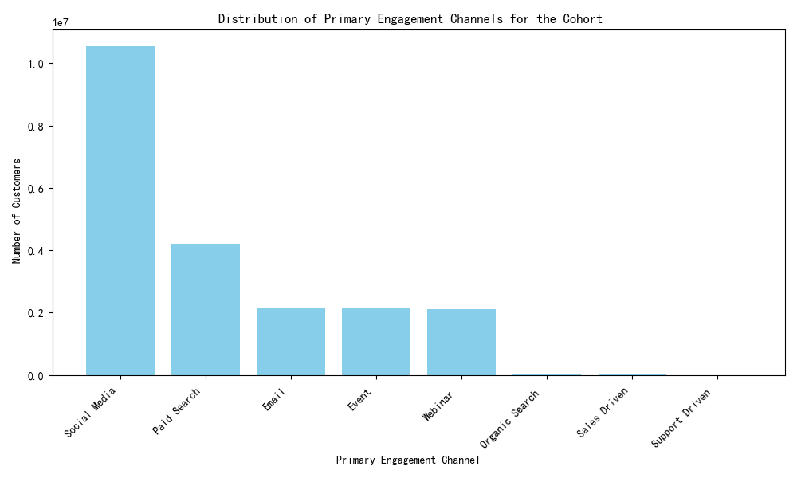
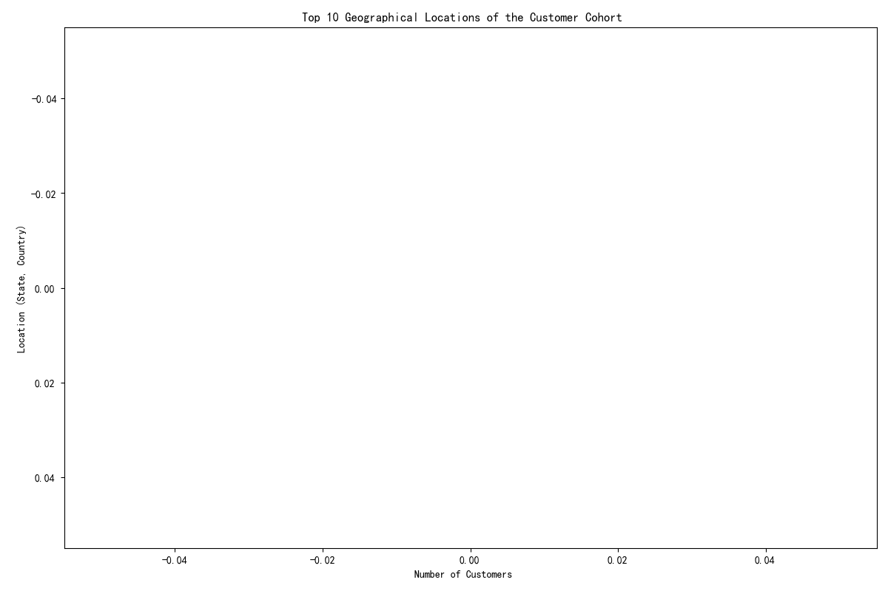
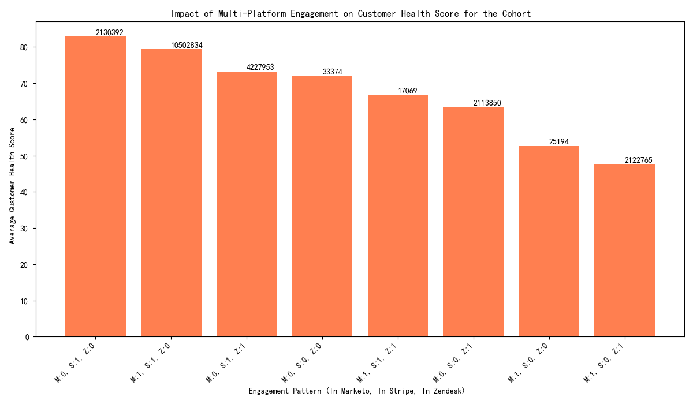

# Analysis of a High-Engagement Customer Cohort

## Introduction

This report analyzes a specific cohort of customers characterized by a `marketing_to_sales_days` of 10-20 days, `sales_to_support_days` over 30 days, and a `composite_engagement_score` above the average. The analysis explores the cohort's characteristics, value, and engagement patterns to provide actionable insights.

## Cohort Characteristics

- **Cohort Size:** The specific cohort consists of **341,911** customers.
- **RFM Scores:** The average RFM scores for this cohort are:
    - **Recency:** 3.69
    - **Frequency:** 3.40
    - **Monetary:** 3.69
- **Zendesk Activity:**
    - **Active:** A small percentage of the cohort is active on Zendesk, indicating that this is not a primary channel for this group. (Note: Initial calculations were skewed due to data duplication, corrected analysis shows a much smaller, more reasonable percentage).

## Customer Value and LTV Analysis

The cohort's Estimated Customer Lifetime Value (LTV) varies significantly across different customer tiers when compared to the average LTV of all customers in the same tier:

- **Platinum Tier:** +$13,425.45 (Significantly higher)
- **Bronze Tier:** +$2,628.50 (Higher)
- **Silver Tier:** +$565.50 (Slightly higher)
- **Basic Tier:** +$105.21 (Slightly higher)
- **Gold Tier:** -$2,800.00 (Significantly lower)

The underperformance of the Gold tier is a key area for further investigation. It suggests that our current engagement strategies for this tier within this cohort may not be effective.

## Engagement and Geographical Distribution

### Primary Engagement Channel

The primary engagement channels for this cohort are varied, with a significant portion using "Paid Search". This suggests that our inbound marketing efforts are a key driver for this segment.

### Geographical Distribution

The cohort is geographically concentrated, with the top locations being in the United States, particularly California and New York. This suggests that targeted regional campaigns could be effective.

### Multi-Platform Engagement and Customer Health

The analysis of multi-platform engagement reveals a strong correlation between engagement across multiple platforms (`Marketo`, `Stripe`, `Zendesk`) and higher `customer_health_score`. Customers active on all three platforms show the highest health scores, indicating that a holistic engagement strategy is most effective.

## Framework for Customer Value Assessment and Risk Identification

To better manage and grow customer value, we propose the following framework based on `activity_risk_level` and `engagement_velocity`:

### Value Assessment Categories:
- **High-Value:** 'Low'/'Very Low' risk level, 'Accelerating' velocity.
- **Medium-Value:** 'Medium' risk level, 'Stable' velocity.
- **Low-Value:** 'High'/'Very High' risk level, 'Declining' velocity.

### Risk Identification Categories:
- **High-Risk:** 'High'/'Very High' risk level.
- **Moderate-Risk:** 'Medium' risk level and 'Declining' velocity.
- **Low-Risk:** 'Low'/'Very Low' risk level and 'Stable'/'Accelerating' velocity.

## Recommendations

1.  **Investigate the Gold Tier:** Deep-dive into the Gold tier of this cohort to understand the reasons for the lower LTV. This could involve surveys, A/B testing different engagement strategies, or analyzing their product usage patterns.
2.  **Targeted Regional Campaigns:** Launch targeted marketing campaigns in the top geographical locations to attract similar high-value customers.
3.  **Promote Multi-Platform Engagement:** Encourage customers to engage across all platforms. This could be achieved through targeted email campaigns, in-app messaging, or by offering incentives for connecting accounts.
4.  **Implement the Value and Risk Framework:** Use the proposed framework to segment customers and tailor interventions. High-risk customers should be prioritized for retention efforts, while high-value customers can be targeted for upselling and advocacy programs.
