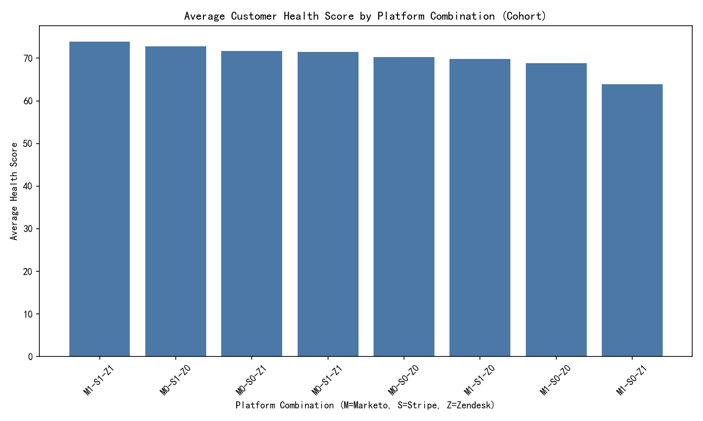

# Cohort Analysis: Customers with 10–20 marketing-to-sales days, >30 sales-to-support days, and above-average composite engagement

This report analyzes the defined customer cohort and provides evidence-backed insights and recommendations. Key metrics and diagnostic analyses are presented, along with one visualization that examines multi-platform engagement combinations versus customer health score.

Image(s) generated:
- platform_health_cohort.png

## Cohort Definition and Size
Filters applied:
- marketing_to_sales_days: between 10 and 20 days
- sales_to_support_days: exceeds 30 days
- composite_engagement_score: higher than overall average across customers (average = 8.999496)

Cohort size:
- 867 distinct customers (by primary_email)

## RFM Averages (Cohort)
- Recency score: 2.977
- Frequency score: 2.979
- Monetary score: 2.988

Interpretation:
- The average RFM scores are around 3, indicating mid-level recency/frequency/monetary. These customers are not the most recent or highest-frequency buyers but are steadily engaged and contributing monetary value. Coupled with high composite engagement (>average), they present an attractive opportunity to deepen value through targeted engagement and faster support activation.

## Estimated Customer LTV Difference vs. Same-Tier Peers
- Average difference (cohort vs. non-cohort peers within the same customer_tier): +839.21
- Interpretation: On average, cohort members exhibit an estimated customer LTV that is about $839 higher than others in their tier. Despite slower progression to support (sales_to_support_days > 30), they represent higher value potential and should be prioritized for onboarding and retention interventions.

## Primary Engagement Channel Distribution (Cohort, distinct customers)
Top channels by share of cohort:
- Webinar: 18.7%
- Email: 16.7%
- Paid Search: 16.4%
- Event: 16.3%
- Organic Search: 16.1%
- Social Media: 15.8%

Interpretation:
- The cohort is highly concentrated in education and content-driven touchpoints (webinar, email, events, organic), indicating they respond to informative experiences rather than purely transactional prompts. Leveraging these channels for onboarding guidance and structured support handoffs can accelerate conversion to support and reduce the >30-day lag.

## Zendesk Active Proportion
- 27.3% of the cohort are marked as zendesk_active.
- Interpretation: Less than one-third have an active support presence, aligning with the observed sales_to_support lag. Increasing the proportion of support activation is a clear lever to improve health and value realization.

## Multi-Platform Engagement Patterns vs. Customer Health
We assessed combinations of in_marketo, in_stripe, in_zendesk flags and their relationship with average customer_health_score (distinct customers).

Visualization:

Highlights from the analysis:
- M0-S0-Z1 (Zendesk only) has the highest average health: 74.28
- M1-S1-Z1 (All three) is next: 73.01
- M0-S0-Z0 (none) sits in the middle: 71.60
- Combinations lacking Zendesk (e.g., M1-S1-Z0 at 71.16; M1-S0-Z0 at 70.95) generally underperform the top combos, suggesting support engagement (Zendesk) is an important driver of health.
- Note: Not all Zendesk-included combos outperform all non-Zendesk ones (e.g., M0-S1-Z1 at 70.57), but the best-performing patterns include Zendesk, indicating that activating support typically correlates with higher health.

Actionable implications:
- Prioritize converting cohort customers to an active support footprint (Zendesk) and, where feasible, unify their presence across marketing (Marketo) and billing (Stripe) for better lifecycle continuity.
- For customers in M0-S0-Z0, create guided onboarding sequences via webinar/email, followed by proactive support enrollment at first transaction or activation milestone.

## Risk and Velocity Diagnostics for Value Assessment & Risk Identification
We examined activity_risk_level and engagement_velocity distributions and their relation to customer_health_score.

Activity risk level (distribution and average health):
- Distribution (counts): Critical (186), Low (184), Very Low (166), Medium (160), High (155), High Activity Risk (16)
- Average health by risk:
  - Very Low: 73.60
  - Medium: 72.36
  - Critical: 71.82
  - High: 71.23
  - Low: 70.75
  - High Activity Risk: 63.55

Engagement velocity (distribution and average health):
- Distribution (counts): Declining (219), Accelerating (217), Stable (216), Volatile (199), Stagnant (16)
- Average health by velocity:
  - Stable: 72.42
  - Accelerating: 72.35
  - Volatile: 71.88
  - Declining: 71.07
  - Stagnant: 63.55

Framework for customer value assessment and risk identification:
- Value tiering (using RFM and LTV):
  - High-value signals: LTV diff > +$800 vs tier peers; Monetary score ≥ 3; Composite engagement > average.
  - Action: Fast-track onboarding, dedicated CSM outreach, targeted webinars/content sequences; optimize from education-heavy channels (webinar/email/event).
- Risk triggers (using activity_risk_level and engagement_velocity):
  - Immediate intervention: High Activity Risk or Stagnant velocity (health ≈ 63.6). Action: Escalate to support activation campaign; offer hands-on onboarding; set SLAs for first-response; run “quick wins” playbook.
  - Watchlist: Declining or Volatile velocity with High/Critical risk. Action: Proactive check-ins; nudges through email/webinar; ensure early support engagement; A/B test messaging on Paid Search/Organic retargeting.
  - Maintain & grow: Stable or Accelerating velocity paired with Low/Very Low risk. Action: Upsell/cross-sell via webinars and events, nurture deeper product adoption; encourage Marketo/Stripe/Zendesk presence for lifecycle continuity.
- Prescriptive prioritization:
  - Score customers with a composite of LTV uplift, velocity category, and risk level to rank outreach. Example weighting: 40% LTV uplift, 30% velocity, 30% risk. Prioritize support activation (Zendesk) as a multiplier for health.

## Geographical Distribution (Country, State)
Attempted linkage outcomes:
- We tested multiple mappings between cohort identifiers (primary_email, marketo_lead_id, stripe_customer_id, zendesk_user_id) and customer360__address.customer360_id (including MD5 hashing of identifiers). None produced viable matches, indicating that address records use a different identity key or an obfuscation not aligned with keys available in the analytical tables.
- As a result, we could not produce country/state distributions specifically for this cohort without additional identity resolution.

Recommendation to enable geographic insights:
- Implement a cross-system identity resolution table (customer360_id ↔ primary_email/marketo_lead_id/stripe_customer_id/zendesk_user_id). Once bridged, compute:
  - Country concentration and state-level clustering of the cohort.
  - Channel effectiveness by geography (e.g., webinar popularity by country).
  - Support activation gaps by geography to target onboarding resources.

## Operational Recommendations
- Reduce the sales-to-support delay (>30 days) through:
  - Automated support enrollment at sale or activation.
  - “Webinar-to-support” guided handoffs, with email follow-ups and in-product prompts.
- Increase Zendesk activation among the cohort (currently 27.3%):
  - Trigger support enrollment campaigns for customers with Declining/Stagnant velocity.
  - Offer priority onboarding for cohorts with high LTV uplift (>+$800 vs same-tier).
- Channel optimization:
  - Leverage webinar and email dominance: scale onboarding webinars and drip email sequences.
  - Use Paid/Organic Search targeting to re-engage Declining/Volatile customers with support-focused CTAs.
- Lifecycle continuity:
  - Encourage presence across marketing, billing, and support platforms (M1-S1-Z1). The “all-in” combination correlates with higher health.
  - For M0-S0-Z0 customers, drive initial support activation as a quick win, then progressively integrate into Marketo/Stripe journeys.

## Notes on Methodology
- Cohort constructed by joining conversion funnel and activity metrics on primary_email, applying filters and comparing composite_engagement_score to the global mean.
- RFM averages and LTV comparisons computed by joining value analysis and averaging differences against non-cohort peers within the same customer tier.
- Multi-platform health visualization generated via Python and Matplotlib; saved as platform_health_cohort.png in the working directory.
- Geographic analysis could not be completed due to non-aligning identity keys in the address table; recommendations provided to enable future linkage.
