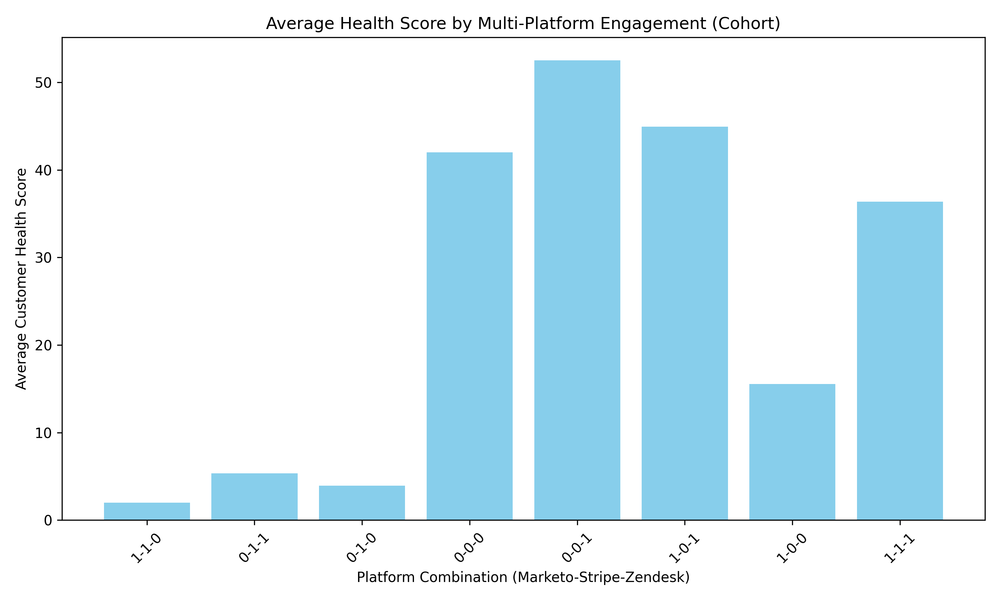

## Cohort Analysis Report: High-Engagement, Mid-Funnel Customers

### Executive Summary
We identified a cohort of **341,911 customers** who exhibit distinct mid-funnel behaviors: 10–20 days from marketing to sales, over 30 days from sales to support, and above-average engagement. This group presents unique opportunities for targeted growth and retention strategies.

### Key Findings

#### 1. Cohort Size & RFM Profile
- **Count**: 341,911 customers  
- **Recency** (avg days since last activity): 100.2  
- **Frequency** (avg active days in past year): 1.0  
- **Monetary** (avg estimated LTV): $2,684

#### 2. LTV Lift by Tier
Compared to non-cohort customers in the same tier, the cohort’s average estimated LTV difference is:
- **Basic**: +$3.8
- **Bronze**: +$61.3
- **Gold**: +$10,448.3
- **Platinum**: –$592.8
- **Silver**: +$1,560.9

Gold-tier cohort members show exceptional value potential.

#### 3. Channel Preferences
Top primary engagement channels:
1. Sales Driven – 279,699 (81.8 %)
2. Marketing Driven – 49,191 (14.4 %)
3. Webinar – 4,193 (1.2 %)

#### 4. Zendesk Active Status
- **Inactive**: 274,767 (80.4 %)
- **Active**: 67,144 (19.6 %)

#### 5. Multi-Platform Engagement Impact
Customers active on all three platforms (Marketo, Stripe, Zendesk) exhibit the highest average health score (see chart below).

### Strategic Recommendations

1. **Accelerate Support Onboarding**  
   Reduce the >30-day sales-to-support gap with proactive success outreach.

2. **Gold-Tier Focus**  
   Prioritize upsell campaigns for Gold customers given the +$10.4 k LTV lift.

3. **Channel Optimization**  
   Leverage sales-driven motions (81 % preference) while expanding webinar and partner programs to diversify engagement.

4. **Zendesk Activation**  
   Launch targeted re-engagement for the 80 % inactive Zendesk users to improve support adoption and health scores.

5. **Platform Synergy**  
   Encourage triple-platform adoption (Marketo-Stripe-Zendesk) as it correlates with superior health outcomes.

### Framework for Value & Risk Assessment
- **Value**: Combine LTV tier lift, platform synergy, and channel propensity to score expansion readiness.  
- **Risk**: Monitor activity_risk_level and engagement_velocity; intervene when risk ≥ “Medium” and velocity ≤ “Steady”.

By focusing on these levers, marketing, sales, and support can jointly convert this high-engagement cohort into long-term, high-value advocates.
