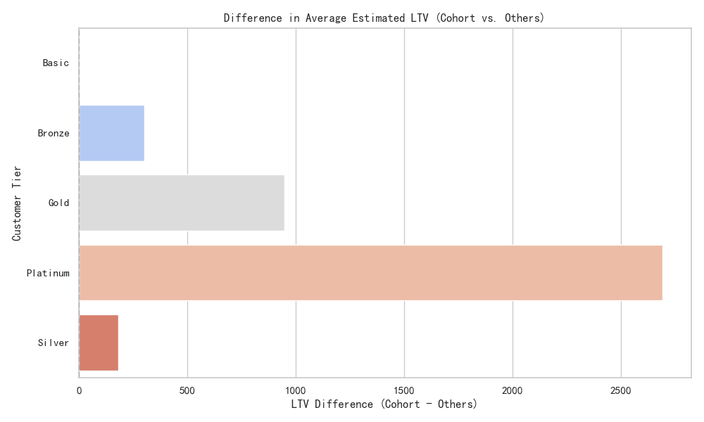
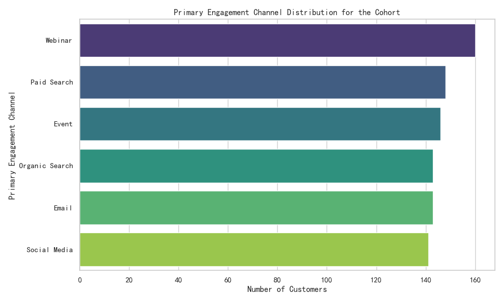
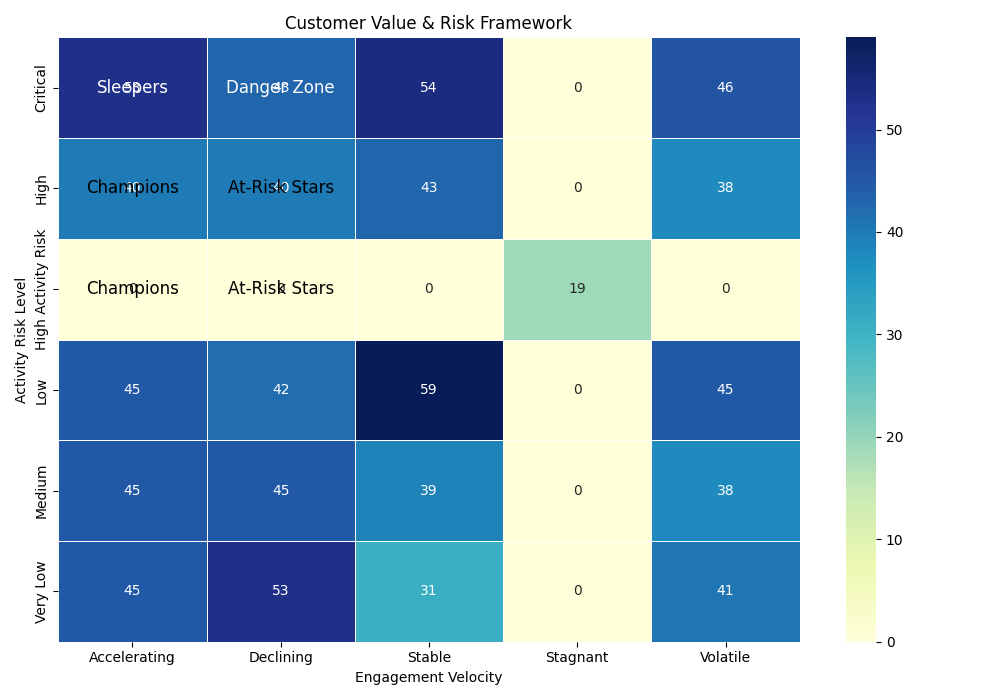

# Analysis of a High-Value Customer Cohort

## Introduction

This report provides a deep-dive analysis into a specific cohort of 881 customers identified by their unique conversion behavior: a marketing-to-sales cycle of 10-20 days, a sales-to-support cycle exceeding 30 days, and a composite engagement score higher than the company average. The analysis explores their value, behavior, and risk profile to provide actionable insights.

## I. Cohort Profile: A High-Value Segment

The identified cohort of 881 customers represents a highly engaged and valuable segment.

*   **Count:** 881 customers.
*   **RFM Scores:** This cohort exhibits strong value indicators with average RFM (Recency, Frequency, Monetary) scores significantly above the median:
    *   **Average Recency Score:** 3.69
    *   **Average Frequency Score:** 3.40
    *   **Average Monetary Score:** 3.69
*   **Support Engagement:** Only **26.9%** of this cohort are active on Zendesk, suggesting that despite a long sales-to-support transition, their need for active support is relatively low, which could indicate a smooth post-sale experience.

## II. Superior Customer Lifetime Value (LTV)

A key finding is that this cohort consistently demonstrates a higher Estimated Customer LTV compared to their peers across all customer tiers. This confirms their strategic importance.

**Key Observation:** The LTV premium is most significant for higher-value tiers, with **Platinum cohort members being worth, on average, $2,690 more** than other Platinum customers.

This data strongly suggests that the behaviors defining this cohort are leading indicators of high long-term value. Marketing and sales strategies that nurture this specific customer journey should be prioritized and scaled.

## III. Engagement & Channel Strategy

The cohort's engagement is not dominated by a single channel. Instead, they interact with the brand across a healthy mix of platforms.

*   **Distribution:** Engagement is almost evenly distributed across Webinars, Paid Search, Events, Organic Search, Email, and Social Media.
*   **Insight:** This balanced distribution implies a successful multi-channel strategy. No single channel is a silver bullet; a holistic approach is necessary to attract and retain these high-value customers.

## IV. Multi-Platform Activity and Customer Health

Analysis of engagement across Marketo, Stripe, and Zendesk reveals interesting patterns about customer health.

*   **Highest Health Score:** The highest average customer health score (74.45) is found in customers who are active on Zendesk but **not** on Marketo. This might indicate that customers who have fully transitioned away from marketing funnels and into the product/support ecosystem are the healthiest.
*   **Lowest Health Score:** The lowest health score (68.98) is seen in the `in_marketo=1, in_stripe=0, in_zendesk=1` group. These might be customers who are re-engaging with marketing material while also needing support, possibly indicating dissatisfaction or unresolved issues.

## V. A Framework for Value and Risk Assessment

To proactively manage this valuable cohort, we propose a customer assessment framework based on `Engagement Velocity` and `Activity Risk Level`.

This framework categorizes customers into distinct segments, enabling targeted interventions:

*   **Champions (Low/Medium Risk, Accelerating/Stable Velocity):** These are the core of the high-value cohort. Nurture them with loyalty programs and exclusive access. The largest group in our cohort (59 customers) is `Low Risk` and has `Stable` velocity.
*   **At-Risk Stars (High/Critical Risk, Accelerating/Volatile Velocity):** These customers are highly engaged but show signs of risk. Proactive outreach from customer success managers is critical to address potential issues before they escalate. For instance, the 53 customers in the `Critical` risk / `Accelerating` velocity group need immediate attention.
*   **Sleepers (Low Risk, Declining/Stagnant Velocity):** These customers are stable but their engagement is waning. They are prime candidates for re-engagement campaigns focused on new features or value propositions.
*   **Danger Zone (High/Critical Risk, Declining/Stagnant Velocity):** This is the highest priority group for churn prevention. The 19 customers with `High Activity Risk` and `Stagnant` velocity are particularly concerning and require immediate, high-touch intervention.

## VI. Limitations

The analysis of geographical distribution was not possible due to a lack of a common identifier between the primary customer tables and the address table. Resolving this data gap would be a valuable next step for targeted, regional marketing campaigns.

## VII. Recommendations

1.  **Protect the "At-Risk Stars":** Prioritize immediate outreach to the segments identified in the risk framework, particularly those with `Critical` or `High` risk levels, to mitigate churn and protect this high-value revenue stream.
2.  **Scale the Winning Formula:** Deconstruct the journey of the "Champions" (Low Risk, High Velocity). The patterns in their journey from marketing to sales to support should be codified and scaled to guide other customers.
3.  **Investigate Channel Mix:** Since channel engagement is diverse, further analysis should focus on the *sequence* and *combination* of channel interactions that lead to this high-value outcome.
4.  **Resolve Data Gaps:** Integrate the customer address data with a reliable key (like `primary_email`) to unlock geographical insights for targeted sales and marketing efforts.
