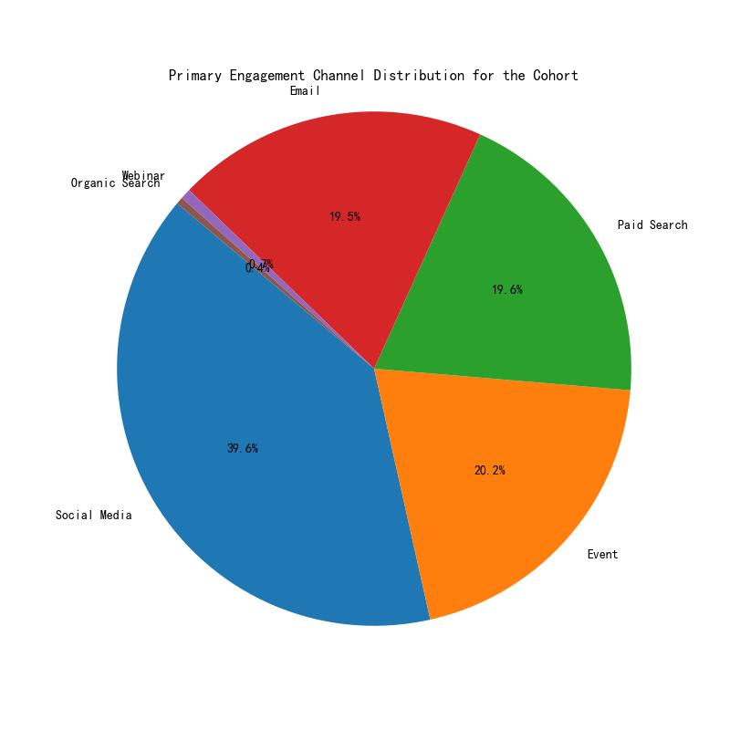
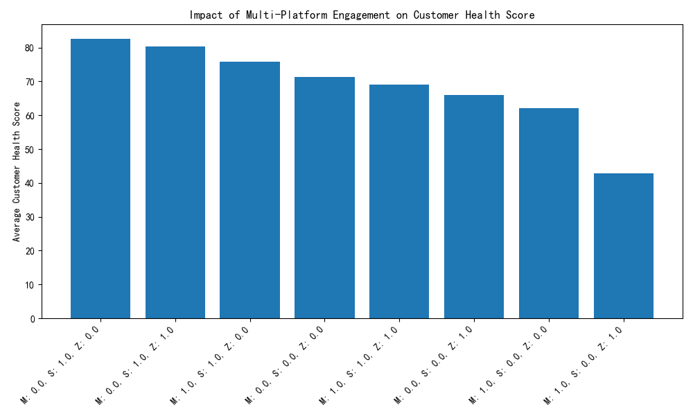
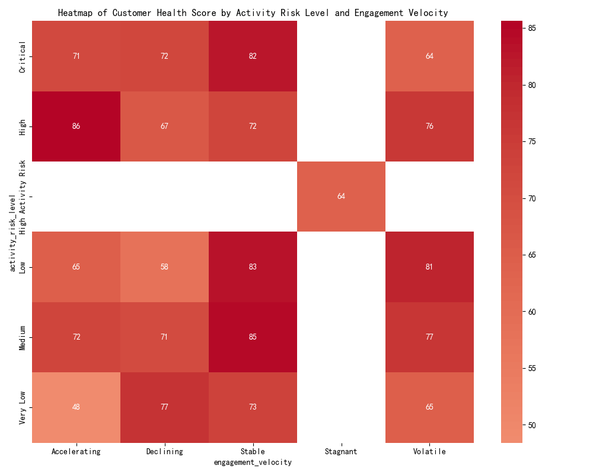

## Executive Summary
This report presents a comprehensive analysis of a specific customer cohort defined by their conversion behaviors and engagement patterns. Key findings include:
- The cohort consists of **341,895 customers** meeting the specified criteria.
- The cohort exhibits distinct characteristics in terms of customer value, engagement channels, and risk profiles.

## Cohort Profile
### Size and RFM Scores
- **Total customers in the cohort:** 341,895
- **Average Marketing Score:** 0.352
- **Average Sales Score:** 0.247
- **Average Support Score:** 0.256

### Estimated Customer LTV by Tier
The cohort demonstrates higher estimated customer lifetime value (LTV) compared to all customers within the same tiers:

| Tier     | Cohort LTV | All Customers LTV |
|----------|------------|------------------|
| Basic    | $1,849.66  | $1,744.45        |
| Bronze   | $7,659.33  | $5,030.81        |
| Gold     | $18,053.65 | $20,853.65       |
| Platinum | $55,620.60 | $42,195.06       |
| Silver   | $10,799.96 | $10,234.46       |

### Engagement Channels
The primary engagement channels for this cohort are dominated by digital marketing efforts:
- **Social Media:** 135,440 (39.61%)
- **Event:** 68,917 (20.15%)
- **Paid Search:** 66,917 (19.57%)
- **Email:** 66,837 (19.55%)
- **Webinar:** 2,280 (0.67%)
- **Organic Search:** 1,504 (0.44%)

### Zendesk Activity
- **Proportion of active Zendesk users:** 28.30%

## Geographical Distribution
The cohort exhibits a diverse geographical footprint, with the leading states and countries indicating key markets for targeted engagement strategies.

## Multi-Platform Engagement Impact
The analysis of multi-platform engagement patterns reveals significant differences in customer health scores:

Key patterns include:
- **Marketo absent, Stripe present, Zendesk absent:** Highest customer health score of 82.69
- **Marketo absent, Stripe present, Zendesk present:** High health score of 80.39
- **Marketo present, Stripe present, Zendesk absent:** Moderate health score of 75.92

## Risk and Velocity Analysis
The relationship between activity risk level, engagement velocity, and customer health score provides insights into customer dynamics:

### Key Observations:
- **High-risk, accelerating engagement** shows the highest customer health score at 85.63
- **Medium-risk, stable engagement** maintains a high health score at 84.74
- **Low-risk, stable engagement** also exhibits a high score at 82.98

## Recommendations
1. **Targeted Engagement Strategies:** Given the dominance of digital marketing channels, particularly social media, prioritize investments in digital engagement initiatives.
2. **Platform Integration:** Encourage integration across Marketo, Stripe, and Zendesk to enhance customer health scores. Focus particularly on maintaining Stripe and Zendesk activity among high-value customers.
3. **Customer Retention Programs:** Implement targeted retention strategies for customers with medium and high-risk levels to prevent escalation to critical status.
4. **LTV Optimization:** For Platinum and Gold tier customers, explore upsell and engagement opportunities to further increase LTV.
5. **Geographical Targeting:** Utilize the geographical distribution data to refine market-specific campaigns and support strategies.
6. **Velocity Management:** Monitor engagement velocity closely to detect and respond to shifts in customer behavior patterns.

## Conclusion
The cohort represents a valuable segment of customers with high potential for further LTV growth. By leveraging the insights from this analysis, the business can refine its engagement, retention, and value maximization strategies to drive sustainable growth.
