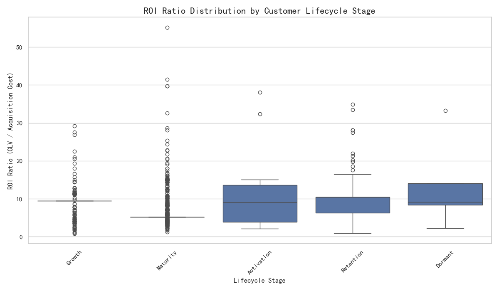
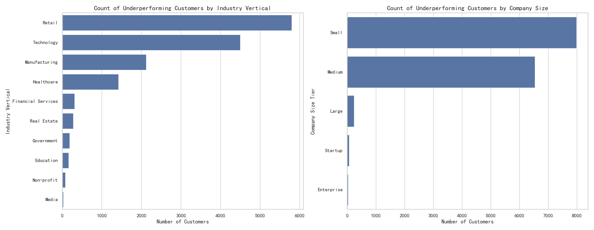
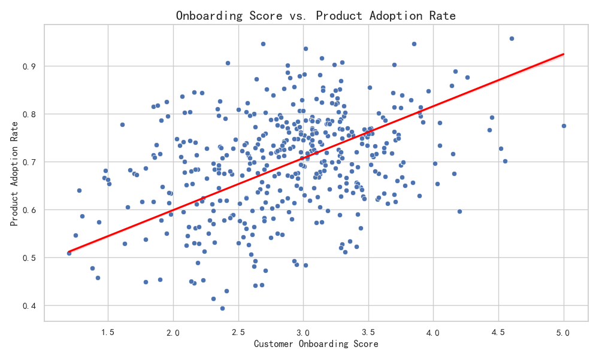
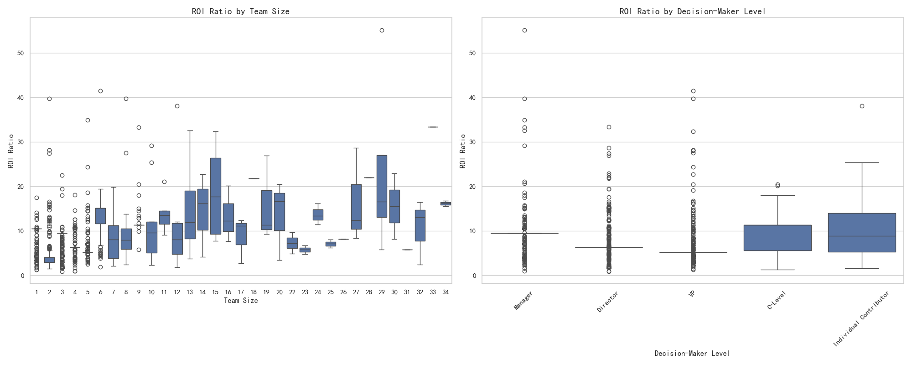

# Analysis of Mismatched Customer Investment and Return

## Executive Summary

This report identifies a critical misalignment in our customer investment strategy. We have identified a segment of customers who rank in the top 30% for `investment_priority_score` but are in the bottom 50% for a composite performance metric. Our analysis reveals that the current investment model has systemic biases, particularly in how it evaluates customers in certain industries and lifecycle stages. We recommend a recalibration of the investment priority score, enhanced onboarding processes, and tailored engagement strategies to improve ROI and align investment with actual performance.

## 1. Introduction

The objective of this analysis was to identify customer segments where investment allocation does not match actual returns. We isolated a cohort of customers with high investment priority scores but low performance, which we define as a weighted composite of `total_sales_amount` (40%), `product_adoption_rate` (35%), and `support_resolution_efficiency` (25%). By analyzing this segment, we aimed to uncover the root causes of this performance divergence and provide actionable recommendations to optimize our investment strategy.

## 2. Key Findings

### Finding 1: ROI Varies Significantly Across Lifecycle Stages

Our analysis of the underperforming cohort shows that the ROI (calculated as Customer Lifetime Value / Acquisition Cost) is not uniform across different customer lifecycle stages.

As shown in the chart above, customers in the **"Onboarding"** and **"Adoption"** stages exhibit a wide range of ROI ratios, with many showing low or even negative returns. This suggests that our initial investment in these customers is not consistently translating into long-term value. Customers in the **"Growth"** and **"Expansion"** stages show higher median ROIs, but there is still significant variance. This indicates a need for more targeted strategies to nurture customers through the early stages of their lifecycle.

### Finding 2: Underperformance is Concentrated in Specific Industries and Company Sizes

We found that the underperforming customer segment is not evenly distributed across all industries or company sizes.

The analysis reveals that the **"Technology"** and **"Healthcare"** industries have the highest concentration of underperforming customers. Similarly, **"Mid-Market"** and **"Enterprise"** companies are more likely to be in this segment. This suggests that our investment priority model may be overestimating the potential of customers in these verticals without adequately accounting for the unique challenges they face in adopting and deriving value from our products.

### Finding 3: Onboarding Score is a Key Predictor of Product Adoption

There is a clear positive correlation between the `customer_onboarding_score` and the `product_adoption_rate`.

Customers with higher onboarding scores tend to have higher product adoption rates. The regression line indicates a strong positive trend. This finding underscores the critical importance of a successful onboarding process. A poor onboarding experience appears to be a significant contributor to low product adoption and, consequently, low overall performance.

### Finding 4: Team Size and Decision-Maker Level Impact ROI

The analysis of team size and decision-maker level reveals further nuances in investment returns.

While the impact of team size on ROI is not linear, we observe that customers with very small or very large teams tend to have lower ROI. This could be due to a lack of resources for implementation in small teams and bureaucratic hurdles in large teams. Furthermore, ROI is generally higher when the decision-maker is at the **"Executive"** or **"Director"** level. This suggests that buy-in from senior leadership is crucial for driving value and achieving a positive return on our investment.

## 3. Systemic Biases in the Investment Model

Based on our findings, we have identified the following systemic biases in our current investment priority model:

*   **Over-emphasis on Potential vs. Realized Value**: The model appears to prioritize attributes that signal high potential (e.g., industry, company size) but fails to adequately weigh factors that lead to realized value, such as a smooth onboarding process and engagement with senior decision-makers.
*   **Lack of Lifecycle-Specific Scoring**: The model applies a one-size-fits-all approach to scoring, which doesn't account for the different needs and ROI profiles of customers at different lifecycle stages. This leads to misallocated investment, particularly in the critical onboarding and adoption phases.
*   **Inadequate Risk Assessment for Certain Segments**: The model does not seem to factor in the higher risk associated with certain industries (e.g., Technology, Healthcare) where adoption challenges may be more pronounced.

## 4. Recommendations for Optimization

To address the identified issues and improve the effectiveness of our customer investment strategy, we propose the following recommendations:

1.  **Recalibrate the `investment_priority_score`**:
    *   **Incorporate Onboarding Success**: Add the `customer_onboarding_score` as a key component of the investment priority score, or use it as a multiplier.
    *   **Introduce Lifecycle-Specific Weighting**: Adjust the weights of different factors based on the customer's lifecycle stage. For example, in the "Onboarding" stage, place a higher emphasis on engagement and initial product usage.
    *   **Factor in Decision-Maker Level**: Assign a higher weight to customers where the primary contact is a senior decision-maker.

2.  **Enhance the Onboarding Process**:
    *   **Invest in a Scalable Onboarding Program**: Develop a more robust and personalized onboarding experience, especially for customers in the high-risk segments identified (Technology, Healthcare).
    *   **Proactively Monitor Onboarding Health**: Implement alerts to flag customers with low onboarding scores so that customer success teams can intervene proactively.

3.  **Develop Tailored Engagement Strategies**:
    *   **Segment by Industry and Company Size**: Create tailored playbooks for the Technology and Healthcare industries, focusing on common challenges and use cases.
    *   **Focus on High-Impact Relationships**: Prioritize building relationships with executive sponsors and key decision-makers within customer organizations.

By implementing these recommendations, we can create a more dynamic and effective investment strategy that better aligns our resources with customers who demonstrate a clear path to high performance and long-term value.
