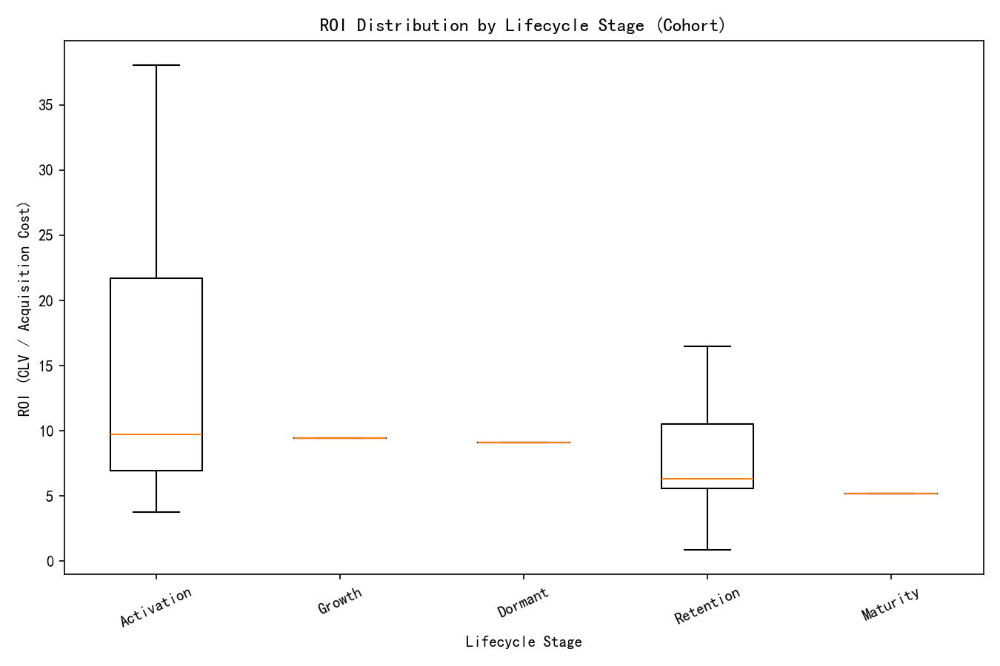
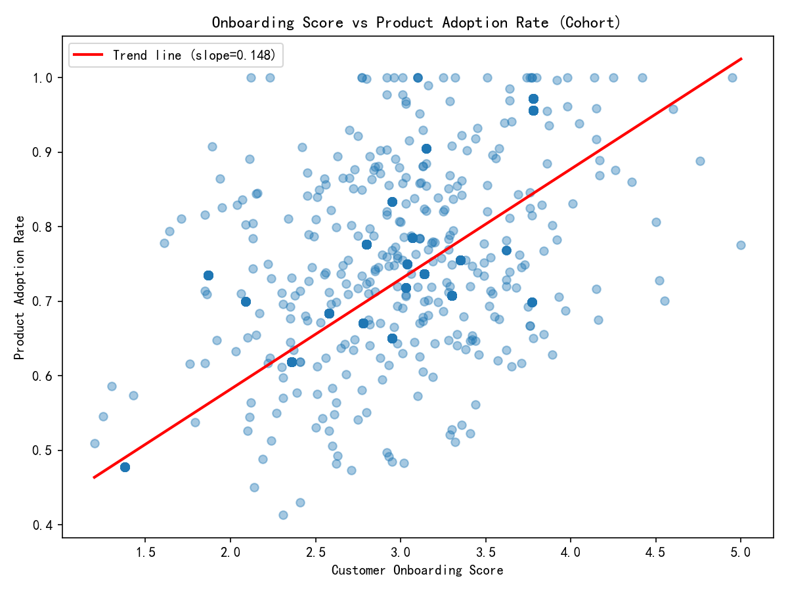

# Investment Misallocation Analysis: Identifying High-Priority, Low-Return Customer Cohorts

## Executive Summary
We identified a cohort of 6,231 customers who are prioritized for investment (top 30% by investment_priority_score) yet underperform (bottom 50% by a composite performance metric weighted as 40% total_sales_amount, 35% product_adoption_rate, and 25% support_resolution_efficiency). This mismatch signals potential misallocation of resources.

Key findings:
- The misaligned cohort is concentrated in Growth (2,240), Maturity (1,977), and Retention (1,236) lifecycle stages, underscoring mid-to-late lifecycle friction areas.
- Strong positive correlation between customer_onboarding_score and product_adoption_rate (Pearson ≈ 0.759), indicating onboarding quality is a pivotal driver of adoption.
- Team_size shows a mild positive correlation with ROI (≈ 0.216); decision_maker_level exhibits a clear gradation in ROI, with higher seniority associated with higher ROI (C-Level/Individual Contributor groups show the highest median ROI among the cohort).
- Time_to_value_days is moderately positively correlated with ROI (≈ 0.379), suggesting larger deployments may require longer time-to-value but can deliver better returns when fully realized.
- Segment-level root cause analysis highlights Technology–Small companies as the weakest ROI segment within the cohort (median ROI ≈ 5.17; n ≥ 30), indicating systematic over-prioritization of this segment relative to realized returns.

These results point to biases in the current investment decision model: over-weighting signals like renewal likelihood and generic strategic classification, under-weighting operational performance (adoption and support), and insufficient segment/lifecycle calibration. We propose a recalibration of the investment_priority_score to incorporate composite performance, segment-aware weights, and gate criteria on adoption momentum and support efficiency.

## Data & Method
- Data sources: customer360__customer and customer360__customer_value_analysis, joined on primary_email (completeness: 100% within the value analysis table; resulting joined dataset: 36,019 rows).
- Composite performance metric: 0.40×total_sales_amount + 0.35×product_adoption_rate + 0.25×support_resolution_efficiency.
- Cohort selection thresholds:
  - Top 30% by investment_priority_score: threshold at approximately 1.8 (70th percentile).
  - Bottom 50% by composite_performance: median ≈ 2,313.94.
- ROI ratio: customer_lifetime_value / acquisition_cost (when acquisition_cost > 0).

## Cohort Distribution by Lifecycle Stage
Counts in the misaligned cohort:
- Growth: 2,240
- Maturity: 1,977
- Retention: 1,236
- Dormant: 765
- Activation: 13

Interpretation:
- Misalignment is most prevalent in Growth and Maturity stages—these customers receive high priority but underperform on sales/adoption/support efficiency. The ROI distribution across stages (see boxplot) corroborates that Maturity and Retention stages have lower median ROI, while Growth/Dormant show higher variability and potential upside.

Visual: ROI distribution by lifecycle stage

## Behavioral Root Causes by Industry Vertical and Company Size
- Bottom segment by ROI (n ≥ 30): Technology–Small, median ROI ≈ 5.17, with relatively lower adoption medians. This suggests our investment model systematically favors small Technology companies despite weaker realized returns in this cohort.
- Other notable segments (from top-10 by count) show varied ROI medians and adoption profiles, e.g., Healthcare (Medium/Large) and Technology (Enterprise/Medium) with stronger ROI medians, indicating better fit for prioritized investments.

Diagnostic implications:
- Segment heterogeneity requires differentiated playbooks. Technology–Small customers may demand either lighter-touch investment or targeted enablement to correct adoption and support gaps before allocating growth budgets.

## Onboarding and Adoption Dynamics
- Pearson correlation (cohort): customer_onboarding_score vs product_adoption_rate ≈ 0.759 (strong).
- Actionable insight: Onboarding quality is a major lever. For the misaligned cohort, increasing onboarding effectiveness is likely to drive adoption and lift composite performance. This effect is direct and sizable.

Visual: Onboarding vs adoption (scatter with trend line)

## Organizational Mechanics: Team Size and Decision Maker Level
- Team_size vs ROI correlation ≈ 0.216 (mild positive). Larger teams tend to yield slightly better ROI—possibly due to broader deployments and higher product breadth usage.
- Decision_maker_level summary (sample sizes in parentheses):
  - C-Level (68): highest ROI median among senior roles; high adoption median.
  - Manager (92): elevated ROI median relative to Director/VP.
  - Director (111), VP (118): lower ROI medians.
  - Individual Contributor (21): high ROI median—likely an artifact of small sample size or specialized use-cases where IC-level champions drive strong product utilization.
Interpretation:
- Securing senior executive sponsorship (C-Level) correlates with better investment effectiveness. However, the unexpectedly high ROI for Individual Contributor group warrants deeper qualitative review due to small n and potential niche workflows.

## Time-to-Value and ROI
- time_to_value_days vs ROI correlation ≈ 0.379 (moderate positive).
Interpretation:
- Some higher-ROI accounts take longer to realize value—often larger or more complex deployments. Investment models should account for lifecycle and deployment complexity to avoid prematurely downgrading accounts with long time-to-value but high eventual ROI.

## Evidence of Systemic Biases in the Investment Decision Model
- Over-emphasis on generalized “priority” signals (e.g., renewal_probability, strategic_classification) without sufficient anchoring to realized performance (sales, adoption, support efficiency).
- Under-weighting operational signals:
  - Adoption momentum (e.g., recent feature_adoption_breadth and product_usage_frequency).
  - Support resolution efficiency and sentiment.
  - Early time-to-value gates.
- Insufficient segment-aware calibration:
  - Technology–Small cohort systematically over-prioritized despite low ROI in the misaligned set.
- Lifecycle-stage neutrality:
  - Current scores may not reflect stage-specific performance risks—Maturity and Retention need different thresholds and weights than Activation/Growth.

## Recommendations (Prescriptive)
1. Recalibrate investment_priority_score using performance-integrated features:
   - Add composite_performance as a core component with significant weight.
   - Include adoption velocity proxies (recent changes in product_usage_frequency, feature_adoption_breadth).
   - Incorporate support_resolution_efficiency and ticket sentiment as negative signals when poor.
2. Segment-aware weighting:
   - Apply segment multipliers: penalize Technology–Small segment unless adoption and support metrics meet minimum gates.
   - Boost weights for segments with historically stronger ROI in this cohort (e.g., Healthcare Medium/Large; Technology Enterprise) when adoption momentum is present.
3. Lifecycle-stage gating:
   - Maturity/Retention: require minimum adoption and support thresholds before allocating expansion investments.
   - Growth: focus investments on accelerating onboarding and expanding feature breadth, monitored via short-interval KPIs.
4. Onboarding-led interventions:
   - Prioritize onboarding improvements for the misaligned cohort (playbooks, guided setup, customer education).
   - Track onboarding NPS and time-to-first-value; use these as early de-prioritization signals when below target.
5. Decision-maker engagement strategy:
   - Elevate executive sponsorship (C-Level) in target accounts; align with value narratives to accelerate ROI.
   - For Manager/Director heavy accounts, invest in internal champions and structured enablement to boost adoption.
6. Time-to-value informed budgeting:
   - Distinguish between long-but-high-potential deployments and genuine stagnation.
   - Introduce time-boxed milestones; if adoption momentum lags, taper investment and redirect to higher-ROI segments.
7. Model monitoring and A/B experimentation:
   - Deploy the recalibrated model to a test segment; compare ROI uplift and performance over 2–3 quarters.
   - Continuously re-estimate weights using out-of-sample validation to avoid drift.

## Limitations & Next Steps
- Joining via email, while performant and comprehensive in the analysis table, may miss edge cases where email mismatches occur. Future iterations can integrate robust ID linking (Marketo/Stripe/Zendesk) with deduplication to avoid row explosion.
- Some subgroup analyses (e.g., Individual Contributor) are based on smaller samples; interpret with caution and augment with qualitative reviews.
- Consider adding predictive modeling (e.g., gradient boosting) to estimate expected ROI under different investment scenarios, enabling prescriptive budget allocation at the account level.

## Appendix: Core Metrics Used
- Composite Performance = 0.40×total_sales_amount + 0.35×product_adoption_rate + 0.25×support_resolution_efficiency
- ROI Ratio = customer_lifetime_value / acquisition_cost
- Selection thresholds: investment_priority_score ≥ 70th percentile; composite_performance ≤ median

Visual assets generated:
- cohort_onboarding_vs_adoption.png
- cohort_roi_by_lifecycle_stage.png

Plots were created in Python (matplotlib) and saved in the working directory; code was included in the execution transcript above.
