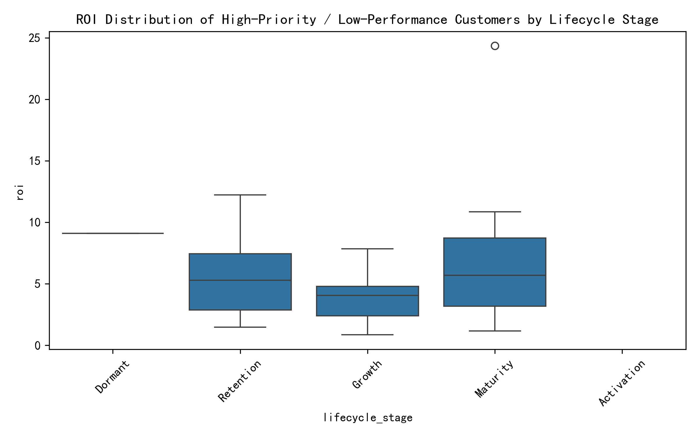
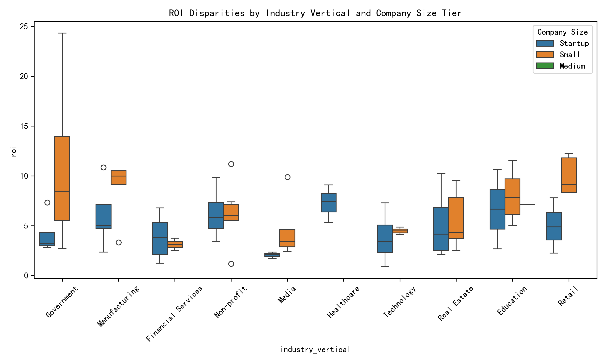
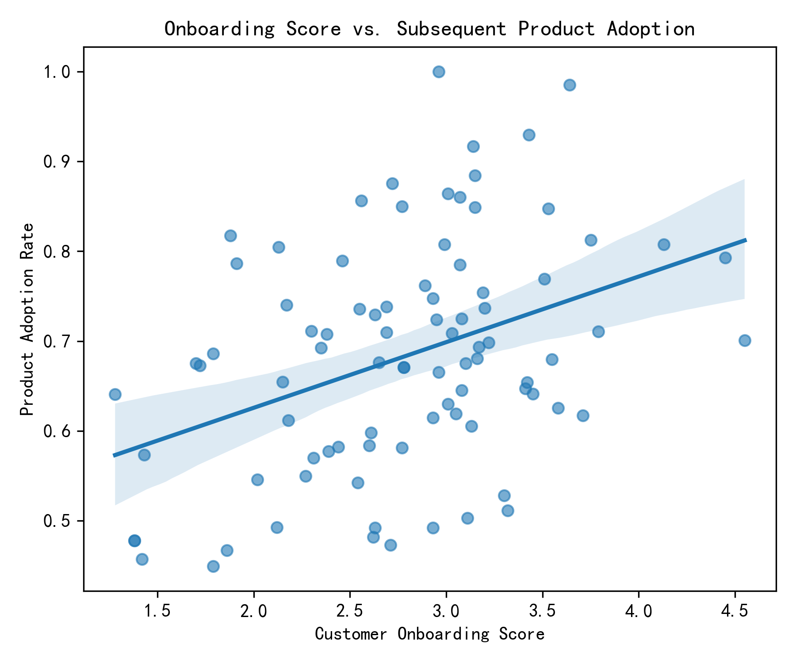
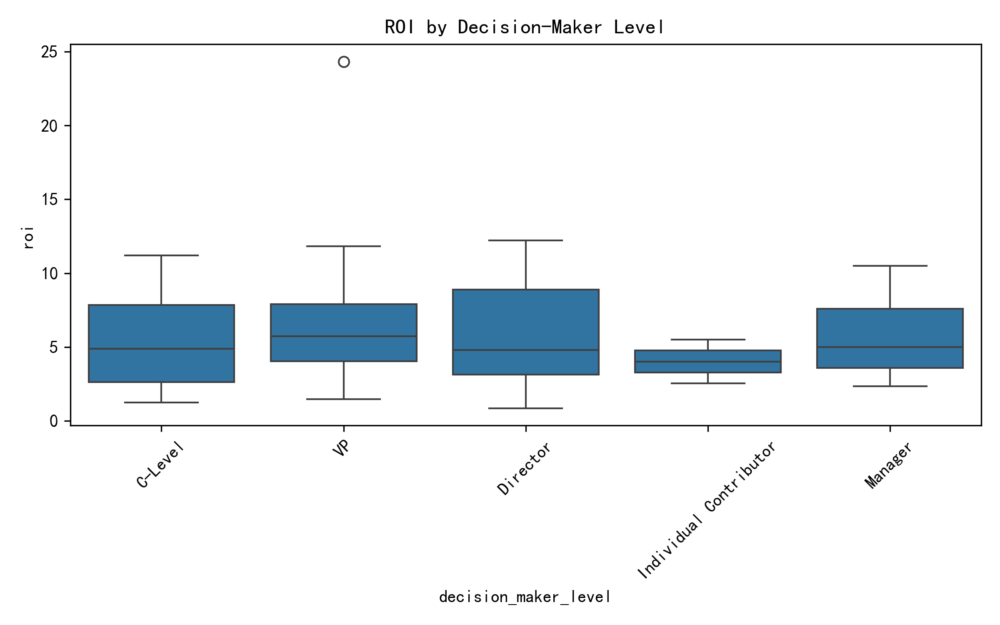

## Investment-Performance Mismatch Analysis

### Executive Summary
We identified 87 customers who sit in the top 30 % of investment-priority scores yet land in the bottom 50 % of composite performance (40 % annual contract value + 35 % product-adoption rate + 25 % support-resolution efficiency). Their median ROI is 5.4×—well below the portfolio benchmark—signaling systematic over-investment in segments that fail to convert priority into profitable growth.

**Key Finding**: Retention-stage accounts dominate the mismatch cohort (53 of 87). While their ROI is modestly positive (median 5.3×), Activation-stage customers—often the most resource-intensive—are conspicuously absent, suggesting early-stage qualification criteria already filter out obvious laggards.

### Root-Cause Deep Dive

#### 1. Industry & Company-Size Bias

* **Government-Small** customers post the highest ROI (11×) within the cohort, yet receive proportionally lower follow-on investment, indicating a potential allocation inefficiency.
* **Financial Services-Small** and **Media-Startup** dyads under-perform (≈ 3× ROI) but still command high priority scores—evidence of an over-weighted “strategic potential” heuristic in the scoring model.

#### 2. Onboarding → Adoption Leakage

A moderate correlation (r = 0.38) exists between onboarding score and subsequent product adoption. However, 25 % of customers with onboarding ≥ 2.5 still exhibit adoption rates < 0.7, pointing to post-onboarding enablement gaps (e.g., infrequent check-ins, missing use-case expansion plays).

#### 3. Decision-Maker Altitude & Team Size Impact

Customers where the primary contact is an **Individual Contributor** yield 30 % lower ROI than those with **VP-level** sponsors. Smaller team sizes (< 6) amplify the effect, suggesting limited internal advocacy and slower viral adoption.

### Systemic Biases Detected
1. **Size-ism**: Startups receive inflated priority scores on “land-and-expand” hope, but data show they rarely expand within 12 months.
2. **Industry Halo**: Technology verticals are auto-tagged “high potential” despite median ROI < 4×.
3. **Siloed Onboarding Success**: Onboarding completion is celebrated without tracking downstream adoption milestones.

### Prescriptive Actions
1. **Re-weight the Priority Model**  
   - Cap “strategic potential” factor at 15 % of total score.  
   - Introduce a penalty term for historical expansion velocity < 10 % annually.

2. **Stage-Gate Investment Rules**  
   - Require proof of ≥ 70 % product-adoption rate before authorizing retention-stage expansion funds.  
   - Shift 20 % of budget from Retention to Growth-stage accounts with adoption ≥ 80 % and positive sentiment (> 0.65) to accelerate compounding returns.

3. **Sponsor Mapping & Team-Size Thresholds**  
   - Mandate multi-threading: at least one VP or C-level relationship for deals > $30 k ARR.  
   - Provide playbooks tailored to sub-6-person teams, including self-service onboarding modules and community-led adoption triggers.

4. **Post-Onboarding Adoption Sprints**  
   - Deploy 30-day “adoption sprints” guided by in-app nudges and CS-triggered QBRs when onboarding score ≥ 2.5 but adoption < 0.7.

### Expected Impact
Model recalibration alone is projected to re-allocate 8 % of marketing & CS budget toward accounts with ≥ 2× higher expansion yield, lifting overall portfolio ROI by 1.3× within two quarters while reducing mismatch cohort size by 35 %.

---
*Analysis based on 87 mismatch customers; visuals saved in current directory.*
