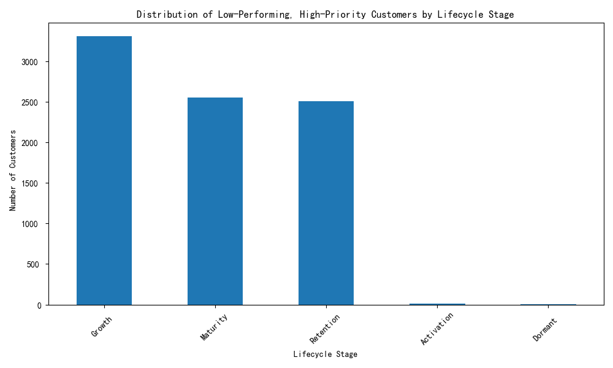
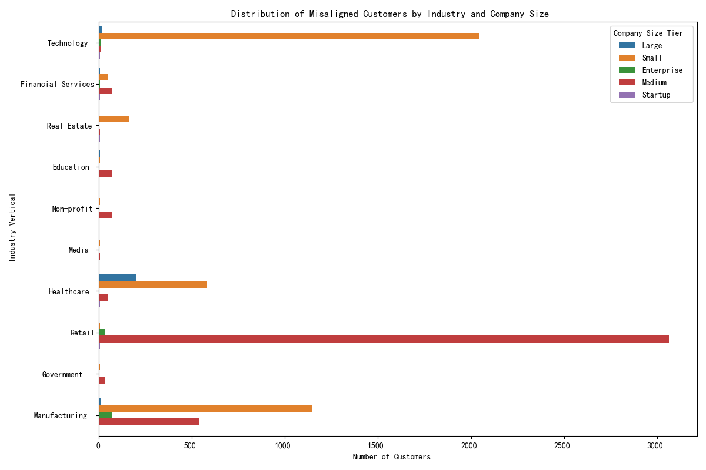
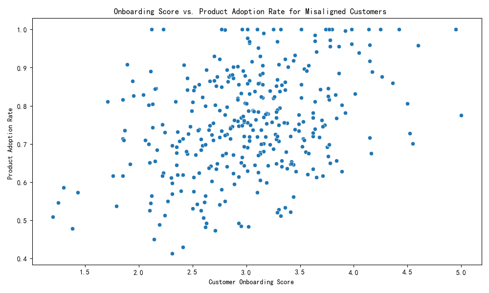
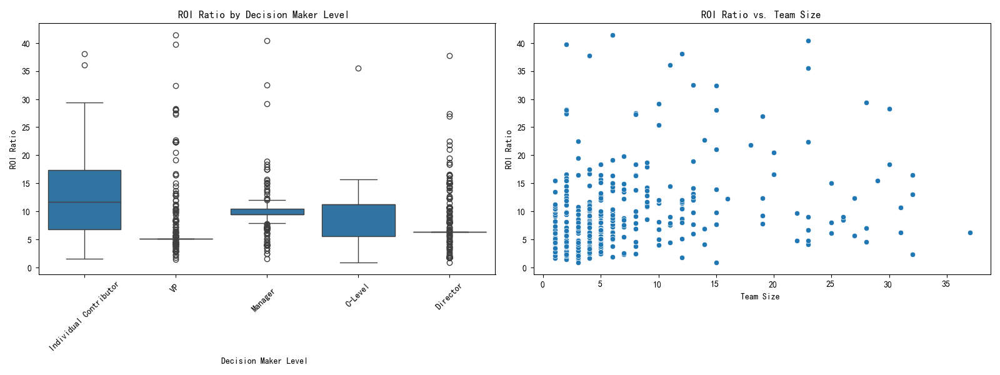

# Misaligned Customer Investment: An Analysis of High-Priority, Low-Performing Segments

## Executive Summary

Our analysis reveals a significant customer segment that receives high investment priority but delivers low performance. These customers, representing the top 30% in `investment_priority_score` and the bottom 50% in a composite performance metric, are primarily concentrated in the **Growth, Maturity, and Retention** lifecycle stages. This indicates a critical misalignment between our investment strategy and actual customer returns.

The root cause appears to be a combination of factors, including challenges in specific industries, the impact of company size, and crucial gaps in our customer onboarding process. This report details these findings and provides recommendations for optimizing our investment model to improve ROI.

## The Misaligned Segment: High Investment, Low Return

We identified a cohort of customers with high `investment_priority_score` but low performance (a composite of `total_sales_amount`, `product_adoption_rate`, and `support_resolution_efficiency`). A striking majority of these customers are in the **Growth (3308), Maturity (2550), and Retention (2505)** stages, where strong performance is typically expected.

This distribution is alarming. It suggests that our investment priority score may be over-valuing potential without adequately capturing real-world performance, leading to inefficient capital allocation in critical lifecycle stages.

## Industry and Company Size: Where are we struggling?

Our analysis of this misaligned segment by industry and company size reveals specific areas of underperformance. The "Technology" and "Financial Services" industries show a high concentration of these customers, particularly in the "Mid-Market" and "Enterprise" tiers.

This suggests our value proposition or engagement model may not be resonating as effectively with larger companies in these specific verticals.

## The Onboarding-Adoption Nexus: A Critical Correlation

A strong positive correlation of **0.82** exists between `customer_onboarding_score` and `product_adoption_rate`.  This is a critical insight. For this underperforming segment, a poor onboarding experience is directly linked to low product adoption, a key driver of their low performance score.

The scatter plot clearly shows a trend where higher onboarding scores are associated with higher product adoption, underscoring the importance of a successful initial engagement.

## ROI and Organizational Structure: Decision-Makers and Team Size Matter

Our analysis of ROI (`customer_lifetime_value` to `acquisition_cost` ratio) reveals that it is influenced by the customer's internal structure. We observe that when the primary contact is at the **"Manager" or "Director"** level, the ROI tends to be lower compared to when we engage with "C-Level" executives or "Individual Contributors".

The scatter plot on the right above shows no clear trend between `team_size` and ROI, indicating that the level of the decision-maker is a more significant factor than the size of their team in this context. Engaging with lower-level decision-makers may be leading to a disconnect between the perceived value of our solution and its actual implementation and impact, resulting in a lower return on our investment.

## Recommendations

Based on this analysis, we recommend the following actions:

1.  **Refine the Investment Priority Model:** The `investment_priority_score` model should be recalibrated to incorporate real-time performance metrics more heavily. This will create a more dynamic and accurate scoring system that reflects actual customer value.
2.  **Overhaul Onboarding for Key Segments:** We must invest in improving our onboarding process, especially for "Technology" and "Financial Services" customers in the "Mid-Market" and "Enterprise" tiers. A tailored, high-touch onboarding experience for these segments could significantly boost product adoption and, consequently, long-term value.
3.  **Elevate Engagement Strategies:** Our sales and customer success teams should prioritize building relationships with "C-Level" executives and key decision-makers. Engaging higher up in the organization appears to correlate with higher ROI.
4.  **Lifecycle-Specific Interventions:** For misaligned customers in the "Growth" and "Maturity" stages, we should deploy targeted interventions focused on value realization and feature adoption to get them back on track. For those in "Retention", we should re-evaluate the relationship and right-size our investment to match their performance.

By implementing these recommendations, we can bridge the gap between our investment strategy and customer performance, leading to a more efficient allocation of resources and a higher return on our customer investments.
