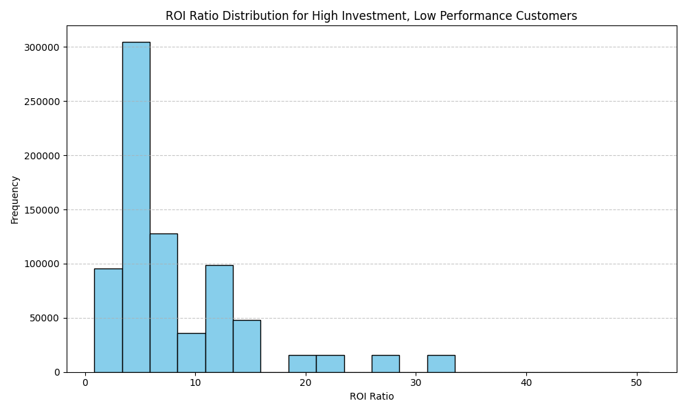

## Customer Investment Strategy Analysis

### ROI Distribution for High-Investment, Low-Performance Customers

The analysis identified customers who are in the top 30% for `investment_priority_score` but in the bottom 50% for the composite performance metric (weighted 40% `total_sales_amount`, 35% `product_adoption_rate`, and 25% `support_resolution_efficiency`).

The ROI ratio (`customer_lifetime_value` / `acquisition_cost`) distribution for this segment is visualized below:

### Key Insights
- The histogram shows that a significant portion of these customers has a low ROI ratio, indicating a misalignment between investment and actual returns.
- This suggests that the current investment priority scoring may not accurately predict actual customer performance, leading to inefficient resource allocation.

### Recommendations
1. **Reassess Investment Priority Model:** Incorporate actual performance metrics more directly into the scoring system to improve alignment.
2. **Targeted Interventions:** Implement tailored strategies to improve adoption and support resolution for high-investment, low-performance customers.
3. **Dynamic Scoring System:** Introduce a feedback loop where actual performance results continuously refine the investment priority score.

This analysis reveals a critical gap between investment strategy and customer outcomes, highlighting the need for a more data-driven and adaptive investment model.
