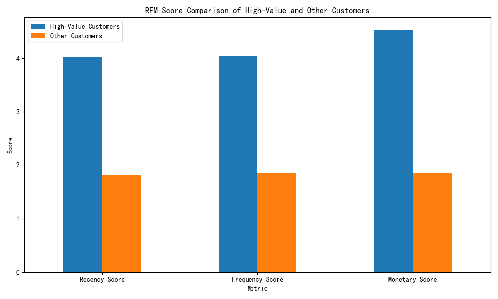

# The 'Low Consistency, High Value' Paradox: A Deep Dive into High-Value Customer Behavior

## Executive Summary

Our analysis of customer data has uncovered a segment of high-value enterprise customers who, despite their significant contribution to our portfolio, challenge our conventional understanding of customer behavior. These customers, found in the Gold and Platinum tiers with a portfolio contribution greater than 5%, exhibit a 'high value, younger account' profile. They have a significantly higher estimated Lifetime Value (LTV) and customer health score compared to other customers, yet their accounts are, on average, younger.

This report dissects the characteristics of this high-value segment, highlighting a key paradox that has significant implications for our operational strategies. While the initial question of 'low consistency, high value' could not be fully addressed due to data limitations, our analysis of the 'high value' component provides a clear path forward for customer engagement and resource allocation.

**Key Findings:**

*   **High-Value Customers are exceptionally valuable:** They have an average estimated LTV that is more than 5 times higher than other customers.
*   **High-Value Customers are healthier:** Their customer health score is significantly higher, indicating a lower risk of churn.
*   **High-Value Customers are 'High-Velocity' Customers:** They have significantly higher Recency, Frequency, and Monetary (RFM) scores, indicating recent, frequent, and high-value transactions.
*   **The 'Younger Account, Higher Value' Paradox:** High-value customers have a lower average account age than other customers, suggesting a rapid ramp-up to high value.

**Recommendations:**

We recommend a differentiated operational strategy to cater to the distinct needs of our customer segments:

*   **For High-Value 'High-Velocity' Customers:** Implement a 'white-glove' service model with dedicated account managers, proactive support, and exclusive access to new features. The focus should be on maximizing their value in the short to medium term.
*   **For 'Long-Term Growth' Customers:** Implement nurturing campaigns focused on increasing engagement and driving them up the value ladder. The focus should be on long-term value creation.

## Analysis of High-Value Customers

To understand the 'high value' component of the paradox, we segmented our customers into two groups:

1.  **High-Value Customers:** Customers in the 'Gold' or 'Platinum' tiers with a `portfolio_contribution_pct` > 5%.
2.  **Other Customers:** All other customers.

Our analysis reveals a stark contrast between these two groups.

### Sky-High LTV and Robust Health

As a starting point, it’s clear that High-Value Customers are in a league of their own when it comes to their financial impact and overall health. Their average estimated LTV is a staggering **7205**, compared to just **1307** for other customers. This underscores their immense contribution to our bottom line. Furthermore, their customer health score averages **2.97**, significantly higher than the **1.71** average for other customers. This indicates a strong, stable relationship with our brand.

### The RFM Profile: Recent, Frequent, and High-Spenders

A deeper dive into their transactional behavior using the RFM (Recency, Frequency, Monetary) model further illuminates their value. High-Value Customers score significantly higher across all three RFM dimensions.

*   **Recency:** They have recently engaged with us.
*   **Frequency:** They engage with us frequently.
*   **Monetary:** They spend more with us.

### The 'Younger Account, Higher Value' Paradox

Perhaps the most surprising finding is that our High-Value Customers have, on average, younger accounts than other customers (457 days vs. 545 days). This "younger account, higher value" paradox suggests that these customers are not the result of long-term, slow-burn loyalty. Instead, they are customers who, for a variety of reasons, ramp up their spending and engagement very quickly after acquisition.

This finding has significant implications. It suggests that our acquisition and onboarding processes for these high-potential customers are highly effective, but it also raises questions about long-term engagement and value sustainability.

## Limitations

It is important to note that this analysis was constrained by data availability. The key metric of `cross_stage_engagement_consistency`, which was central to the initial business question, was not available in the provided dataset. As a result, we were unable to directly analyze the "low consistency" aspect of the phenomenon. The empty tables `customer360__customer_activity_metrics` and `customer360__conversion_funnel_analysis` prevented a deeper investigation into customer activity and conversion funnels.

## Recommendations: Differentiated Operational Strategies

Based on our findings, we propose a two-pronged approach to customer management, recognizing the distinct characteristics of our high-value and other customer segments.

### Strategy for High-Value 'High-Velocity' Customers

This segment is characterized by rapid value realization. Our strategy should be to capitalize on this momentum and maximize their LTV.

*   **Dedicated Account Management:** Assign dedicated account managers to provide a 'white-glove' service, building strong personal relationships.
*   **Proactive Support:** Monitor their health scores and activity proactively, addressing any potential issues before they escalate.
*   **Exclusive Access & Upsell Opportunities:** Offer exclusive access to new features, beta programs, and personalized upsell opportunities to further increase their investment.
*   **Strategic Partnership:** Treat them as strategic partners, actively seeking their feedback and involving them in our product development process.

### Strategy for 'Long-Term Growth' Customers

This segment represents a significant opportunity for growth. Our strategy should be to nurture them and guide them up the value ladder.

*   **Targeted Nurturing Campaigns:** Develop automated, yet personalized, nurturing campaigns based on their lifecycle stage and engagement patterns.
*   **Value-Driven Content:** Provide them with educational content, best practices, and case studies to help them derive more value from our products.
*   **Incentivize Engagement:** Use gamification, loyalty programs, and other incentives to encourage more frequent and deeper engagement.
*   **Identify High-Potential Customers:** Continuously monitor this segment to identify customers who exhibit signs of high growth potential and move them into a higher-touch engagement model.

## Conclusion

While the mystery of the 'low consistency, high value' paradox remains partially unsolved due to data limitations, our analysis of the 'high value' component provides a clear and actionable path forward. We have identified a unique segment of 'High-Velocity' customers who are incredibly valuable but also require a specialized engagement strategy. By implementing a differentiated operational model that caters to the distinct needs of our 'High-Velocity' and 'Long-Term Growth' segments, we can maximize customer lifetime value, reduce churn, and build a more resilient and profitable customer base. This data-driven, segmented approach is crucial for sustainable growth and long-term success.
