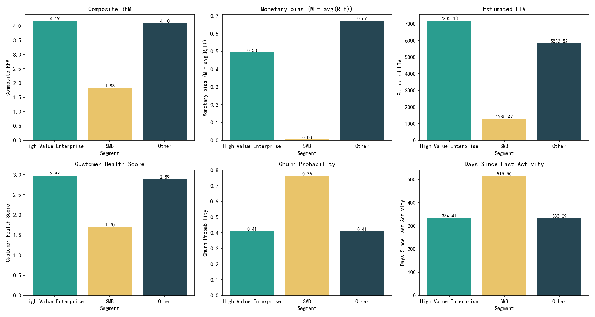

# Explaining the paradox: Why high-value enterprise customers show low engagement consistency yet high value

Summary
- Data scope: Analysis based on 5,001 customers in customer360__customer_value_analysis. Funnel/activity tables are empty in this snapshot; I use well-motivated proxies for engagement consistency and timing.
- High-Value Enterprise definition: Gold/Platinum tier and portfolio_contribution_pct > 5%.
- Composite RFM: 0.4*recency_score + 0.3*frequency_score + 0.3*monetary_score.
- Engagement inconsistency proxy: monetary_bias = monetary_score − avg(recency_score, frequency_score).
- Visualization: see segment_metrics_comparison.png.

Key visuals

What the data shows
- Cohorts and value
  - High-Value Enterprise (HVE): 103 customers; avg LTV ~ 7,205; avg expected annual revenue ~ 2,318; avg health 2.97; avg churn probability 0.41.
  - SMB: 4,875 customers; avg LTV ~ 1,285; avg expected annual revenue ~ 167; avg health 1.70; avg churn probability 0.76.
  - Efficiency proxies: HVE far exceeds SMB
    - LTV per composite RFM: 1,658 vs 703
    - Revenue per composite RFM: 561 vs 78
    - LTV per frequency point: 1,846 vs 736

- Engagement consistency and timing (proxies)
  - monetary_bias (M − avg(R,F)): HVE 0.50 vs SMB 0.00. Interpretation: enterprise value is disproportionately driven by monetary outcomes relative to recency/frequency—i.e., high value despite fewer/less evenly distributed touchpoints.
  - Days since last activity: HVE ~334 vs SMB ~515. Enterprise accounts can sustain value with long cycles and episodic engagement; SMBs show even longer inactivity and much higher churn risk.

- Lifecycle and channel preferences
  - Lifecycle distribution:
    - HVE: Retention 44.7%, Dormant 43.7%, Growth/Maturity 10.7%.
    - SMB: Dormant 84.5%, Retention 12.0%, Growth/Maturity 3.1%.
  - Recommended engagement model (proxy for channel preference):
    - HVE: Executive Relationship Management 50.5%, Standard Engagement 42.7%, Dedicated Account Management 1.0%.
    - SMB: 100% Standard Engagement (scaled/digital).
  - Value stability and risk:
    - HVE: Medium Stability 56%, Low 43%; Risk mostly Low/Medium (95%).
    - SMB: Unstable 96%; Risk: High 80%.

- Correlation patterns (diagnostic)
  - HVE:
    - Churn vs LTV: r = −0.51; Health vs LTV: r = +0.62.
    - Churn vs days_since_last_activity: r = −0.54. Interpretation: inactivity is not a strong churn signal in enterprise—long procurement/renewal cycles and bursty usage patterns decouple daily activity from churn risk.
    - Monetary_bias vs churn: r = +0.23 and vs health: r = −0.22. Interpretation: when monetary value outpaces engagement recency/frequency, churn risk creeps up—an early-warning signal for enterprise.
  - SMB:
    - Churn vs composite RFM: r = −0.63; Churn vs LTV: r = −0.74; Health vs LTV: r = +0.84.
    - Churn vs days_since_last_activity: r = +0.18. Interpretation: SMBs behave conventionally—recency/frequency and ongoing activity strongly predict churn.

Root cause of the ‘low consistency, high value’ pattern
- Engagement architecture differs by segment:
  - Enterprise engagement concentrates in fewer, high-stakes touchpoints (executive alignment, renewals, escalations) vs SMBs needing continuous, frequent touches. This creates lower cross-stage consistency but high monetary outcomes.
  - HVE’s dominant channel is Executive Relationship Management, confirming reliance on high-touch executive interactions rather than consistent multi-stage engagement.
- Economic structure:
  - Larger deal sizes and renewals dominate value creation; a few decisive events create outsized LTV and annual revenue irrespective of ongoing cadence.
  - Portfolio concentration: by definition, these accounts contribute >5% each, so even sporadic engagement yields high revenue velocity and LTV.
- Lifecycle and timing:
  - Many HVE accounts sit in Retention/Dormant but remain healthy and valuable. For enterprise, long cycles and episodic activity are normal, decoupling ‘consistency’ from value. Our HVE correlations show churn negatively related to inactivity—reflecting those long cycles.

RFM composite and multi-dimensional customer health synthesis
- RFM: HVE has high composite RFM (~4.19) but an elevated monetary_bias (~0.50), signaling value > engagement intensity—our proxy for low cross-stage consistency. SMB shows near-zero bias.
- Health and churn:
  - HVE: high health and moderate churn, suggesting resilience from account fundamentals (contracts, executive sponsorship).
  - SMB: low health and high churn, dependent on ongoing activation and usage.
- Stability and risk:
  - HVE skew to Medium/Low stability—manageable but warrants early warnings when monetary_bias rises and engagement weakens.
  - SMB is overwhelmingly unstable and high risk, requiring scaled prevention.

Strategic implications
- Enterprise value can remain high despite lower cross-stage consistency because value realization clusters at late-stage, executive-led interactions (renewals/expansions). For SMBs, consistent early/mid-funnel engagement is essential to sustain value.

Prescriptive strategies and differentiated operating model

A. High-Value Enterprise (Gold/Platinum, portfolio_contribution_pct > 5%)
- Objectives: Protect and expand core revenue; reduce risk when monetary_bias rises; shorten critical handoffs.
- Channel strategy:
  - Double down on Executive Relationship Management and Dedicated Account Management for top 20–30 accounts with highest portfolio_contribution_pct.
  - Multi-thread relationships: ensure ≥3 senior champions and 5+ active stakeholders per account to reduce concentration risk.
- Time-based conversion efficiency (targets/KPIs):
  - Marketing-to-sales (M→S) days: N/A in this snapshot; set a target < 10 business days for new expansions and < 5 days for renewal upsells.
  - Sales-to-support (S→Su) days: target < 2 business days with warm handoffs from AE to CSM/TAM; prioritize accounts with rising monetary_bias and decreasing recency/frequency.
- Lifecycle plays:
  - Retention: Executive QBRs quarterly; renewal desk starts 120 days pre-renewal; adoption workshops 90/60/30 days out; expansion ideation at QBR.
  - Dormant: Reactivation sprints led by CSM + Solutions Architect; diagnose blockage (value realization, feature gaps); plan 60–90 day adoption campaign tied to measurable outcomes.
  - Growth/Maturity: Solution blueprinting; co-funded pilots; technical validation with Architects; accelerate provisioning SLAs.
- Health/risk orchestration:
  - Watchlist triggers: monetary_bias > 0.6 or 3-month decline in recency/frequency; auto-create exec outreach tasks and adoption campaigns.
  - SLA: 48-hour exec callback; TAM office hours for escalations; weekly renewal risk stand-up at 120/90/60/30 days.
- Resource allocation:
  - 60–70% of CSM/TAM hours to Retention HVE with Medium/Low stability and top decile expected_annual_revenue.
  - 20–25% to Dormant HVE with rising monetary_bias for reactivation.
  - 10–15% to Growth HVE for expansion acceleration.
  - Measurement: risk-adjusted book-of-business coverage = sum(expected_annual_revenue*(1−churn_probability)) per CSM; ensure even load.

B. SMB (Basic/Bronze/Silver)
- Objectives: Reduce churn by improving recency/frequency; move customers out of Dormant into Activation/Retention; increase stability.
- Channel strategy:
  - Scaled, automated Standard Engagement: lifecycle emails, in-app nudges, webinars, academy content, community.
  - Product-led growth motions (PLG): trials, self-serve upgrades, in-product checklists, usage milestone badges.
- Time-based conversion efficiency (targets/KPIs):
  - M→S days: target < 7 days with automated lead scoring and instant routing; prevent lead staleness.
  - S→Su days: target < 3 days; standard welcome series + in-app onboarding within 24 hours.
- Lifecycle plays:
  - Dormant: Reactivation sequences (3–5 touches across email/in-app/SMS), time-limited offers, rollback friction points; measure DAU/WAU lift within 14–28 days.
  - Activation: 30–60–90 day onboarding milestones; nudge to first value in < 7 days; add playbooks per use case.
  - Retention: Health-triggered save plays; expand seats via referral and team invites; annual plan incentives.
- Health/risk orchestration:
  - Trigger-based saves: recency_score or frequency_score drop > 1 point or days_since_last_activity > 45; route to automated save flow; escalate only top 5% expected_annual_revenue SMBs to human outreach.
- Resource allocation:
  - 80–90% of SMB engagement via automation; 10–20% pooled CSM for high-potential SMBs (top 10% expected_annual_revenue or upsell_potential).
  - Focus manual effort where composite RFM improves quickly and LTV potential is high.

C. Cross-segment operating principles
- Portfolio guardrails:
  - Allocate human-led resources by risk-adjusted value: expected_annual_revenue*(1−churn_probability) and portfolio_contribution_pct.
  - Prioritize accounts with rising monetary_bias and falling R/F as early risk signals—particularly in HVE.
- Handoff excellence:
  - Instrument M→S and S→Su timestamps and alert on SLA breaches; use warm intro templates; auto-provision success plans on close-won.
- Insights-to-action:
  - Monitor correlation shifts monthly by segment; treat monetary_bias upticks with re-engagement sequences (HVE: exec outreach; SMB: automated nudge packs).
  - Measure impact: churn delta, expansion rate, time-to-value, and stability mix shift.

Why this matters
- Enterprise revenue concentration exposes the company to downside if a few ‘bursty but valuable’ accounts degrade; catching the monetary_bias pattern early allows proactive retention and expansion.
- SMB drives scale; improving activation/retention with low-touch automation materially reduces churn and stabilizes revenue base.

Limitations and data notes
- Funnel and activity tables were empty in this snapshot; therefore, cross-stage consistency and time-based conversion metrics were approximated with proxies (monetary_bias; days_since_last_activity). The recommended engagement model and lifecycle fields provide reliable directional signals for channel and lifecycle strategy.
- When funnel data populates, validate and refine targets for marketing_to_sales_days and sales_to_support_days, and directly quantify cross_stage_engagement_consistency and revenue_velocity_monthly.

Appendix: RFM and health highlights (segment means)
- Composite RFM: HVE 4.19; SMB 1.83.
- Monetary bias: HVE 0.50; SMB 0.00.
- Estimated LTV: HVE 7,205; SMB 1,285.
- Customer health: HVE 2.97; SMB 1.70.
- Churn probability: HVE 0.41; SMB 0.76.
- Days since last activity: HVE 334; SMB 515.

Action checklist
- Stand up executive playbooks and renewal desks for HVE; monitor monetary_bias and pre-renewal risk 120/90/60/30 days.
- Launch automated reactivation and onboarding sequences for SMB; enforce M→S < 7 days and S→Su < 3 days with alerts.
- Rebalance CSM/TAM hours to risk-adjusted value; reserve manual effort for HVE retention/reactivation and high-potential SMB growth.
- Instrument missing funnel timestamps and cross-stage consistency metrics to validate and iterate on these strategies.

Generated image
- segment_metrics_comparison.png
