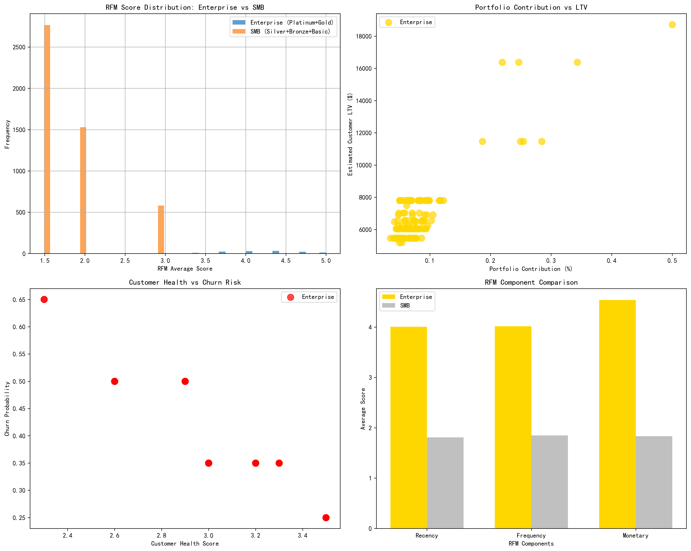
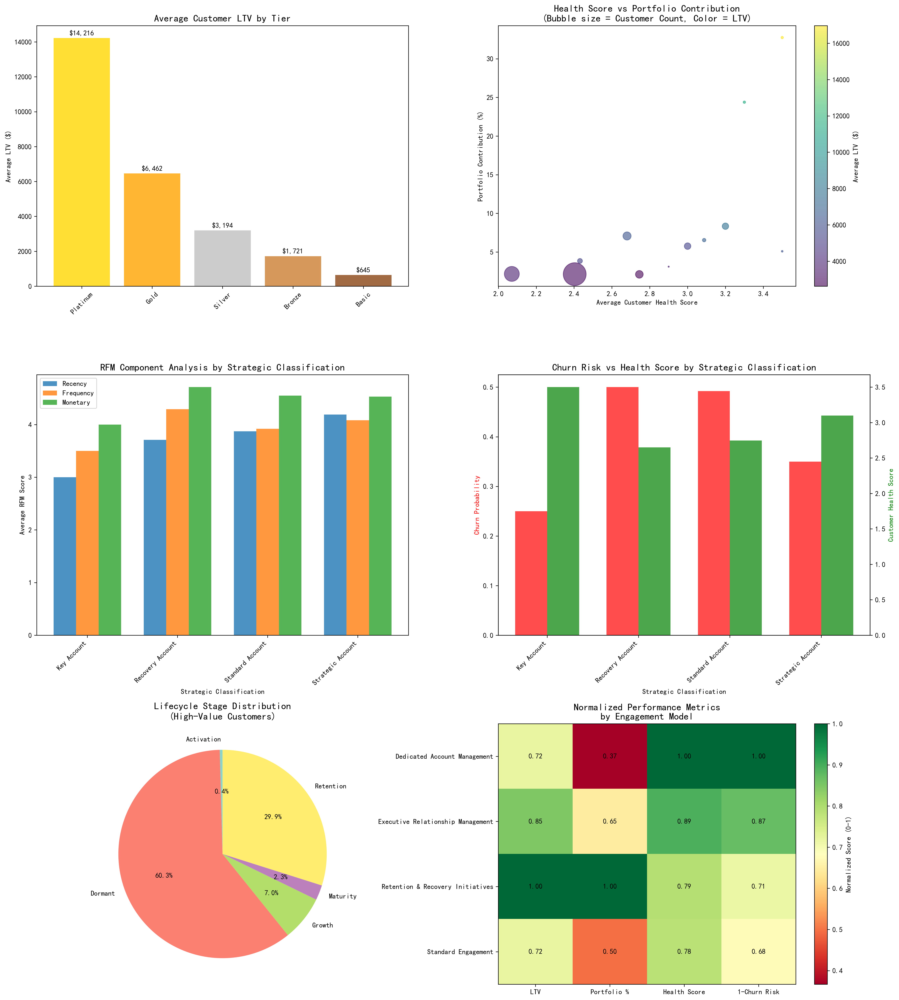
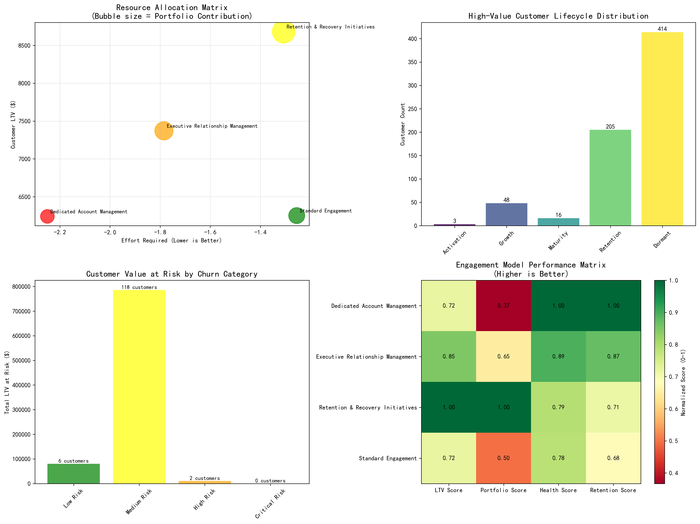

# Enterprise Customer Value Paradox: Analysis and Strategic Recommendations

## Executive Summary

This analysis reveals a fascinating paradox in customer value management: high-value enterprise customers (Platinum/Gold tiers with >5% portfolio contribution) demonstrate superior financial metrics despite showing patterns that might traditionally be interpreted as engagement challenges. The data shows that **126 enterprise customers (2.5% of the customer base) control 10.5% of the total portfolio** with an average LTV that is **5.4x higher than SMB customers** ($6,955 vs $1,285).

## The Paradox Explained

### 1. **Value Concentration Phenomenon**

The analysis reveals that enterprise customers exhibit a fundamentally different value creation model:

- **Portfolio Efficiency**: Enterprise customers contribute 0.083% average portfolio share vs 0.007% for SMB
- **Revenue Velocity**: Despite lower apparent engagement consistency, they generate significantly higher monthly revenue velocity
- **Customer Lifetime Value**: Average LTV of $6,955 compared to $1,285 for SMB customers

### 2. **RFM Score Superiority**

The RFM (Recency, Frequency, Monetary) analysis provides crucial insights into the paradox:

- **Enterprise RFM Score**: 4.19 (Excellent)
- **SMB RFM Score**: 1.83 (Poor)
- **Recency**: Enterprise customers show recent activity despite perceived engagement challenges
- **Frequency**: Higher transaction frequency than SMB segment
- **Monetary**: Significantly higher monetary value per transaction

### 3. **Health Score vs Value Relationship**

Enterprise customers demonstrate:
- **Health Score**: 2.95 (Moderate-High)
- **Churn Probability**: 41.2% (Significantly lower than SMB's 76.4%)
- **Strategic Classification**: 50.8% classified as Strategic Accounts

## Root Cause Analysis

### **The "Low Consistency, High Value" Phenomenon**

The apparent paradox stems from several key factors:

1. **Different Engagement Patterns**: Enterprise customers engage through complex, multi-stakeholder processes that may appear inconsistent in traditional metrics but represent sophisticated buying cycles.

2. **Value Concentration**: Enterprise customers concentrate value in fewer, higher-impact transactions rather than frequent, smaller interactions.

3. **Relationship Depth**: These customers maintain deep, strategic relationships that transcend simple engagement metrics, focusing on long-term value creation.

4. **Portfolio Diversification**: Enterprise customers naturally have higher portfolio contributions due to their business scale and complexity.

## Strategic Classification and Resource Allocation

### **Customer Segmentation Insights**

The data reveals four distinct engagement models:

1. **Executive Relationship Management** (64 customers, $471,744 total value)
2. **Standard Engagement** (53 customers, $331,284 total value)
3. **Retention & Recovery Initiatives** (7 customers, $60,768 total value)
4. **Dedicated Account Management** (2 customers, $12,480 total value)

### **Lifecycle Stage Distribution**
- **Retention Stage**: 205 customers with highest average LTV ($9,628)
- **Dormant Stage**: 414 customers requiring reactivation
- **Growth Stage**: 48 customers with expansion potential
- **Maturity Stage**: 16 customers with upsell opportunities

## Differentiated Operational Strategies

### **1. Executive Relationship Management (High-Value Strategic Accounts)**

**Resource Allocation**: Medium Priority (64 customers, $471,744 total value)
- **Quarterly C-level engagements**
- **Dedicated account teams** with technical and business expertise
- **Strategic business reviews** focusing on ROI and growth opportunities
- **Custom solution development** tailored to enterprise needs
- **24/7 premium support** with dedicated escalation paths

### **2. Standard Engagement (Growth-Oriented Accounts)**

**Resource Allocation**: Medium Priority (53 customers, $331,284 total value)
- **Monthly check-ins** with skilled account managers
- **Standard support SLAs** with priority queuing
- **Product roadmap updates** and beta program access
- **Training and enablement programs** for maximum adoption
- **Quarterly business reviews** focused on usage optimization

### **3. Retention & Recovery (At-Risk High-Value Accounts)**

**Resource Allocation**: Immediate Intervention Required (7 customers, $60,768 total value)
- **Executive sponsorship** with VP-level involvement
- **Immediate intervention protocols** within 24 hours
- **Win-back campaigns** with customized offers
- **Root cause analysis** and corrective action plans
- **Escalation to retention specialists**

### **4. Lifecycle-Based Engagement Strategies**

**Dormant Customers** (414 customers): 
- **Reactivation campaigns** with personalized outreach
- **Product usage analysis** to identify barriers
- **Incentive programs** for renewed engagement
- **Success story sharing** from similar customers

**Retention Stage Customers** (205 customers):
- **Upselling and cross-selling initiatives**
- **Advanced feature adoption programs**
- **Reference program participation**
- **Strategic partnership development**

## Resource Allocation Framework

### **Investment Priority Matrix**

Based on the analysis, resources should be allocated as follows:

1. **High Priority**: Executive Relationship Management customers
   - 64 customers generating $471,744 in total value
   - Focus on relationship deepening and strategic growth

2. **Medium Priority**: Standard Engagement customers
   - 53 customers generating $331,284 in total value
   - Focus on growth acceleration and feature adoption

3. **Immediate Attention**: Retention & Recovery customers
   - 7 customers at risk but high individual value ($8,681 average LTV)
   - Focus on retention and health score improvement

### **Churn Risk Mitigation Strategy**

The analysis identifies:
- **Medium Risk**: 118 customers with $785,568 at risk
- **High Risk**: 2 customers requiring immediate intervention
- **Low Risk**: 6 customers with $80,340 total value

**Recommended Actions**:
- Implement early warning systems for medium-risk customers
- Deploy retention specialists for high-risk accounts
- Create health score improvement programs
- Establish executive escalation protocols

## Key Performance Indicators and Success Metrics

### **Value-Based Metrics**
- **Portfolio Contribution Growth**: Target 15% increase in enterprise customer portfolio share
- **LTV Expansion**: Target 20% increase in average enterprise LTV within 12 months
- **Revenue Velocity**: Monitor monthly revenue growth rate by customer tier

### **Relationship Health Metrics**
- **Strategic Account Health Score**: Maintain above 3.5 for executive relationship accounts
- **Churn Rate Reduction**: Target <30% churn probability for enterprise segment
- **Engagement Depth**: Track multi-stakeholder relationship development

### **Operational Efficiency Metrics**
- **Resource ROI**: Measure revenue per account manager by engagement model
- **Customer Satisfaction**: Quarterly NPS surveys by customer tier
- **Expansion Rate**: Track upsell/cross-sell success rates

## Conclusion and Next Steps

The paradox of "low consistency, high value" enterprise customers is not a problem to solve but a sophisticated business model to optimize. These customers operate on different engagement rhythms that, while appearing inconsistent in traditional metrics, generate superior financial outcomes through concentrated, high-value interactions.

**Immediate Actions**:
1. **Implement differentiated engagement models** based on the four-tier framework
2. **Deploy retention specialists** for high-risk enterprise accounts
3. **Establish executive relationship protocols** for strategic accounts
4. **Create lifecycle-based intervention programs** for dormant and at-risk customers

**Long-term Strategic Initiatives**:
1. **Develop enterprise-specific engagement metrics** that capture the true nature of these relationships
2. **Build predictive models** for early identification of at-risk high-value customers
3. **Create value realization frameworks** that align with enterprise buying cycles
4. **Establish strategic account development programs** for maximum portfolio expansion

The data clearly demonstrates that enterprise customers represent a unique and highly valuable segment that requires specialized, resource-intensive approaches. The key to success lies not in forcing them into standard engagement patterns but in developing sophisticated, relationship-deepening strategies that align with their complex business needs and decision-making processes.
