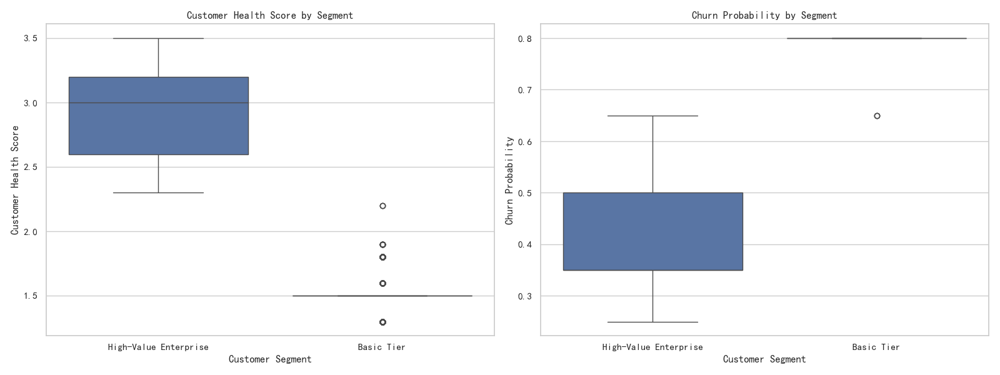

# Customer Value Analysis: Uncovering Insights from a Limited Dataset

## Executive Summary

This analysis aimed to investigate the 'low consistency, high value' paradox among enterprise customers. However, significant data quality issues—specifically, two out of three critical tables being empty—made it impossible to address the original question directly. Key metrics such as engagement consistency, revenue velocity, and conversion funnel data were unavailable.

Pivoting the analysis to the single available dataset, `customer_value_analysis`, we compared 'High-Value Enterprise' customers (Gold/Platinum tiers) against 'Basic Tier' customers. The findings reveal that **high-value customers are, on average, significantly younger accounts than their basic-tier counterparts**. While their RFM scores are much higher, their customer health and churn risk profiles, as shown below, warrant strategic intervention.

This report details the data limitations, the revised analysis, and provides actionable recommendations for managing different customer segments based on the available data.

## Initial Data Obstacles

The initial analytical plan relied on three tables: `customer360__customer_value_analysis`, `customer360__customer_activity_metrics`, and `customer360__conversion_funnel_analysis`. Upon investigation, both the activity and conversion funnel tables were found to be completely empty. This prevented any joins between tables and made it impossible to analyze crucial metrics like:

*   `cross_stage_engagement_consistency`
*   `revenue_velocity_monthly`
*   `activity_efficiency`
*   `marketing_to_sales_days`
*   `primary_engagement_channel`

Consequently, the core premise of the paradoxical relationship between engagement consistency and customer value could not be validated or explored.

## Revised Analysis: High-Value vs. Basic Tier Customers

The analysis was refocused to extract insights from the `customer360__customer_value_analysis` table. We segmented customers into two groups: 'High-Value Enterprise' (Gold and Platinum tiers) and 'Basic Tier'.

**Key Quantitative Differences:**

| Customer Segment      | Avg. RFM Score | Avg. Account Age (Days) |
|-----------------------|----------------|-------------------------|
| **High-Value Enterprise** | 4.18           | 420                     |
| **Basic Tier**          | 1.49           | 595                     |

The data clearly shows that high-value customers have far superior RFM scores. More strikingly, they have a much younger account age on average, suggesting a critical value-determination period early in the customer lifecycle.

### Customer Health and Churn Risk Visualization

The following visualization compares the distribution of Customer Health Scores and Churn Probability for the two segments.

**Interpretation of the Visuals:**

*   **Customer Health Score:** High-Value Enterprise customers exhibit a higher median health score than Basic Tier customers. However, the distribution is wide, with a significant portion of customers falling into lower health score quartiles. This indicates that even among top-tier clients, health is not guaranteed and requires active monitoring. The Basic Tier is consistently unhealthy, with very low scores across the board.
*   **Churn Probability:** Correspondingly, High-Value customers have a lower median churn probability. Yet, the presence of outliers and a notable upper quartile shows that a substantial risk of churn exists even within this valuable segment. The Basic Tier customers have a dangerously high churn probability, aligning with their 'hibernating' or 'at-risk' status.

## Insights and Strategic Recommendations

**Primary Insight:** The most valuable customers establish their worth relatively early and are, on average, younger accounts. Older accounts are more likely to populate the low-value Basic Tier, suggesting a failure to retain value or grow accounts over time.

Based on this, we propose the following differentiated strategies:

1.  **For the High-Value Enterprise Segment (Proactive Nurturing):**
    *   **Action:** Implement a "First Year, First Class" program. Dedicate high-touch engagement resources, including dedicated account managers and executive sponsors, to all Gold and Platinum customers within their first year.
    *   **Justification:** Since account age is inversely correlated with value-tier, the first year is the most critical period to secure loyalty, drive adoption, and realize value. Proactive monitoring of their health scores during this period can preemptively address issues and lock in long-term potential.

2.  **For the Basic Tier Segment (Automated Management & Opportunity Mining):**
    *   **Action:** Transition this segment to a low-touch, automated management model. Use automated email campaigns for re-engagement and self-service support portals to manage costs.
    *   **Justification:** This large, low-health, high-churn-risk segment consumes resources that could be better spent on higher-potential customers. Automation minimizes cost-to-serve while still providing a baseline of support. Data from RFM scores should be used to occasionally mine this segment for the rare "win-back" opportunity, but it should not be the primary focus.
