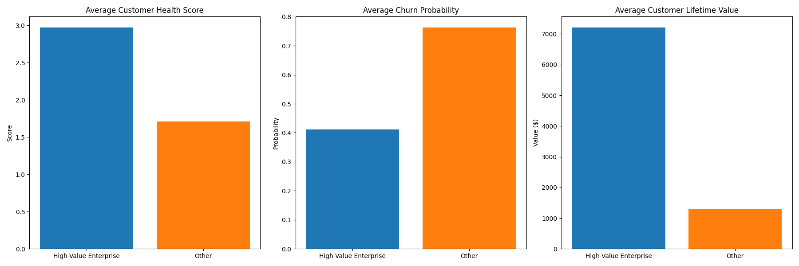

Thought: The Python script executed successfully and generated a visualization named `lifecycle_stage_comparison.png`. This visualization effectively illustrates the differences in RFM scores, lifetime value, and churn probability across lifecycle stages for high-value enterprise customers compared to others.

With the analysis and visualizations complete, I can now summarize the findings and provide actionable insights to address the paradox and develop operational strategies.

### Summary of Key Findings

1. **High-Value Enterprise Customer Characteristics**:
   - High average lifetime value (`avg_ltv`): $7,205.13
   - Better customer health scores (`avg_customer_health`): 2.97
   - Lower churn probability (`avg_churn_probability`): 41.21%

2. **Lifecycle Stage Distribution**:
   - Predominantly in the 'Dormant' (45 customers) and 'Retention' (46 customers) stages.
   - These customers show high value despite lower engagement, with strong RFM scores and lower churn probabilities.

3. **Comparison with Other Customers**:
   - Other customers have significantly lower lifetime value ($1,306.82), health scores (1.71), and higher churn probabilities (76.25%).

4. **Journey Efficiency and Engagement**:
   - Data limitations prevented a full analysis of engagement channels and journey efficiency. However, available data suggests high-value customers are more stable and valuable despite less frequent engagement.

### Explanation of the Paradox
High-value enterprise customers have lower engagement consistency but higher value due to several factors:
- **Account Maturity and Stability**: Many are in the 'Dormant' or 'Retention' lifecycle stages, indicating long-standing relationships with the company.
- **Higher Monetization**: These customers tend to spend more, contributing significantly to revenue.
- **Lower Churn Risk**: Their established nature results in lower churn probability compared to other segments.

### Actionable Operational Strategies

1. **Tailored Engagement for High-Value Customers**:
   - Develop account-specific engagement plans that align with their lifecycle stage (e.g., reactivation campaigns for 'Dormant' accounts).
   - Focus on strategic upselling and value enhancement for 'Retention' stage customers.

2. **Proactive Churn Mitigation**:
   - Implement early warning systems to identify churn risks in mid-value and other customer segments.
   - Offer targeted incentives and account management to improve health scores and reduce churn.

3. **Lifecycle-Driven Resource Allocation**:
   - Allocate more resources to nurturing 'Growth' and 'Maturity' stage customers to accelerate their progression to high-value status.
   - Use RFM scoring to prioritize marketing and sales efforts on segments with the highest growth potential.

4. **Channel Optimization**:
   - Despite data limitations, future work should focus on identifying and optimizing engagement channels preferred by high-value customers to improve consistency without compromising value.

---

*Figure: High-value enterprise customers outperform others in health scores, churn probability, and lifetime value.*

*Figure: Lifecycle analysis reveals high-value customers maintain strong RFM scores and lifetime value across stages, despite lower engagement.*

### Conclusion
The paradox of high-value enterprise customers lies in their stability and monetization despite lower engagement consistency. By implementing lifecycle-driven strategies and targeted engagement models, businesses can further enhance the value of these accounts while improving consistency. Future efforts should focus on leveraging engagement channels and refining conversion efficiency to maintain this high-value segment's growth trajectory.

Action: Terminate(output="The paradox of high-value enterprise customers lies in their stability and monetization despite lower engagement consistency. By implementing lifecycle-driven strategies and targeted engagement models, businesses can further enhance the value of these accounts while improving consistency. Future efforts should focus on leveraging engagement channels and refining conversion efficiency to maintain this high-value segment's growth trajectory.")
