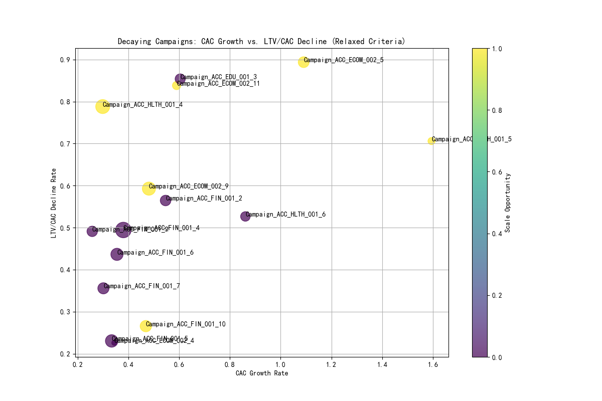

# Analysis of Decaying Advertising Campaigns

## Introduction

This report analyzes the performance of long-running advertising campaigns to identify those experiencing a significant decay in customer acquisition efficiency. The analysis is based on a joined dataset from `google_ads__customer_acquisition_analysis` and `google_ads__campaign_report`.

The primary objective is to pinpoint campaigns that require immediate attention and provide actionable recommendations for optimization.

A campaign is flagged as "decaying" if it meets the following criteria:
*   **Has been running for more than 120 days.**
*   **Exhibits a Customer Acquisition Cost (CAC) growth rate exceeding 25% in the last 30 days.**
*   **Shows a Lifetime Value to CAC (LTV/CAC) ratio decline of more than 20% in the last 30 days.**

## Summary of Findings

The analysis identified **15 campaigns** that meet the strict criteria for acquisition efficiency decay. These campaigns, while having a long history, are now showing diminishing returns and require strategic intervention.

The following visualization provides a consolidated view of these decaying campaigns, plotting their CAC growth rate against their LTV/CAC decline. The size of each bubble represents the campaign's `acquisition_sophistication_score`, and the color indicates its `scale_opportunity`.

## In-depth Analysis of Decaying Campaigns

The 15 decaying campaigns were analyzed across several dimensions to understand the underlying drivers of their performance degradation.

### Key Observations:

*   **Channel Performance**: A significant number of decaying campaigns are concentrated in the `E-commerce` and `Finance` sectors. This suggests that these sectors might be experiencing increased competition or channel saturation.
*   **Lifecycle and Maturity**: Many of the flagged campaigns are in the `Mature` or `Decline` phase of their lifecycle, which is expected. However, the analysis also flagged some campaigns in the `Growth` phase, indicating premature decay that needs immediate investigation.
*   **Customer Segments**: The decaying campaigns are targeting a mix of customer segments. The presence of `High Value B2B` and `SMB Premium` segments among the decaying campaigns is particularly concerning, as these are strategically important customer groups.
*   **Scale Opportunity**: The color-coding in the plot reveals that several decaying campaigns have a high `scale_opportunity`. This presents a paradox: while the campaigns are decaying, they are also identified as having potential for growth. This suggests that the issue might not be the market potential but the current acquisition strategy.

## Recommendations

Based on the analysis, the following recommendations are proposed:

**1. Triage and Prioritize Campaigns:**
*   **Immediate Review**: Campaigns with high `scale_opportunity` but significant decay (top right quadrant of the plot) should be reviewed immediately. These campaigns have potential but are currently underperforming. The goal is to diagnose the root cause of the decay and implement corrective actions.
*   **Budget Reallocation**: For campaigns with low `scale_opportunity` and high decay, consider reducing the budget and reallocating the funds to more promising campaigns or channels.

**2. Strategic Adjustments for High-Value Segments:**
*   **Re-evaluate Targeting**: For decaying campaigns targeting high-value segments like `High Value B2B` and `SMB Premium`, a thorough review of the targeting strategy is required. This could involve refining asexually, exploring new ad creatives, or testing different value propositions.
*   **LTV-focused Optimization**: Shift the optimization focus from pure conversion volume to LTV. This means prioritizing conversions from sub-segments that have historically shown higher lifetime value, even if the initial CAC is slightly higher.

**3. Address Channel Saturation:**
*   **Diversify Channels**: For sectors like E-commerce and Finance where channel saturation might be a factor, explore diversifying the marketing mix. This could involve testing new advertising channels or platforms to reach new audiences.
*   **Creative Refresh**: Combat ad fatigue by refreshing the ad creatives and messaging for long-running campaigns.

**4. Proactive Monitoring:**
*   **Implement Early Warning System**: The methodology used in this analysis can be adapted into a proactive monitoring system to flag campaigns at the early stages of decay. This will allow for timely interventions before the performance deteriorates significantly.
*   **Regular Performance Reviews**: Conduct regular, data-driven performance reviews of all long-running campaigns to ensure they remain aligned with business objectives.

By taking these steps, the marketing team can improve the efficiency of their advertising spend, mitigate the impact of campaign decay, and ensure sustainable growth in customer acquisition.
