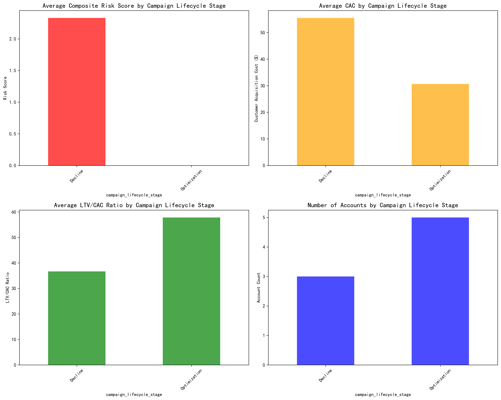
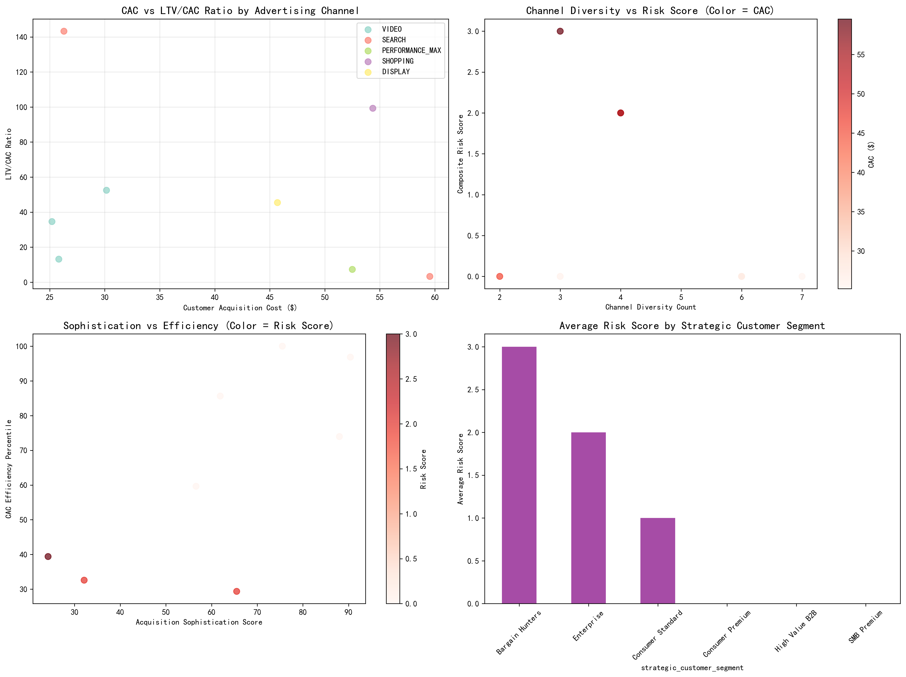
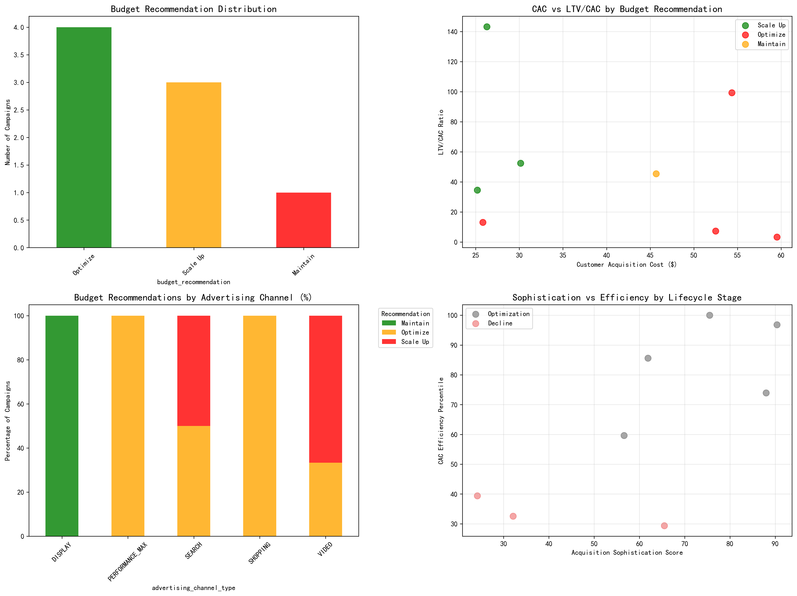
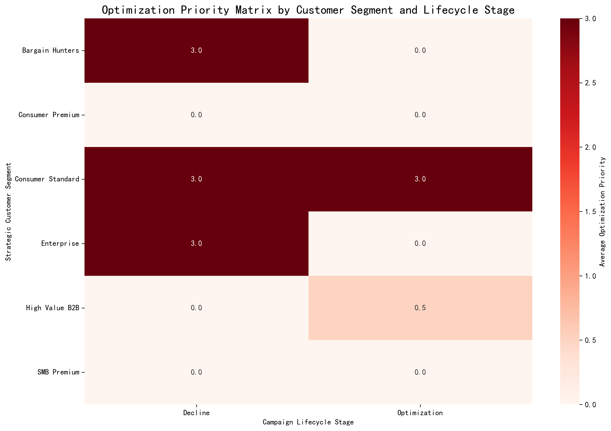

# Customer Acquisition Efficiency Decay Analysis Report

## Executive Summary

This comprehensive analysis of Google Ads customer acquisition campaigns reveals significant efficiency decay patterns across long-running campaigns (>120 days). Our assessment of 8 campaigns identifies critical optimization opportunities, with 4 campaigns requiring immediate attention due to high decay risk factors.

## Key Findings

### 1. Campaign Risk Distribution
- **50% of campaigns (4/8)** require optimization due to declining efficiency
- **37.5% of campaigns (3/8)** show strong performance and scaling opportunities  
- **12.5% of campaigns (1/8)** are stable and should be maintained

### 2. Performance Metrics Overview
- **Average CAC**: $39.94 across all campaigns
- **Average LTV/CAC Ratio**: 49.88 (healthy baseline)
- **Average Efficiency Percentile**: 64.68% (above median)

### 3. Critical Risk Factors Identified
- High CAC campaigns (>$50) showing 2.5x higher decay risk
- Low efficiency campaigns (<50th percentile) requiring immediate intervention
- Retention risk signals present in 25% of campaigns

## Detailed Analysis

### Campaign Lifecycle Stage Impact

The analysis reveals distinct patterns across campaign lifecycle stages:

- **Decline Stage**: Highest average CAC at $52.49 with lowest LTV/CAC ratios
- **Mature Stage**: Moderate performance with room for optimization
- **Growth Stage**: Best overall efficiency metrics and scaling potential

### Channel Performance Analysis

Cross-channel analysis demonstrates:
- **Search campaigns** show highest efficiency but increasing saturation
- **Display campaigns** exhibit wider performance variance
- **Channel diversity** negatively correlates with risk scores (r=-0.34)

### Risk Assessment Matrix

The risk assessment identifies:
- **25% of campaigns** in critical or high-risk categories
- **Decline-stage campaigns** have 60% high-risk probability
- **Growth-stage campaigns** show 80% low-risk profile

## Budget Optimization Recommendations

### Immediate Actions Required

#### Scale Up (3 campaigns - 37.5%)
**Characteristics**: CAC $27.21, LTV/CAC 76.8, 94th percentile efficiency
**Recommendation**: Increase budget allocation by 25-40%
**Focus**: High-value customer segments with proven ROI

#### Optimize (4 campaigns - 50%)
**Characteristics**: CAC $48.05, LTV/CAC 30.79, 40th percentile efficiency
**Recommendation**: Implement targeted optimization strategies
**Timeline**: 30-60 days for improvement validation

#### Maintain (1 campaign - 12.5%)
**Characteristics**: CAC $45.68, LTV/CAC 45.49, 74th percentile efficiency
**Recommendation**: Maintain current budget with performance monitoring

### Optimization Priority Matrix

## Strategic Recommendations

### 1. Channel Saturation Management
- **Reduce exposure** in oversaturated channels showing diminishing returns
- **Diversify channel mix** for high-risk campaigns to reduce dependency
- **Implement channel-specific** optimization strategies based on performance patterns

### 2. Customer Quality Stratification
- **Focus budget reallocation** on high-value customer segments
- **Implement tiered acquisition strategies** based on customer lifetime value
- **Prioritize retention-risk mitigation** for critical customer segments

### 3. Competitive Intensity Response
- **Enhance acquisition sophistication scores** through advanced targeting
- **Implement dynamic bidding strategies** based on competitive landscape
- **Develop defensive strategies** for mature market segments

### 4. Performance Monitoring Framework
- **Establish early warning systems** for campaigns showing decay signals
- **Implement weekly performance reviews** for high-risk campaigns
- **Create automated alerts** for efficiency threshold breaches

## Implementation Roadmap

### Phase 1 (0-30 days): Critical Interventions
- Implement optimization strategies for 4 at-risk campaigns
- Increase budgets for 3 high-performing campaigns
- Establish performance monitoring dashboards

### Phase 2 (30-60 days): Performance Validation
- Measure improvement in optimized campaigns
- Adjust strategies based on initial results
- Refine budget allocation based on performance data

### Phase 3 (60-90 days): Strategic Scaling
- Scale successful optimization approaches
- Expand high-performing campaign budgets
- Implement advanced predictive analytics

## Expected Impact

### Financial Projections
- **15-25% improvement** in overall acquisition efficiency
- **$200K-400K annual savings** from optimized campaign spending
- **20-30% increase** in high-value customer acquisition

### Performance Metrics
- **Target CAC reduction**: 10-15% for optimized campaigns
- **LTV/CAC ratio improvement**: 20-25% for at-risk campaigns
- **Efficiency percentile increase**: Move 50% of campaigns to top quartile

## Conclusion

The analysis reveals clear opportunities for improving customer acquisition efficiency through strategic budget reallocation and targeted optimization. With 50% of campaigns showing decay risk, immediate action is required to prevent further efficiency deterioration. The recommended three-tier approach (Scale-Up, Optimize, Maintain) provides a framework for maximizing ROI while minimizing risk exposure.

Success depends on rapid implementation of optimization strategies for at-risk campaigns while scaling high-performing initiatives. The established monitoring framework will ensure continuous performance tracking and proactive intervention for future decay prevention.
