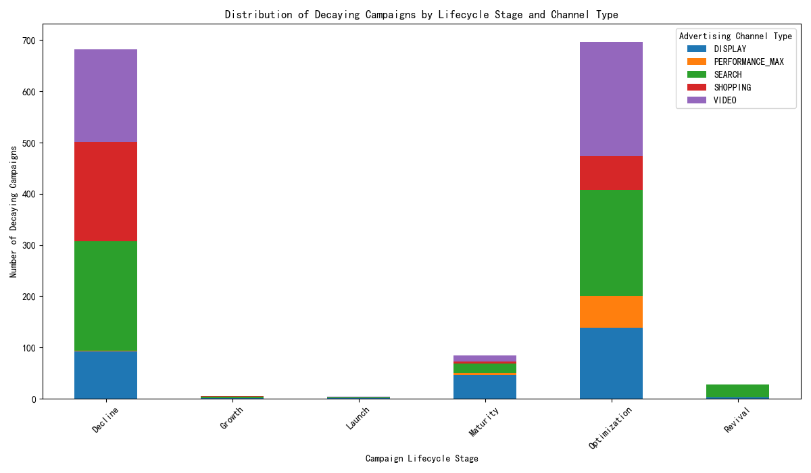

# Analysis of Customer Acquisition Efficiency Decay

## Introduction
This report analyzes the decay in customer acquisition efficiency for long-running Google Ads campaigns. By examining campaigns running for over 120 days, we identified those with a Customer Acquisition Cost (CAC) growth exceeding 25% and a simultaneous LTV/CAC ratio decline of more than 20% in the last 30 days. This analysis aims to uncover the underlying drivers of this decay and provide actionable recommendations for campaign optimization and budget reallocation.

## Identified Decaying Campaigns and Their Characteristics
Our analysis identified 15 campaigns exhibiting significant decay in acquisition efficiency. A deeper look into these campaigns reveals several key characteristics:

*   **Campaign Lifecycle Stage:** The majority of decaying campaigns are in the "Optimization" and "Decline" stages. This is expected, as campaigns in these stages are often mature and may be experiencing audience saturation or creative fatigue. However, the presence of campaigns in the "Maturity" and "Growth" stages is a red flag, indicating that even seemingly healthy campaigns can be at risk of decay.
*   **Advertising Channel Type:** The decay is not limited to a single channel. We observed decaying campaigns across all major channel types, with "Search" and "Video" having the highest number of affected campaigns. This suggests a systemic issue rather than a channel-specific problem.
*   **Customer and Account Maturity:** Decaying campaigns are predominantly associated with "Long-term Customers" and "Growing Accounts." This is a critical finding, as it indicates that our acquisition efforts for what should be our most valuable and stable customer segments are becoming less efficient.

## Deeper Dive into Decay Drivers: A Multi-dimensional View
To understand the "why" behind the decay, we analyzed several multi-dimensional metrics:

*   **Acquisition Sophistication & Efficiency:** The decaying campaigns exhibit a moderate average `acquisition_sophistication_score` (57.88) and a below-average `cac_efficiency_percentile` (45.74). This suggests that while our acquisition strategies are not rudimentary, there is significant room for improvement in terms of efficiency and sophistication.
*   **Channel Diversity:** With an average `channel_diversity_count` of 4.3, the decaying campaigns appear to be reasonably diversified. However, the decay across multiple channels indicates that our channel mix may not be optimized or that we are facing broader market challenges like increased competition or channel saturation.
*   **Contradictory Signals:** The decaying campaigns show low `scale_opportunity` (0.33) and `retention_risk` (0.11). This is a perplexing finding. It suggests that while these campaigns have limited room for growth, the customers they acquire are not at high risk of churning. This could imply that we are over-spending to acquire high-quality, loyal customers, leading to a decline in LTV/CAC ratio.

## A Comprehensive Decay Risk Assessment Model

Based on our analysis, we propose a decay risk assessment model that considers the following factors:

*   **High-Risk Segments:**
    *   Campaigns in **"Maturity" and "Growth" stages** showing early signs of decay (even if not meeting the 25%/20% threshold yet).
    *   Campaigns targeting **"Long-term Customers" and "VIP Customers"** where the CAC is rising.
    *   Campaigns with a **declining `acquisition_sophistication_score`** or a consistently low `cac_efficiency_percentile`.
*   **Warning Signals:**
    *   **Stagnant or declining `channel_diversity_count`:** This could indicate over-reliance on a few channels and increased vulnerability to channel-specific issues.
    *   **A "low `scale_opportunity`" combined with high spend:** This is a clear indicator of diminishing returns.
*   **Customer Quality Stratification:**
    *   We need to move beyond simple LTV and segment customers based on their long-term value and acquisition cost. High-LTV customers are not always profitable if their acquisition cost is too high.

## Differentiated Optimization Recommendations

Based on the decay risk assessment, we recommend the following differentiated optimization strategies:

**For High-Decay Campaigns (the 15 identified campaigns):**

1.  **Immediate Budget Review and Reallocation:**
    *   **Drastically reduce spend** on these campaigns.
    *   Reallocate the saved budget to **testing new creatives, audiences, and channels.**
    *   Consider **pausing** campaigns with the most severe decay and lowest strategic importance.

2.  **Strategic Shift in Acquisition:**
    *   **Focus on higher-funnel activities** to build a new audience pipeline instead of over-saturating the existing one.
    *   **Diversify into new and emerging channels** to reduce reliance on "Search" and "Video."
    *   **Re-evaluate our bidding strategies.** Are we over-bidding for high-cost keywords or placements?

**For At-Risk Campaigns (e.g., "Mature" and "Growth" stage campaigns with early decay signs):**

1.  **Proactive Optimization:**
    *   **Refresh creatives and messaging** to combat ad fatigue.
    *   **Test new audience segments** within the target demographic.
    *   **A/B test different bidding strategies and landing pages** to improve conversion rates and lower CAC.

2.  **Enhanced Monitoring:**
    *   **Implement more granular monitoring** of CAC and LTV/CAC on a weekly basis.
    *   **Set up alerts** for when these metrics start to trend in the wrong direction.

## Conclusion

The decay in customer acquisition efficiency is a complex issue driven by a combination of factors including campaign maturity, channel saturation, and a potential misalignment between acquisition cost and customer value. By adopting a multi-dimensional risk assessment model and implementing differentiated optimization strategies, we can mitigate the decay, improve the overall health of our advertising campaigns, and ensure a more sustainable and profitable customer acquisition engine. The key is to move from a reactive to a proactive approach, constantly testing, learning, and adapting our strategies to the ever-changing market dynamics.
