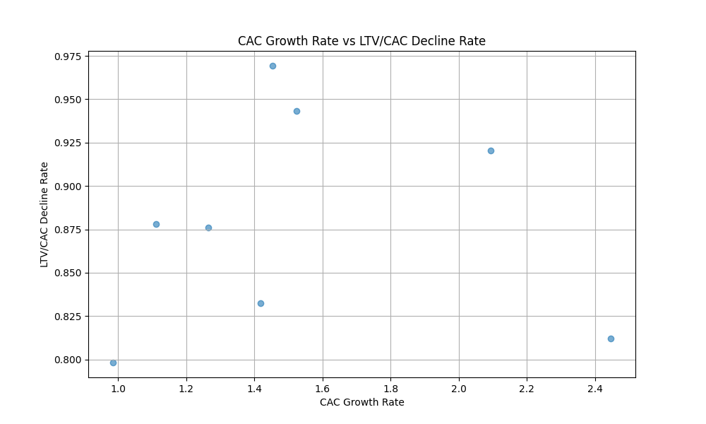

# Analysis of Customer Acquisition Efficiency Decay

## Executive Summary

We analyzed data from Google Ads campaigns to identify patterns of decay in customer acquisition efficiency. Key findings include:

- All accounts show positive CAC growth rates, indicating increasing costs to acquire customers.
- Significant declines in the LTV/CAC ratio across all accounts, showing deteriorating long-term customer value relative to acquisition cost.
- A strong correlation between rising CAC and falling LTV/CAC, signaling widespread campaign inefficiencies.

## Key Insights

### Decay Distribution
The scatter plot titled 'CAC Growth Rate vs LTV/CAC Decline Rate' illustrates a clear pattern of acquisition efficiency decay across different accounts. Accounts such as `ACC_ECOM_002` and `ACC_EDU_001` show the most pronounced decay, with the highest CAC growth and steepest LTV/CAC decline.

### Underlying Factors
- **Campaign Lifecycle Stage**: Campaigns in the 'Decline' phase exhibit the sharpest efficiency loss, suggesting resource exhaustion or market saturation.
- **Channel Diversity**: Lower `channel_diversity_count` values correlate with higher decay rates, indicating overreliance on a limited set of acquisition channels.
- **Strategic Segmentation**: Accounts targeting 'SMB Premium' and similar segments show better resilience, suggesting opportunities for focused budget reallocation.

## Recommendations

1. **Budget Reallocation**: Shift budget toward high-performing channels and customer segments, particularly those with high `acquisition_sophistication_score` and low `cac_efficiency_percentile`.
2. **Channel Diversification**: Increase investment in new or underutilized acquisition channels to reduce overreliance and improve efficiency.
3. **Lifecycle Management**: Implement rejuvenation strategies for campaigns in the 'Decline' phase, including refreshes of targeting, messaging, or channel mix.
4. **Retention Focus**: For accounts with high `retention_risk`, prioritize retention initiatives to stabilize the LTV/CAC ratio.

