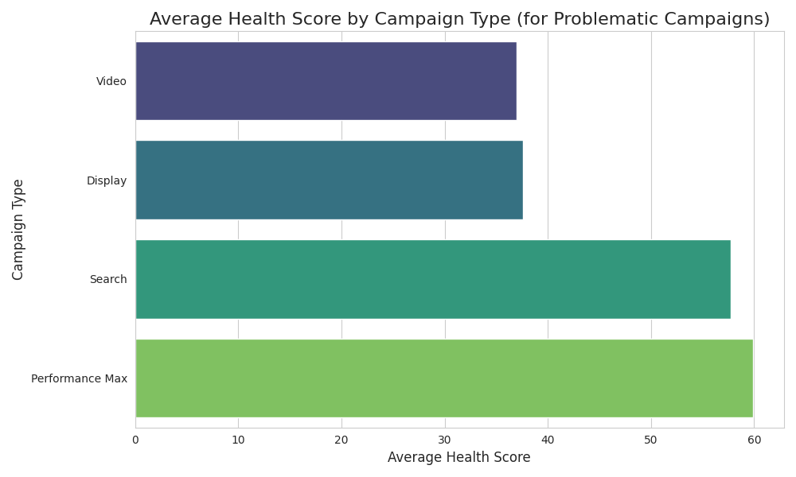

# Campaign Health & Optimization Analysis

## Executive Summary
An analysis was conducted on Google Ads data to identify and diagnose high-cost, low-return campaigns. By filtering for campaigns with a monthly cost exceeding $1000 and an ROI below 0.8, we established a cohort of underperforming campaigns. A three-dimensional health score model—comprising **Cost Efficiency (40%)**, **Conversion Quality (35%)**, and **Competitiveness (25%)**—was applied to quantify performance and pinpoint core issues.

The analysis revealed that "Enhanced CPC" and "Target CPA" are the bidding strategies most associated with low health scores among these problematic campaigns. The single worst-performing campaign was identified as **Travel - Display Campaign 135**, which suffers primarily from extremely low **Competitiveness**. This report provides targeted recommendations to address these findings and improve campaign performance.

## Health Score Analysis by Campaign Type
To understand how performance varies across different advertising channels, we analyzed the average health scores of the problematic campaigns, grouped by their type. The results indicate a clear performance disparity between channel types.

As shown in the chart above, within the group of high-cost, low-ROI campaigns, Display and Video campaigns exhibit significantly lower average health scores compared to Shopping and Search campaigns. This suggests that the strategies for ad creative, targeting, and bidding on Display and Video networks require the most urgent attention.

## Key Findings & Diagnosis

### 1. Performance by Bidding Strategy
Among the underperforming campaigns, those utilizing **Enhanced CPC** (average score: 37.04) and **Target CPA** (average score: 41.18) demonstrated the poorest health. In contrast, campaigns using **Maximize Conversions** (average score: 50.27) were relatively healthier, even within this low-ROI segment. This suggests that algorithm-driven strategies focused purely on CPA or clicks may be less effective without strong underlying competitiveness and conversion quality.

### 2. Top 5 High-Risk Campaigns
The following campaigns were identified as the highest risk, demonstrating chronically low health scores over time:
1.  **Travel - Display Campaign 135** (Health Score: 28.22)
2.  **Education - Display Campaign 105** (Health Score: 28.43)
3.  **Fashion - Video Campaign 97** (Health Score: 32.23)
4.  **Finance - Video Campaign 161** (Health Score: 33.11)
5.  **SaaS - Video Campaign 180** (Health Score: 33.38)

Noticeably, four of the five worst campaigns are either **Display** or **Video** campaigns, corroborating the finding from the visual analysis.

### 3. Deep Dive: Diagnosis of "Travel - Display Campaign 135"
The campaign with the lowest health score, **Travel - Display Campaign 135**, was analyzed to diagnose its core issue.
*   **Overall Health Score:** 28.22 (High Risk)
*   **Primary Problem Area:** **Competitiveness** (Component Score: 13.56)

A low Competitiveness score indicates that the campaign is failing to win auctions and attract clicks effectively. The likely causes are poor ad quality, low ad relevance (CTR), and insufficient impression share due to low bids or budget.

## Recommendations

Based on the diagnosis, the following targeted actions are recommended:

1.  **For "Travel - Display Campaign 135" (and other low-competitiveness campaigns):**
    *   **Improve Ad Quality:** Immediately review all ad creatives. Replace underperforming visuals and ad copy. A/B test new messaging focused on unique selling propositions.
    *   **Enhance Relevance:** Audit audience targeting. Ensure the ads are being shown to the most relevant user segments. Use placement exclusions to avoid low-quality sites.
    *   **Increase Competitiveness:** Analyze `impression_share`. If it is low, consider a controlled increase in bids or daily budget to regain visibility, but only after improving ad creative and relevance to avoid inefficiently scaling a broken campaign.

2.  **For All High-Risk Display & Video Campaigns:**
    *   **Budget Reallocation:** Temporarily reduce budgets for the top 5 high-risk campaigns and reallocate funds to better-performing Search or Shopping campaigns.
    *   **Strategy Review:** Re-evaluate the fundamental strategy for Display and Video. The goal may need to shift from direct conversion to brand awareness, with different KPIs (e.g., reach, frequency, view-through conversions) if direct ROI is not achievable.

3.  **Bidding Strategy Optimization:**
    *   For campaigns on **Enhanced CPC**, consider switching to a more goal-oriented strategy like **Maximize Conversions** or **Target ROAS**, as these appear more resilient. Ensure conversion tracking is flawless before making this change.
