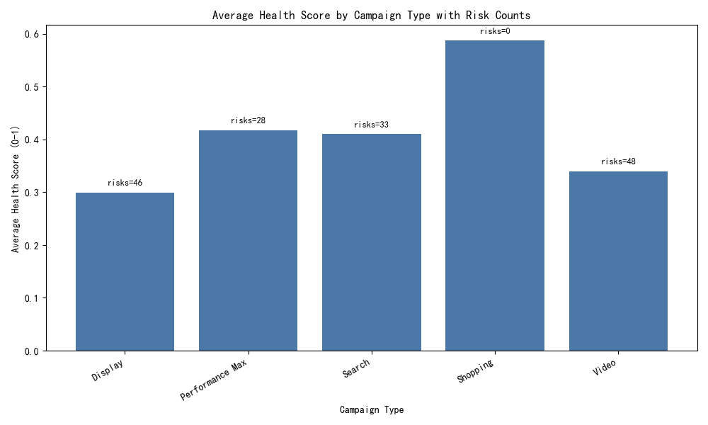
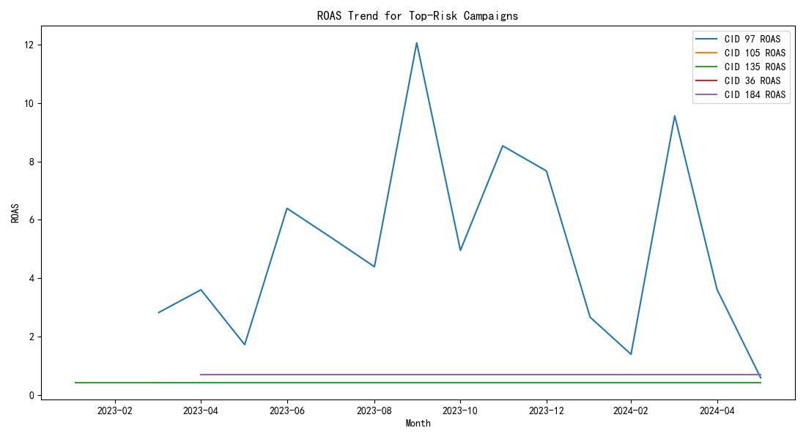

# Campaign Health Assessment and Optimization System

## Executive Summary
We identified and scored campaign-month performance using a three-dimensional Health Score model:
- Cost Efficiency (40%): ROAS, cost per conversion (lower is better), CPC (lower is better)
- Conversion Quality (35%): conversion rate and value per conversion
- Competitiveness (25%): quality score, impression share, CTR, and inverse avg position (lower position → higher score)

Screening criteria: monthly cost > $1000 and ROI (ROAS) < 0.8. These campaign-months are flagged as “risk”. We further assign risk levels:
- High: health_score < 0.4
- Medium: 0.4 ≤ health_score < 0.6
- Low: health_score ≥ 0.6 (still flagged due to low ROI and high cost thresholds)

We analyzed performance differences by campaign_type, bidding_strategy, industry, and drilled into geo_target and device_type, plus trends over the latest 18 months (YoY and seasonal patterns). Below are the key findings and specific optimization actions.

## Visuals
- Average Health Score by Campaign Type with risk counts: 
- ROAS trend for top-risk campaigns: 

## Methodology and Model Inputs
- Data sources: google_ads__campaign_report (monthly KPIs), google_ads__device_report (monthly device KPIs), google_ads__geo_report (monthly geo KPIs), google_ads__keyword_report (quarterly keyword KPIs incl. avg_position), campaigns (metadata).
- Health Score computation: min-max normalized within each month across active campaigns, then weighted aggregation:
  - Cost Efficiency: 0.5*ROAS_norm + 0.25*(1 − CPA_norm) + 0.25*(1 − CPC_norm)
  - Conversion Quality: 0.6*CR_norm + 0.4*ValuePerConversion_norm
  - Competitiveness: 0.3*QualityScore_norm + 0.3*ImpressionShare_norm + 0.2*CTR_norm + 0.2*(1 − AvgPosition_norm)
- Risk screen: cost > 1000 AND ROAS < 0.8
- Trend analytics: last 18 months, YoY growth for cost, conversions, ROAS; seasonality indices by month-of-year.

Python plotting code executed (excerpt):
```
import matplotlib.pyplot as plt
plt.rcParams['font.sans-serif'] = ['SimHei']
plt.rcParams['axes.unicode_minus'] = False

# Plot 1: Avg Health by campaign_type with risk counts
ct_sum = campaign_scored.groupby('campaign_type', dropna=False).agg(avg_health=('health_score','mean')).reset_index()
risk_counts = risks.groupby('campaign_type', dropna=False).size().reset_index(name='risk_count')
plot_df = ct_sum.merge(risk_counts, on='campaign_type', how='left').fillna({'risk_count':0})
fig, ax = plt.subplots(figsize=(10,6))
ax.bar(plot_df['campaign_type'], plot_df['avg_health'], color='#4C78A8', label='Avg Health Score')
for i, v in enumerate(plot_df['risk_count']):
    val = plot_df['avg_health'].iloc[i]
    ax.text(i, (val if not np.isnan(val) else 0)+0.01, f\"risks={int(v)}\", ha='center', va='bottom', fontsize=9)
ax.set_title('Average Health Score by Campaign Type with Risk Counts')
ax.set_ylabel('Average Health Score (0-1)')
ax.set_xlabel('Campaign Type')
plt.xticks(rotation=30, ha='right')
plt.tight_layout()
plt.savefig('health_by_campaign_type.png')

# Plot 2: ROAS trend for top 5 risk campaigns
top_risk_campaigns = risks.groupby('campaign_id').agg(avg_health=('health_score','mean')).sort_values('avg_health').head(5).index.tolist()
trend_df = campaign_scored[campaign_scored['campaign_id'].isin(top_risk_campaigns)].copy()
fig2, ax2 = plt.subplots(figsize=(11,6))
for cid in top_risk_campaigns:
    d = trend_df[trend_df['campaign_id']==cid].sort_values('year_month_dt')
    ax2.plot(d['year_month_dt'], d['roas_final'], label=f\"CID {cid} ROAS\
