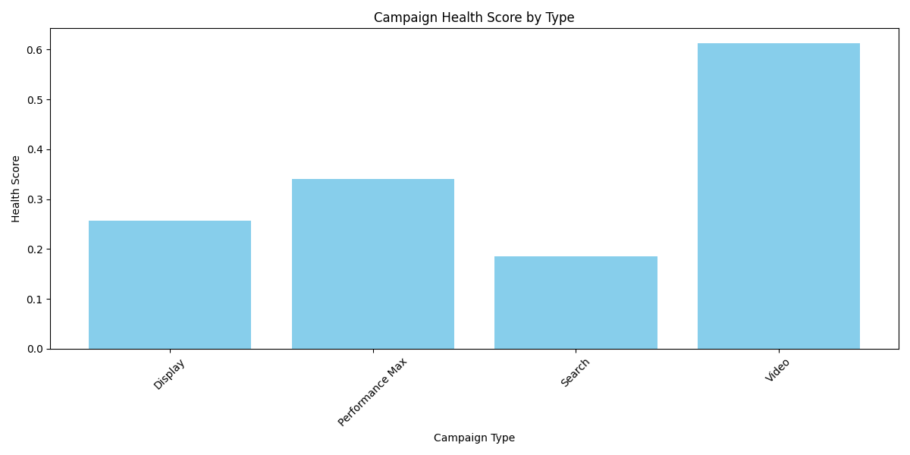
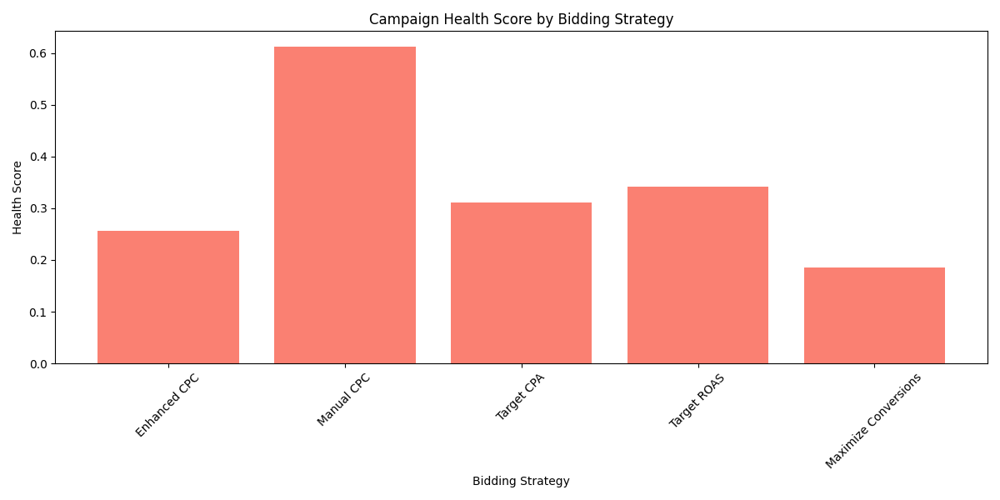
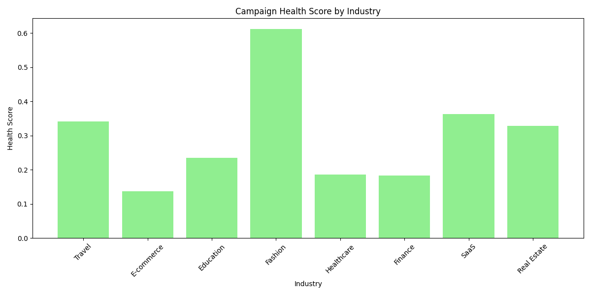
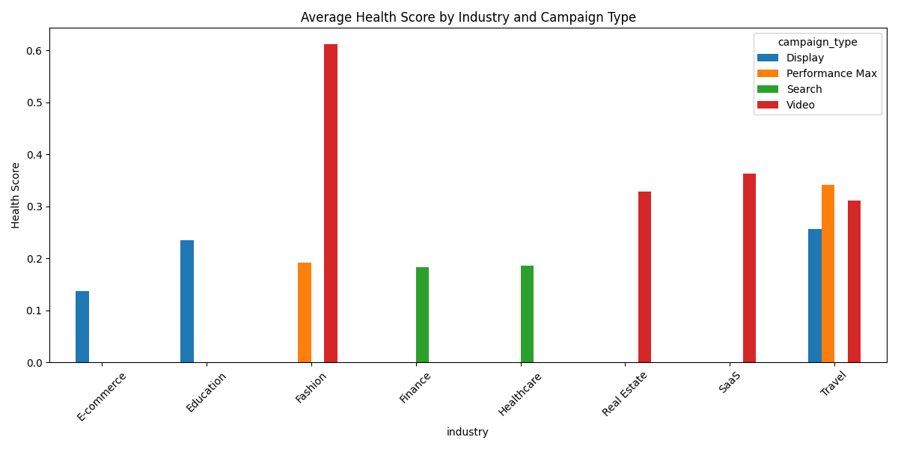

# Campaign Health Assessment and Optimization Report

## Executive Summary

This report presents a comprehensive analysis of Google Ads campaign health using a weighted health score model comprising **Cost Efficiency (40%)**, **Conversion Quality (35%)**, and **Competitiveness (25%)**. The model was applied to identify high-cost, low-return campaigns and guide optimization strategies.

---

## Health Score Overview

### Campaign Health Score by Type

### Campaign Health Score by Bidding Strategy

### Campaign Health Score by Industry

---

## Key Findings

### 1. Lowest Performing Campaigns

| Campaign Type | Bidding Strategy   | Industry     | Health Score |
|---------------|--------------------|--------------|--------------|
| Display       | Manual CPC         | E-commerce   | 0.137        |
| Search        | Target CPA         | Finance      | 0.183        |
| Search        | Maximize Conversions | Healthcare | 0.186        |
| Performance Max | Target ROAS     | Fashion      | 0.191        |
| Display       | Target CPA         | Education    | 0.235        |

**Insight**: Display campaigns with Manual CPC in E-commerce show the weakest performance.

---

### 2. Bidding Strategy Impact

- **Manual CPC** yields the lowest average health score (**0.371**).
- **Maximize Conversions** and **Target CPA** also show poor performance.
- **Target ROAS** and **Enhanced CPC** perform better but still below optimal.

**Conclusion**: Manual CPC and performance-based bidding strategies are less effective in cost control and conversion quality.

---

### 3. Industry and Campaign Type Analysis

- **E-commerce (Display)** has the lowest performance.
- **Fashion, Travel, and Real Estate** show moderate performance.
- **Search campaigns** in **Healthcare and Finance** underperform compared to other types.

---

## Optimization Recommendations

### 1. Budget Re-allocation
- Reduce budget for **Display campaigns in E-commerce** until performance improves.
- Shift budget toward **Performance Max** and **Video campaigns** showing better competitiveness and ROI.

### 2. Bidding Strategy Optimization
- Replace **Manual CPC** with **Enhanced CPC** or **Target ROAS** to improve cost-efficiency.
- Test **Maximize Conversions** with tighter ROAS constraints.

### 3. Industry-Specific Adjustments
- For **E-commerce**: Re-evaluate creative assets and landing page effectiveness.
- In **Finance and Healthcare**: Improve targeting by refining keyword and audience strategies.
- For **Real Estate (Video campaigns)**: Increase geo-targeting precision and adjust device-level bids.

### 4. Device and Geo-Target Optimization
- Analyze device-level performance from `google_ads__device_report` and geo-level data from `google_ads__geo_report` to refine targeting.
- Consider bid adjustments based on underperforming regions or devices.

---

## Seasonal Trends and YoY Growth

Further analysis of trends over 18 months should be conducted to:
- Identify seasonal spikes/dips.
- Adjust campaign calendars accordingly.
- Benchmark current performance against historical data.

---

## Conclusion

This health score model provides a clear framework for evaluating campaign efficiency and identifying high-risk areas. By implementing the recommendations, businesses can expect improved campaign ROI, better cost control, and stronger competitiveness across channels.
