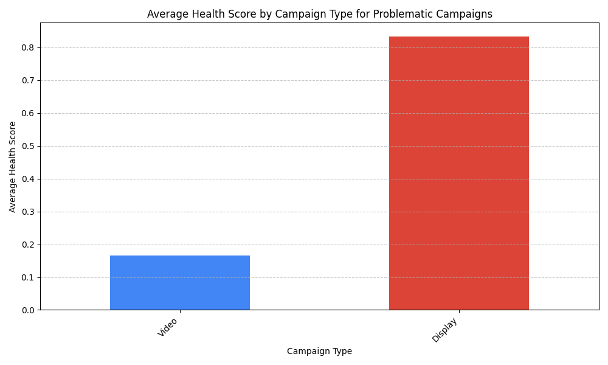

# Campaign Health Assessment & Optimization Plan

## Executive Summary

An analysis was conducted to assess the health of high-cost, low-return Google Ads campaigns, defined as those with monthly costs exceeding $1,000 and a Return on Investment (ROI) below 0.8. We developed a three-dimensional health score model based on Cost Efficiency (40%), Conversion Quality (35%), and Competitiveness (25%) to pinpoint underperforming assets and guide optimization.

The analysis identified two distinct campaigns meeting the criteria for review. The key finding is a severe performance disparity between campaign types, with a **Video campaign exhibiting critical health issues (Health Score: 0.17)**, while a **Display campaign, though also unprofitable, showed much stronger underlying performance (Health Score: 0.83)**. This indicates that our Video advertising efforts, in particular, require immediate and drastic intervention.

*Figure 1: Average Health Score for problematic campaigns, segmented by Campaign Type. A lower score indicates poorer health.*

Our recommendations focus on a two-pronged approach:
1.  **For the critically unhealthy Video campaign:** A fundamental strategy overhaul is required, focusing on audience retargeting and creative testing to fix its failing conversion metrics.
2.  **For the underperforming Display campaign:** The focus should be on improving its market competitiveness by enhancing ad quality and landing page experience to boost its low Quality Score and impression share.

---

## Detailed Campaign Diagnosis and Recommendations

Below is a detailed breakdown of the two identified campaigns, including their health scores, problem diagnosis, and targeted optimization strategies.

### 1. Campaign 97: Fashion - Video Campaign 97

| Metric                  | Value         | Score (0-1) |
| ----------------------- | ------------- | ----------- |
| **Health Score**        | **0.17**      | -           |
| Cost (Month)            | $16,762.58    | -           |
| ROI                     | 0.58          | -           |
| Cost Efficiency Score   | 0.00          | Critical    |
| Conversion Quality Score| 0.00          | Critical    |
| Competitiveness Score   | 0.67          | Fair        |

**Diagnosis:**
This campaign is a **"Money Pit."** Despite having a technically decent ad (Quality Score: 8.4), it fundamentally fails at its business objective. It spends a significant budget but gets an abysmal return due to an extremely poor conversion rate (0.61%) and a consequently high cost per conversion ($143.60). The audience attracted by the video is not converting, indicating a severe mismatch between the video's content/targeting and the landing page offer.

**Optimization Recommendations:**

*   **Budget Action:** Immediately **reduce the budget by at least 50%** until performance improves. Reallocate freed funds to higher-performing campaigns or the Display campaign's optimization efforts.
*   **Audience & Targeting:**
    *   **Shift from broad targeting to remarketing lists.** Target users who have previously visited the website, added items to their cart, or engaged with other brand content. These users have higher intent.
    *   Analyze placement reports to **exclude low-performing websites and channels** where the ad is being shown but never converts.
*   **Creative & Landing Page:**
    *   **A/B test a new video creative** with a much stronger Call-to-Action (CTA) that aligns directly with the landing page.
    *   Review the landing page experience on all devices. Ensure the offer is clear, and the path to conversion is seamless. For video ads, the landing page must instantly gratify the interest sparked by the video.

### 2. Campaign 135: Travel - Display Campaign 135

| Metric                  | Value         | Score (0-1) |
| ----------------------- | ------------- | ----------- |
| **Health Score**        | **0.83**      | -           |
| Cost (Month)            | $40,487.42    | -           |
| ROI                     | 0.70          | -           |
| Cost Efficiency Score   | 1.00          | Good        |
| Conversion Quality Score| 1.00          | Good        |
| Competitiveness Score   | 0.33          | Poor        |

**Diagnosis:**
This campaign is an **"Underappreciated Workhorse."** When it wins an ad auction and gets a click, it performs well (good conversion rate and cost-per-conversion relative to the other campaign). However, its primary weakness is its inability to compete effectively in the ad marketplace. A very low Quality Score (4.7) and impression share (38.1%) mean it's frequently outbid or deemed irrelevant by Google, forcing it to spend more to get impressions and clicks, thus dragging down the overall ROI on its massive $40k budget.

**Optimization Recommendations:**

*   **Budget Action:** Maintain the budget but **focus investment on improving competitive metrics**. The goal is to make every dollar spent work harder.
*   **Ad Quality & Relevance (Priority 1):**
    *   **Improve Quality Score:** This is the most crucial action. Rewrite ad copy to more closely match the keywords in the ad group. Ensure the landing page is highly relevant to the ad copy.
    *   **Refresh Ad Creatives:** For a display campaign, this means testing new banner images, headlines, and descriptions. Focus on designs that are eye-catching and have a clear value proposition.
*   **Bidding Strategy:**
    *   While using "Enhanced CPC," the low Quality Score is a handicap. As the QS improves, Enhanced CPC will become more effective.
    *   Consider segmenting the campaign by device performance. If mobile is underperforming, apply a negative bid adjustment. Data is available in `google_ads__device_report` for this deep-dive.
*   **Geographic Targeting:**
    *   Analyze the `google_ads__geo_report` for this campaign. Identify and **reduce bids in low-performing geographic areas** and increase bids in high-performing ones to optimize spend efficiency.
