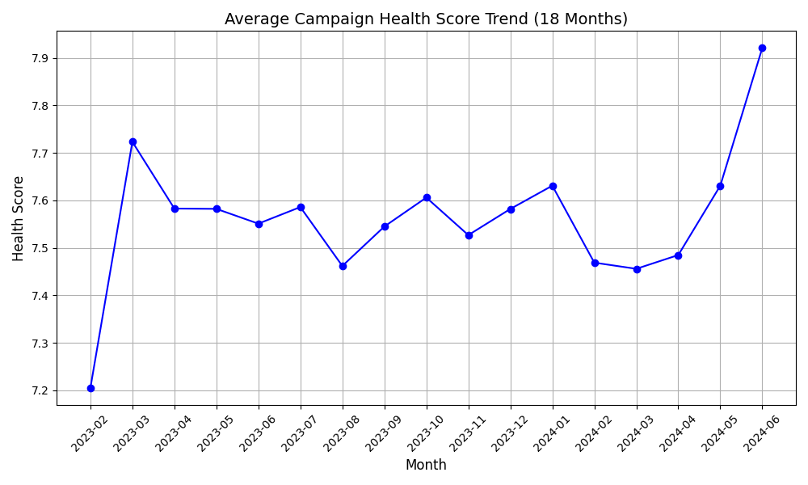

# Campaign Health Analysis Report

## Executive Summary
- Total Campaigns Analyzed: 11
- High Risk Campaigns: 0
- Medium Risk Campaigns: 115
- Low Risk Campaigns: 39
- Most Common Issue: Cost Inefficiency, Low Conversion Quality
- Top Recommendation: Improve ad relevance

## Health Score Trend

## Detailed Campaign Analysis
|   campaign_id | campaign_name                          | campaign_type   | bidding_strategy     | industry    | year_month   |    cost |   roas |   conversion_rate |   quality_score |   impression_share |    ctr |   cost_efficiency_weighted |   conversion_quality_weighted |   competitiveness_weighted |   health_score | risk_level   | core_issue                                | recommendations                                                                                                      |
|--------------:|:---------------------------------------|:----------------|:---------------------|:------------|:-------------|--------:|-------:|------------------:|----------------:|-------------------:|-------:|---------------------------:|------------------------------:|---------------------------:|---------------:|:-------------|:------------------------------------------|:---------------------------------------------------------------------------------------------------------------------|
|           180 | SaaS - Video Campaign 180              | Video           | Manual CPC           | SaaS        | 2023-02      | 37936.1 |   0.56 |            0.0115 |             5.4 |              0.478 | 0.0078 |                       0.01 |                          0.4  |                       7.15 |           7.56 | Medium Risk  | Cost Inefficiency, Low Conversion Quality | ['Reduce daily budget or optimize bidding strategy.', 'Improve landing page relevance or refine keyword targeting.'] |
|           135 | Travel - Display Campaign 135          | Display         | Enhanced CPC         | Travel      | 2023-02      | 49630.6 |   0.43 |            0.0182 |             4.7 |              0.381 | 0.0086 |                       0.01 |                          0.64 |                       6.2  |           6.85 | Medium Risk  | Cost Inefficiency, Low Conversion Quality | ['Reduce daily budget or optimize bidding strategy.', 'Improve landing page relevance or refine keyword targeting.'] |
|            69 | Healthcare - Search Campaign 69        | Search          | Maximize Conversions | Healthcare  | 2023-03      | 57071.3 |   0.52 |            0.0394 |             5.5 |              0.289 | 0.0271 |                       0.01 |                          1.38 |                       7.23 |           8.61 | Low Risk     | Cost Inefficiency, Low Conversion Quality | ['Reduce daily budget or optimize bidding strategy.', 'Improve landing page relevance or refine keyword targeting.'] |
|            56 | Real Estate - Video Campaign 56        | Video           | Target ROAS          | Real Estate | 2023-03      | 41171.7 |   0.31 |            0.0085 |             6.1 |              0.436 | 0.0057 |                       0.01 |                          0.3  |                       7.98 |           8.29 | Low Risk     | Cost Inefficiency, Low Conversion Quality | ['Reduce daily budget or optimize bidding strategy.', 'Improve landing page relevance or refine keyword targeting.'] |
|           148 | Travel - Performance Max Campaign 148  | Performance Max | Target ROAS          | Travel      | 2023-03      | 31431.8 |   0.47 |            0.0395 |             4.7 |              0.369 | 0.0281 |                       0.01 |                          1.38 |                       6.29 |           7.69 | Medium Risk  | Cost Inefficiency, Low Conversion Quality | ['Reduce daily budget or optimize bidding strategy.', 'Improve landing page relevance or refine keyword targeting.'] |
|            27 | Finance - Search Campaign 27           | Search          | Target CPA           | Finance     | 2023-03      | 49648.7 |   0.69 |            0.0295 |             4.8 |              0.494 | 0.0447 |                       0.01 |                          1.03 |                       6.59 |           7.63 | Medium Risk  | Cost Inefficiency, Low Conversion Quality | ['Reduce daily budget or optimize bidding strategy.', 'Improve landing page relevance or refine keyword targeting.'] |
|           180 | SaaS - Video Campaign 180              | Video           | Manual CPC           | SaaS        | 2023-03      | 31006.2 |   0.56 |            0.0086 |             5.4 |              0.478 | 0.0097 |                       0.01 |                          0.3  |                       7.16 |           7.47 | Medium Risk  | Cost Inefficiency, Low Conversion Quality | ['Reduce daily budget or optimize bidding strategy.', 'Improve landing page relevance or refine keyword targeting.'] |
|           135 | Travel - Display Campaign 135          | Display         | Enhanced CPC         | Travel      | 2023-03      | 39449   |   0.43 |            0.0121 |             4.7 |              0.381 | 0.0115 |                       0.01 |                          0.42 |                       6.22 |           6.65 | Medium Risk  | Cost Inefficiency, Low Conversion Quality | ['Reduce daily budget or optimize bidding strategy.', 'Improve landing page relevance or refine keyword targeting.'] |
|            69 | Healthcare - Search Campaign 69        | Search          | Maximize Conversions | Healthcare  | 2023-04      | 55286.2 |   0.52 |            0.0379 |             5.5 |              0.289 | 0.0295 |                       0.01 |                          1.33 |                       7.24 |           8.57 | Low Risk     | Cost Inefficiency, Low Conversion Quality | ['Reduce daily budget or optimize bidding strategy.', 'Improve landing page relevance or refine keyword targeting.'] |
|            56 | Real Estate - Video Campaign 56        | Video           | Target ROAS          | Real Estate | 2023-04      | 33033.3 |   0.31 |            0.0084 |             6.1 |              0.436 | 0.0063 |                       0.01 |                          0.29 |                       7.98 |           8.29 | Low Risk     | Cost Inefficiency, Low Conversion Quality | ['Reduce daily budget or optimize bidding strategy.', 'Improve landing page relevance or refine keyword targeting.'] |
|            27 | Finance - Search Campaign 27           | Search          | Target CPA           | Finance     | 2023-04      | 58263.1 |   0.69 |            0.0392 |             4.8 |              0.494 | 0.0424 |                       0.01 |                          1.37 |                       6.58 |           7.96 | Medium Risk  | Cost Inefficiency, Low Conversion Quality | ['Reduce daily budget or optimize bidding strategy.', 'Improve landing page relevance or refine keyword targeting.'] |
|           148 | Travel - Performance Max Campaign 148  | Performance Max | Target ROAS          | Travel      | 2023-04      | 40512.1 |   0.47 |            0.0389 |             4.7 |              0.369 | 0.0241 |                       0.01 |                          1.36 |                       6.27 |           7.64 | Medium Risk  | Cost Inefficiency, Low Conversion Quality | ['Reduce daily budget or optimize bidding strategy.', 'Improve landing page relevance or refine keyword targeting.'] |
|           180 | SaaS - Video Campaign 180              | Video           | Manual CPC           | SaaS        | 2023-04      | 37243.6 |   0.56 |            0.0079 |             5.4 |              0.478 | 0.0061 |                       0.01 |                          0.28 |                       7.14 |           7.43 | Medium Risk  | Cost Inefficiency, Low Conversion Quality | ['Reduce daily budget or optimize bidding strategy.', 'Improve landing page relevance or refine keyword targeting.'] |
|           135 | Travel - Display Campaign 135          | Display         | Enhanced CPC         | Travel      | 2023-04      | 39662.8 |   0.43 |            0.0121 |             4.7 |              0.381 | 0.0085 |                       0.01 |                          0.42 |                       6.2  |           6.64 | Medium Risk  | Cost Inefficiency, Low Conversion Quality | ['Reduce daily budget or optimize bidding strategy.', 'Improve landing page relevance or refine keyword targeting.'] |
|           105 | Education - Display Campaign 105       | Display         | Target CPA           | Education   | 2023-04      | 32982.3 |   0.43 |            0.0099 |             4.7 |              0.327 | 0.015  |                       0.01 |                          0.35 |                       6.2  |           6.55 | Medium Risk  | Cost Inefficiency, Low Conversion Quality | ['Reduce daily budget or optimize bidding strategy.', 'Improve landing page relevance or refine keyword targeting.'] |
|            69 | Healthcare - Search Campaign 69        | Search          | Maximize Conversions | Healthcare  | 2023-05      | 49089.2 |   0.52 |            0.0426 |             5.5 |              0.289 | 0.0448 |                       0.01 |                          1.49 |                       7.32 |           8.81 | Low Risk     | Cost Inefficiency, Low Conversion Quality | ['Reduce daily budget or optimize bidding strategy.', 'Improve landing page relevance or refine keyword targeting.'] |
|            56 | Real Estate - Video Campaign 56        | Video           | Target ROAS          | Real Estate | 2023-05      | 42331.5 |   0.31 |            0.013  |             6.1 |              0.436 | 0.0088 |                       0.01 |                          0.46 |                       8    |           8.46 | Low Risk     | Cost Inefficiency, Low Conversion Quality | ['Reduce daily budget or optimize bidding strategy.', 'Improve landing page relevance or refine keyword targeting.'] |
|            27 | Finance - Search Campaign 27           | Search          | Target CPA           | Finance     | 2023-05      | 40465.2 |   0.69 |            0.0376 |             4.8 |              0.494 | 0.0451 |                       0.01 |                          1.32 |                       6.6  |           7.92 | Medium Risk  | Cost Inefficiency, Low Conversion Quality | ['Reduce daily budget or optimize bidding strategy.', 'Improve landing page relevance or refine keyword targeting.'] |
|           180 | SaaS - Video Campaign 180              | Video           | Manual CPC           | SaaS        | 2023-05      | 26710.5 |   0.56 |            0.0093 |             5.4 |              0.478 | 0.0097 |                       0.01 |                          0.33 |                       7.16 |           7.5  | Medium Risk  | Cost Inefficiency, Low Conversion Quality | ['Reduce daily budget or optimize bidding strategy.', 'Improve landing page relevance or refine keyword targeting.'] |
|           148 | Travel - Performance Max Campaign 148  | Performance Max | Target ROAS          | Travel      | 2023-05      | 34360.9 |   0.47 |            0.031  |             4.7 |              0.369 | 0.0267 |                       0.01 |                          1.09 |                       6.29 |           7.38 | Medium Risk  | Cost Inefficiency, Low Conversion Quality | ['Reduce daily budget or optimize bidding strategy.', 'Improve landing page relevance or refine keyword targeting.'] |
|           184 | Travel - Video Campaign 184            | Video           | Target CPA           | Travel      | 2023-05      | 31477.1 |   0.69 |            0.0089 |             5.3 |              0.5   | 0.0102 |                       0.01 |                          0.31 |                       7.05 |           7.38 | Medium Risk  | Cost Inefficiency, Low Conversion Quality | ['Reduce daily budget or optimize bidding strategy.', 'Improve landing page relevance or refine keyword targeting.'] |
|            36 | E-commerce - Display Campaign 36       | Display         | Manual CPC           | E-commerce  | 2023-05      | 58997.3 |   0.69 |            0.0097 |             5.3 |              0.293 | 0.0114 |                       0.01 |                          0.34 |                       6.9  |           7.25 | Medium Risk  | Cost Inefficiency, Low Conversion Quality | ['Reduce daily budget or optimize bidding strategy.', 'Improve landing page relevance or refine keyword targeting.'] |
|           105 | Education - Display Campaign 105       | Display         | Target CPA           | Education   | 2023-05      | 46025   |   0.43 |            0.0187 |             4.7 |              0.327 | 0.0145 |                       0.01 |                          0.65 |                       6.19 |           6.86 | Medium Risk  | Cost Inefficiency, Low Conversion Quality | ['Reduce daily budget or optimize bidding strategy.', 'Improve landing page relevance or refine keyword targeting.'] |
|           135 | Travel - Display Campaign 135          | Display         | Enhanced CPC         | Travel      | 2023-05      | 45642.1 |   0.43 |            0.0133 |             4.7 |              0.381 | 0.0088 |                       0.01 |                          0.47 |                       6.2  |           6.68 | Medium Risk  | Cost Inefficiency, Low Conversion Quality | ['Reduce daily budget or optimize bidding strategy.', 'Improve landing page relevance or refine keyword targeting.'] |
|            69 | Healthcare - Search Campaign 69        | Search          | Maximize Conversions | Healthcare  | 2023-06      | 57667.8 |   0.52 |            0.046  |             5.5 |              0.289 | 0.035  |                       0.01 |                          1.61 |                       7.27 |           8.88 | Low Risk     | Cost Inefficiency, Low Conversion Quality | ['Reduce daily budget or optimize bidding strategy.', 'Improve landing page relevance or refine keyword targeting.'] |
|            56 | Real Estate - Video Campaign 56        | Video           | Target ROAS          | Real Estate | 2023-06      | 32843.5 |   0.31 |            0.0132 |             6.1 |              0.436 | 0.0086 |                       0.01 |                          0.46 |                       8    |           8.47 | Low Risk     | Cost Inefficiency, Low Conversion Quality | ['Reduce daily budget or optimize bidding strategy.', 'Improve landing page relevance or refine keyword targeting.'] |
|            27 | Finance - Search Campaign 27           | Search          | Target CPA           | Finance     | 2023-06      | 44974.1 |   0.69 |            0.0399 |             4.8 |              0.494 | 0.0354 |                       0.01 |                          1.4  |                       6.55 |           7.95 | Medium Risk  | Cost Inefficiency, Low Conversion Quality | ['Reduce daily budget or optimize bidding strategy.', 'Improve landing page relevance or refine keyword targeting.'] |
|            36 | E-commerce - Display Campaign 36       | Display         | Manual CPC           | E-commerce  | 2023-06      | 57473.9 |   0.69 |            0.0189 |             5.3 |              0.293 | 0.0122 |                       0.01 |                          0.66 |                       6.91 |           7.57 | Medium Risk  | Cost Inefficiency, Low Conversion Quality | ['Reduce daily budget or optimize bidding strategy.', 'Improve landing page relevance or refine keyword targeting.'] |
|           180 | SaaS - Video Campaign 180              | Video           | Manual CPC           | SaaS        | 2023-06      | 39811.2 |   0.56 |            0.0073 |             5.4 |              0.478 | 0.0065 |                       0.01 |                          0.26 |                       7.14 |           7.41 | Medium Risk  | Cost Inefficiency, Low Conversion Quality | ['Reduce daily budget or optimize bidding strategy.', 'Improve landing page relevance or refine keyword targeting.'] |
|           184 | Travel - Video Campaign 184            | Video           | Target CPA           | Travel      | 2023-06      | 29414.5 |   0.69 |            0.0086 |             5.3 |              0.5   | 0.0079 |                       0.01 |                          0.3  |                       7.04 |           7.35 | Medium Risk  | Cost Inefficiency, Low Conversion Quality | ['Reduce daily budget or optimize bidding strategy.', 'Improve landing page relevance or refine keyword targeting.'] |
|           148 | Travel - Performance Max Campaign 148  | Performance Max | Target ROAS          | Travel      | 2023-06      | 36917.4 |   0.47 |            0.0211 |             4.7 |              0.369 | 0.0202 |                       0.01 |                          0.74 |                       6.25 |           7    | Medium Risk  | Cost Inefficiency, Low Conversion Quality | ['Reduce daily budget or optimize bidding strategy.', 'Improve landing page relevance or refine keyword targeting.'] |
|           105 | Education - Display Campaign 105       | Display         | Target CPA           | Education   | 2023-06      | 48090.1 |   0.43 |            0.015  |             4.7 |              0.327 | 0.0136 |                       0.01 |                          0.53 |                       6.19 |           6.72 | Medium Risk  | Cost Inefficiency, Low Conversion Quality | ['Reduce daily budget or optimize bidding strategy.', 'Improve landing page relevance or refine keyword targeting.'] |
|           135 | Travel - Display Campaign 135          | Display         | Enhanced CPC         | Travel      | 2023-06      | 38139.6 |   0.43 |            0.0113 |             4.7 |              0.381 | 0.009  |                       0.01 |                          0.4  |                       6.21 |           6.61 | Medium Risk  | Cost Inefficiency, Low Conversion Quality | ['Reduce daily budget or optimize bidding strategy.', 'Improve landing page relevance or refine keyword targeting.'] |
|            69 | Healthcare - Search Campaign 69        | Search          | Maximize Conversions | Healthcare  | 2023-07      | 41408.2 |   0.52 |            0.0412 |             5.5 |              0.289 | 0.0277 |                       0.01 |                          1.44 |                       7.23 |           8.68 | Low Risk     | Cost Inefficiency, Low Conversion Quality | ['Reduce daily budget or optimize bidding strategy.', 'Improve landing page relevance or refine keyword targeting.'] |
|            56 | Real Estate - Video Campaign 56        | Video           | Target ROAS          | Real Estate | 2023-07      | 42007.4 |   0.31 |            0.012  |             6.1 |              0.436 | 0.0085 |                       0.01 |                          0.42 |                       7.99 |           8.42 | Low Risk     | Cost Inefficiency, Low Conversion Quality | ['Reduce daily budget or optimize bidding strategy.', 'Improve landing page relevance or refine keyword targeting.'] |
|            27 | Finance - Search Campaign 27           | Search          | Target CPA           | Finance     | 2023-07      | 39918.9 |   0.69 |            0.0386 |             4.8 |              0.494 | 0.0326 |                       0.01 |                          1.35 |                       6.53 |           7.89 | Medium Risk  | Cost Inefficiency, Low Conversion Quality | ['Reduce daily budget or optimize bidding strategy.', 'Improve landing page relevance or refine keyword targeting.'] |
|           178 | Fashion - Performance Max Campaign 178 | Performance Max | Target ROAS          | Fashion     | 2023-07      | 57903.1 |   0.49 |            0.0482 |             4.5 |              0.328 | 0.0213 |                       0.01 |                          1.69 |                       5.98 |           7.67 | Medium Risk  | Cost Inefficiency, Low Conversion Quality | ['Reduce daily budget or optimize bidding strategy.', 'Improve landing page relevance or refine keyword targeting.'] |
|            36 | E-commerce - Display Campaign 36       | Display         | Manual CPC           | E-commerce  | 2023-07      | 53992.5 |   0.69 |            0.0196 |             5.3 |              0.293 | 0.0154 |                       0.01 |                          0.69 |                       6.92 |           7.62 | Medium Risk  | Cost Inefficiency, Low Conversion Quality | ['Reduce daily budget or optimize bidding strategy.', 'Improve landing page relevance or refine keyword targeting.'] |
|           180 | SaaS - Video Campaign 180              | Video           | Manual CPC           | SaaS        | 2023-07      | 33337.8 |   0.56 |            0.0097 |             5.4 |              0.478 | 0.0075 |                       0.01 |                          0.34 |                       7.15 |           7.5  | Medium Risk  | Cost Inefficiency, Low Conversion Quality | ['Reduce daily budget or optimize bidding strategy.', 'Improve landing page relevance or refine keyword targeting.'] |
|           184 | Travel - Video Campaign 184            | Video           | Target CPA           | Travel      | 2023-07      | 37448.6 |   0.69 |            0.0073 |             5.3 |              0.5   | 0.0102 |                       0.01 |                          0.26 |                       7.05 |           7.32 | Medium Risk  | Cost Inefficiency, Low Conversion Quality | ['Reduce daily budget or optimize bidding strategy.', 'Improve landing page relevance or refine keyword targeting.'] |
|           148 | Travel - Performance Max Campaign 148  | Performance Max | Target ROAS          | Travel      | 2023-07      | 37464.9 |   0.47 |            0.0299 |             4.7 |              0.369 | 0.0202 |                       0.01 |                          1.05 |                       6.25 |           7.31 | Medium Risk  | Cost Inefficiency, Low Conversion Quality | ['Reduce daily budget or optimize bidding strategy.', 'Improve landing page relevance or refine keyword targeting.'] |
|           135 | Travel - Display Campaign 135          | Display         | Enhanced CPC         | Travel      | 2023-07      | 35813.3 |   0.43 |            0.0191 |             4.7 |              0.381 | 0.0107 |                       0.01 |                          0.67 |                       6.21 |           6.89 | Medium Risk  | Cost Inefficiency, Low Conversion Quality | ['Reduce daily budget or optimize bidding strategy.', 'Improve landing page relevance or refine keyword targeting.'] |
|           105 | Education - Display Campaign 105       | Display         | Target CPA           | Education   | 2023-07      | 47805.4 |   0.43 |            0.0108 |             4.7 |              0.327 | 0.0116 |                       0.01 |                          0.38 |                       6.18 |           6.56 | Medium Risk  | Cost Inefficiency, Low Conversion Quality | ['Reduce daily budget or optimize bidding strategy.', 'Improve landing page relevance or refine keyword targeting.'] |
|            69 | Healthcare - Search Campaign 69        | Search          | Maximize Conversions | Healthcare  | 2023-08      | 52807.7 |   0.52 |            0.0525 |             5.5 |              0.289 | 0.0318 |                       0.01 |                          1.84 |                       7.25 |           9.1  | Low Risk     | Cost Inefficiency, Low Conversion Quality | ['Reduce daily budget or optimize bidding strategy.', 'Improve landing page relevance or refine keyword targeting.'] |
|            56 | Real Estate - Video Campaign 56        | Video           | Target ROAS          | Real Estate | 2023-08      | 46192   |   0.31 |            0.0076 |             6.1 |              0.436 | 0.0099 |                       0.01 |                          0.27 |                       8    |           8.28 | Low Risk     | Cost Inefficiency, Low Conversion Quality | ['Reduce daily budget or optimize bidding strategy.', 'Improve landing page relevance or refine keyword targeting.'] |
|            27 | Finance - Search Campaign 27           | Search          | Target CPA           | Finance     | 2023-08      | 43048   |   0.69 |            0.0377 |             4.8 |              0.494 | 0.0452 |                       0.01 |                          1.32 |                       6.6  |           7.93 | Medium Risk  | Cost Inefficiency, Low Conversion Quality | ['Reduce daily budget or optimize bidding strategy.', 'Improve landing page relevance or refine keyword targeting.'] |
|           180 | SaaS - Video Campaign 180              | Video           | Manual CPC           | SaaS        | 2023-08      | 30133.5 |   0.56 |            0.0114 |             5.4 |              0.478 | 0.0096 |                       0.01 |                          0.4  |                       7.16 |           7.57 | Medium Risk  | Cost Inefficiency, Low Conversion Quality | ['Reduce daily budget or optimize bidding strategy.', 'Improve landing page relevance or refine keyword targeting.'] |
|           184 | Travel - Video Campaign 184            | Video           | Target CPA           | Travel      | 2023-08      | 38644.4 |   0.69 |            0.0114 |             5.3 |              0.5   | 0.0073 |                       0.01 |                          0.4  |                       7.04 |           7.45 | Medium Risk  | Cost Inefficiency, Low Conversion Quality | ['Reduce daily budget or optimize bidding strategy.', 'Improve landing page relevance or refine keyword targeting.'] |
|            36 | E-commerce - Display Campaign 36       | Display         | Manual CPC           | E-commerce  | 2023-08      | 47695.5 |   0.69 |            0.0099 |             5.3 |              0.293 | 0.0153 |                       0.01 |                          0.35 |                       6.92 |           7.28 | Medium Risk  | Cost Inefficiency, Low Conversion Quality | ['Reduce daily budget or optimize bidding strategy.', 'Improve landing page relevance or refine keyword targeting.'] |
|           148 | Travel - Performance Max Campaign 148  | Performance Max | Target ROAS          | Travel      | 2023-08      | 27556   |   0.47 |            0.0232 |             4.7 |              0.369 | 0.0225 |                       0.01 |                          0.81 |                       6.26 |           7.09 | Medium Risk  | Cost Inefficiency, Low Conversion Quality | ['Reduce daily budget or optimize bidding strategy.', 'Improve landing page relevance or refine keyword targeting.'] |
|           178 | Fashion - Performance Max Campaign 178 | Performance Max | Target ROAS          | Fashion     | 2023-08      | 45807.6 |   0.49 |            0.0212 |             4.5 |              0.328 | 0.0308 |                       0.01 |                          0.74 |                       6.03 |           6.78 | Medium Risk  | Cost Inefficiency, Low Conversion Quality | ['Reduce daily budget or optimize bidding strategy.', 'Improve landing page relevance or refine keyword targeting.'] |
|           135 | Travel - Display Campaign 135          | Display         | Enhanced CPC         | Travel      | 2023-08      | 39463.3 |   0.43 |            0.0107 |             4.7 |              0.381 | 0.0109 |                       0.01 |                          0.37 |                       6.22 |           6.6  | Medium Risk  | Cost Inefficiency, Low Conversion Quality | ['Reduce daily budget or optimize bidding strategy.', 'Improve landing page relevance or refine keyword targeting.'] |
|           105 | Education - Display Campaign 105       | Display         | Target CPA           | Education   | 2023-08      | 40442.8 |   0.43 |            0.0101 |             4.7 |              0.327 | 0.0118 |                       0.01 |                          0.35 |                       6.18 |           6.54 | Medium Risk  | Cost Inefficiency, Low Conversion Quality | ['Reduce daily budget or optimize bidding strategy.', 'Improve landing page relevance or refine keyword targeting.'] |
|            69 | Healthcare - Search Campaign 69        | Search          | Maximize Conversions | Healthcare  | 2023-09      | 56606.3 |   0.52 |            0.0466 |             5.5 |              0.289 | 0.0253 |                       0.01 |                          1.63 |                       7.22 |           8.86 | Low Risk     | Cost Inefficiency, Low Conversion Quality | ['Reduce daily budget or optimize bidding strategy.', 'Improve landing page relevance or refine keyword targeting.'] |
|            56 | Real Estate - Video Campaign 56        | Video           | Target ROAS          | Real Estate | 2023-09      | 42855.3 |   0.31 |            0.0093 |             6.1 |              0.436 | 0.008  |                       0.01 |                          0.33 |                       7.99 |           8.33 | Low Risk     | Cost Inefficiency, Low Conversion Quality | ['Reduce daily budget or optimize bidding strategy.', 'Improve landing page relevance or refine keyword targeting.'] |
|            27 | Finance - Search Campaign 27           | Search          | Target CPA           | Finance     | 2023-09      | 58586.6 |   0.69 |            0.0456 |             4.8 |              0.494 | 0.0248 |                       0.01 |                          1.6  |                       6.49 |           8.1  | Low Risk     | Cost Inefficiency, Low Conversion Quality | ['Reduce daily budget or optimize bidding strategy.', 'Improve landing page relevance or refine keyword targeting.'] |
|           148 | Travel - Performance Max Campaign 148  | Performance Max | Target ROAS          | Travel      | 2023-09      | 40322.1 |   0.47 |            0.0414 |             4.7 |              0.369 | 0.0276 |                       0.01 |                          1.45 |                       6.29 |           7.75 | Medium Risk  | Cost Inefficiency, Low Conversion Quality | ['Reduce daily budget or optimize bidding strategy.', 'Improve landing page relevance or refine keyword targeting.'] |
|           180 | SaaS - Video Campaign 180              | Video           | Manual CPC           | SaaS        | 2023-09      | 27946.6 |   0.56 |            0.0092 |             5.4 |              0.478 | 0.0074 |                       0.01 |                          0.32 |                       7.15 |           7.48 | Medium Risk  | Cost Inefficiency, Low Conversion Quality | ['Reduce daily budget or optimize bidding strategy.', 'Improve landing page relevance or refine keyword targeting.'] |
|           184 | Travel - Video Campaign 184            | Video           | Target CPA           | Travel      | 2023-09      | 40809.1 |   0.69 |            0.0112 |             5.3 |              0.5   | 0.0061 |                       0.01 |                          0.39 |                       7.03 |           7.43 | Medium Risk  | Cost Inefficiency, Low Conversion Quality | ['Reduce daily budget or optimize bidding strategy.', 'Improve landing page relevance or refine keyword targeting.'] |
|            36 | E-commerce - Display Campaign 36       | Display         | Manual CPC           | E-commerce  | 2023-09      | 42344.1 |   0.69 |            0.0093 |             5.3 |              0.293 | 0.0153 |                       0.01 |                          0.33 |                       6.92 |           7.26 | Medium Risk  | Cost Inefficiency, Low Conversion Quality | ['Reduce daily budget or optimize bidding strategy.', 'Improve landing page relevance or refine keyword targeting.'] |
|           178 | Fashion - Performance Max Campaign 178 | Performance Max | Target ROAS          | Fashion     | 2023-09      | 49513.8 |   0.49 |            0.0254 |             4.5 |              0.328 | 0.0198 |                       0.01 |                          0.89 |                       5.97 |           6.87 | Medium Risk  | Cost Inefficiency, Low Conversion Quality | ['Reduce daily budget or optimize bidding strategy.', 'Improve landing page relevance or refine keyword targeting.'] |
|           105 | Education - Display Campaign 105       | Display         | Target CPA           | Education   | 2023-09      | 45807.4 |   0.43 |            0.0155 |             4.7 |              0.327 | 0.0156 |                       0.01 |                          0.54 |                       6.2  |           6.75 | Medium Risk  | Cost Inefficiency, Low Conversion Quality | ['Reduce daily budget or optimize bidding strategy.', 'Improve landing page relevance or refine keyword targeting.'] |
|           135 | Travel - Display Campaign 135          | Display         | Enhanced CPC         | Travel      | 2023-09      | 40387.4 |   0.43 |            0.0116 |             4.7 |              0.381 | 0.0096 |                       0.01 |                          0.41 |                       6.21 |           6.62 | Medium Risk  | Cost Inefficiency, Low Conversion Quality | ['Reduce daily budget or optimize bidding strategy.', 'Improve landing page relevance or refine keyword targeting.'] |
|            69 | Healthcare - Search Campaign 69        | Search          | Maximize Conversions | Healthcare  | 2023-10      | 52998.7 |   0.52 |            0.039  |             5.5 |              0.289 | 0.0313 |                       0.01 |                          1.37 |                       7.25 |           8.62 | Low Risk     | Cost Inefficiency, Low Conversion Quality | ['Reduce daily budget or optimize bidding strategy.', 'Improve landing page relevance or refine keyword targeting.'] |
|            56 | Real Estate - Video Campaign 56        | Video           | Target ROAS          | Real Estate | 2023-10      | 44616.9 |   0.31 |            0.009  |             6.1 |              0.436 | 0.0079 |                       0.01 |                          0.32 |                       7.99 |           8.32 | Low Risk     | Cost Inefficiency, Low Conversion Quality | ['Reduce daily budget or optimize bidding strategy.', 'Improve landing page relevance or refine keyword targeting.'] |
|            27 | Finance - Search Campaign 27           | Search          | Target CPA           | Finance     | 2023-10      | 52866.2 |   0.69 |            0.0462 |             4.8 |              0.494 | 0.0328 |                       0.01 |                          1.62 |                       6.53 |           8.16 | Low Risk     | Cost Inefficiency, Low Conversion Quality | ['Reduce daily budget or optimize bidding strategy.', 'Improve landing page relevance or refine keyword targeting.'] |
|           148 | Travel - Performance Max Campaign 148  | Performance Max | Target ROAS          | Travel      | 2023-10      | 36310.8 |   0.47 |            0.0412 |             4.7 |              0.369 | 0.0293 |                       0.01 |                          1.44 |                       6.3  |           7.75 | Medium Risk  | Cost Inefficiency, Low Conversion Quality | ['Reduce daily budget or optimize bidding strategy.', 'Improve landing page relevance or refine keyword targeting.'] |
|           180 | SaaS - Video Campaign 180              | Video           | Manual CPC           | SaaS        | 2023-10      | 31337.5 |   0.56 |            0.0096 |             5.4 |              0.478 | 0.0075 |                       0.01 |                          0.34 |                       7.15 |           7.49 | Medium Risk  | Cost Inefficiency, Low Conversion Quality | ['Reduce daily budget or optimize bidding strategy.', 'Improve landing page relevance or refine keyword targeting.'] |
|           184 | Travel - Video Campaign 184            | Video           | Target CPA           | Travel      | 2023-10      | 42692.7 |   0.69 |            0.011  |             5.3 |              0.5   | 0.0091 |                       0.01 |                          0.39 |                       7.05 |           7.44 | Medium Risk  | Cost Inefficiency, Low Conversion Quality | ['Reduce daily budget or optimize bidding strategy.', 'Improve landing page relevance or refine keyword targeting.'] |
|           178 | Fashion - Performance Max Campaign 178 | Performance Max | Target ROAS          | Fashion     | 2023-10      | 47328.9 |   0.49 |            0.0399 |             4.5 |              0.328 | 0.0192 |                       0.01 |                          1.4  |                       5.97 |           7.37 | Medium Risk  | Cost Inefficiency, Low Conversion Quality | ['Reduce daily budget or optimize bidding strategy.', 'Improve landing page relevance or refine keyword targeting.'] |
|            36 | E-commerce - Display Campaign 36       | Display         | Manual CPC           | E-commerce  | 2023-10      | 49549.8 |   0.69 |            0.0093 |             5.3 |              0.293 | 0.0137 |                       0.01 |                          0.33 |                       6.91 |           7.25 | Medium Risk  | Cost Inefficiency, Low Conversion Quality | ['Reduce daily budget or optimize bidding strategy.', 'Improve landing page relevance or refine keyword targeting.'] |
|           135 | Travel - Display Campaign 135          | Display         | Enhanced CPC         | Travel      | 2023-10      | 43127.2 |   0.43 |            0.0192 |             4.7 |              0.381 | 0.0153 |                       0.01 |                          0.67 |                       6.24 |           6.92 | Medium Risk  | Cost Inefficiency, Low Conversion Quality | ['Reduce daily budget or optimize bidding strategy.', 'Improve landing page relevance or refine keyword targeting.'] |
|           105 | Education - Display Campaign 105       | Display         | Target CPA           | Education   | 2023-10      | 40097.4 |   0.43 |            0.0158 |             4.7 |              0.327 | 0.0109 |                       0.01 |                          0.55 |                       6.17 |           6.74 | Medium Risk  | Cost Inefficiency, Low Conversion Quality | ['Reduce daily budget or optimize bidding strategy.', 'Improve landing page relevance or refine keyword targeting.'] |
|            69 | Healthcare - Search Campaign 69        | Search          | Maximize Conversions | Healthcare  | 2023-11      | 43702.5 |   0.52 |            0.0502 |             5.5 |              0.289 | 0.0339 |                       0.01 |                          1.76 |                       7.26 |           9.03 | Low Risk     | Cost Inefficiency, Low Conversion Quality | ['Reduce daily budget or optimize bidding strategy.', 'Improve landing page relevance or refine keyword targeting.'] |
|            56 | Real Estate - Video Campaign 56        | Video           | Target ROAS          | Real Estate | 2023-11      | 31888   |   0.31 |            0.0096 |             6.1 |              0.436 | 0.0064 |                       0.01 |                          0.34 |                       7.98 |           8.33 | Low Risk     | Cost Inefficiency, Low Conversion Quality | ['Reduce daily budget or optimize bidding strategy.', 'Improve landing page relevance or refine keyword targeting.'] |
|            27 | Finance - Search Campaign 27           | Search          | Target CPA           | Finance     | 2023-11      | 41802.9 |   0.69 |            0.0304 |             4.8 |              0.494 | 0.0287 |                       0.01 |                          1.06 |                       6.51 |           7.59 | Medium Risk  | Cost Inefficiency, Low Conversion Quality | ['Reduce daily budget or optimize bidding strategy.', 'Improve landing page relevance or refine keyword targeting.'] |
|           184 | Travel - Video Campaign 184            | Video           | Target CPA           | Travel      | 2023-11      | 38495.5 |   0.69 |            0.0122 |             5.3 |              0.5   | 0.0084 |                       0.01 |                          0.43 |                       7.04 |           7.48 | Medium Risk  | Cost Inefficiency, Low Conversion Quality | ['Reduce daily budget or optimize bidding strategy.', 'Improve landing page relevance or refine keyword targeting.'] |
|           180 | SaaS - Video Campaign 180              | Video           | Manual CPC           | SaaS        | 2023-11      | 35024.1 |   0.56 |            0.009  |             5.4 |              0.478 | 0.0061 |                       0.01 |                          0.32 |                       7.14 |           7.47 | Medium Risk  | Cost Inefficiency, Low Conversion Quality | ['Reduce daily budget or optimize bidding strategy.', 'Improve landing page relevance or refine keyword targeting.'] |
|            36 | E-commerce - Display Campaign 36       | Display         | Manual CPC           | E-commerce  | 2023-11      | 57594   |   0.69 |            0.0159 |             5.3 |              0.293 | 0.0108 |                       0.01 |                          0.56 |                       6.9  |           7.46 | Medium Risk  | Cost Inefficiency, Low Conversion Quality | ['Reduce daily budget or optimize bidding strategy.', 'Improve landing page relevance or refine keyword targeting.'] |
|           148 | Travel - Performance Max Campaign 148  | Performance Max | Target ROAS          | Travel      | 2023-11      | 28480.8 |   0.47 |            0.0308 |             4.7 |              0.369 | 0.0307 |                       0.01 |                          1.08 |                       6.31 |           7.4  | Medium Risk  | Cost Inefficiency, Low Conversion Quality | ['Reduce daily budget or optimize bidding strategy.', 'Improve landing page relevance or refine keyword targeting.'] |
|           178 | Fashion - Performance Max Campaign 178 | Performance Max | Target ROAS          | Fashion     | 2023-11      | 47247.7 |   0.49 |            0.0376 |             4.5 |              0.328 | 0.0194 |                       0.01 |                          1.32 |                       5.97 |           7.29 | Medium Risk  | Cost Inefficiency, Low Conversion Quality | ['Reduce daily budget or optimize bidding strategy.', 'Improve landing page relevance or refine keyword targeting.'] |
|           105 | Education - Display Campaign 105       | Display         | Target CPA           | Education   | 2023-11      | 42209.2 |   0.43 |            0.0124 |             4.7 |              0.327 | 0.0142 |                       0.01 |                          0.43 |                       6.19 |           6.63 | Medium Risk  | Cost Inefficiency, Low Conversion Quality | ['Reduce daily budget or optimize bidding strategy.', 'Improve landing page relevance or refine keyword targeting.'] |
|           135 | Travel - Display Campaign 135          | Display         | Enhanced CPC         | Travel      | 2023-11      | 40487.4 |   0.43 |            0.0106 |             4.7 |              0.381 | 0.0092 |                       0.01 |                          0.37 |                       6.21 |           6.59 | Medium Risk  | Cost Inefficiency, Low Conversion Quality | ['Reduce daily budget or optimize bidding strategy.', 'Improve landing page relevance or refine keyword targeting.'] |
|            69 | Healthcare - Search Campaign 69        | Search          | Maximize Conversions | Healthcare  | 2023-12      | 51609.1 |   0.52 |            0.0438 |             5.5 |              0.289 | 0.043  |                       0.01 |                          1.53 |                       7.31 |           8.85 | Low Risk     | Cost Inefficiency, Low Conversion Quality | ['Reduce daily budget or optimize bidding strategy.', 'Improve landing page relevance or refine keyword targeting.'] |
|            56 | Real Estate - Video Campaign 56        | Video           | Target ROAS          | Real Estate | 2023-12      | 45254.9 |   0.31 |            0.0134 |             6.1 |              0.436 | 0.0098 |                       0.01 |                          0.47 |                       8    |           8.48 | Low Risk     | Cost Inefficiency, Low Conversion Quality | ['Reduce daily budget or optimize bidding strategy.', 'Improve landing page relevance or refine keyword targeting.'] |
|            27 | Finance - Search Campaign 27           | Search          | Target CPA           | Finance     | 2023-12      | 47379.9 |   0.69 |            0.0485 |             4.8 |              0.494 | 0.0406 |                       0.01 |                          1.7  |                       6.57 |           8.28 | Low Risk     | Cost Inefficiency, Low Conversion Quality | ['Reduce daily budget or optimize bidding strategy.', 'Improve landing page relevance or refine keyword targeting.'] |
|           148 | Travel - Performance Max Campaign 148  | Performance Max | Target ROAS          | Travel      | 2023-12      | 34599.8 |   0.47 |            0.0336 |             4.7 |              0.369 | 0.0209 |                       0.01 |                          1.18 |                       6.26 |           7.44 | Medium Risk  | Cost Inefficiency, Low Conversion Quality | ['Reduce daily budget or optimize bidding strategy.', 'Improve landing page relevance or refine keyword targeting.'] |
|            36 | E-commerce - Display Campaign 36       | Display         | Manual CPC           | E-commerce  | 2023-12      | 53826.5 |   0.69 |            0.0145 |             5.3 |              0.293 | 0.0123 |                       0.01 |                          0.51 |                       6.91 |           7.42 | Medium Risk  | Cost Inefficiency, Low Conversion Quality | ['Reduce daily budget or optimize bidding strategy.', 'Improve landing page relevance or refine keyword targeting.'] |
|           180 | SaaS - Video Campaign 180              | Video           | Manual CPC           | SaaS        | 2023-12      | 28099.9 |   0.56 |            0.0063 |             5.4 |              0.478 | 0.0075 |                       0.01 |                          0.22 |                       7.15 |           7.38 | Medium Risk  | Cost Inefficiency, Low Conversion Quality | ['Reduce daily budget or optimize bidding strategy.', 'Improve landing page relevance or refine keyword targeting.'] |
|           184 | Travel - Video Campaign 184            | Video           | Target CPA           | Travel      | 2023-12      | 42736.1 |   0.69 |            0.0072 |             5.3 |              0.5   | 0.0087 |                       0.01 |                          0.25 |                       7.04 |           7.3  | Medium Risk  | Cost Inefficiency, Low Conversion Quality | ['Reduce daily budget or optimize bidding strategy.', 'Improve landing page relevance or refine keyword targeting.'] |
|           178 | Fashion - Performance Max Campaign 178 | Performance Max | Target ROAS          | Fashion     | 2023-12      | 41474.7 |   0.49 |            0.0355 |             4.5 |              0.328 | 0.0313 |                       0.01 |                          1.24 |                       6.03 |           7.28 | Medium Risk  | Cost Inefficiency, Low Conversion Quality | ['Reduce daily budget or optimize bidding strategy.', 'Improve landing page relevance or refine keyword targeting.'] |
|           135 | Travel - Display Campaign 135          | Display         | Enhanced CPC         | Travel      | 2023-12      | 35288   |   0.43 |            0.0153 |             4.7 |              0.381 | 0.0155 |                       0.01 |                          0.54 |                       6.24 |           6.79 | Medium Risk  | Cost Inefficiency, Low Conversion Quality | ['Reduce daily budget or optimize bidding strategy.', 'Improve landing page relevance or refine keyword targeting.'] |
|           105 | Education - Display Campaign 105       | Display         | Target CPA           | Education   | 2023-12      | 41973.2 |   0.43 |            0.012  |             4.7 |              0.327 | 0.0095 |                       0.01 |                          0.42 |                       6.17 |           6.6  | Medium Risk  | Cost Inefficiency, Low Conversion Quality | ['Reduce daily budget or optimize bidding strategy.', 'Improve landing page relevance or refine keyword targeting.'] |
|            27 | Finance - Search Campaign 27           | Search          | Target CPA           | Finance     | 2024-01      | 58676.9 |   0.69 |            0.0544 |             4.8 |              0.494 | 0.0385 |                       0.01 |                          1.9  |                       6.56 |           8.47 | Low Risk     | Cost Inefficiency, Low Conversion Quality | ['Reduce daily budget or optimize bidding strategy.', 'Improve landing page relevance or refine keyword targeting.'] |
|            69 | Healthcare - Search Campaign 69        | Search          | Maximize Conversions | Healthcare  | 2024-01      | 41483.5 |   0.52 |            0.0301 |             5.5 |              0.289 | 0.0417 |                       0.01 |                          1.05 |                       7.3  |           8.36 | Low Risk     | Cost Inefficiency, Low Conversion Quality | ['Reduce daily budget or optimize bidding strategy.', 'Improve landing page relevance or refine keyword targeting.'] |
|            56 | Real Estate - Video Campaign 56        | Video           | Target ROAS          | Real Estate | 2024-01      | 36335.9 |   0.31 |            0.0085 |             6.1 |              0.436 | 0.0067 |                       0.01 |                          0.3  |                       7.99 |           8.29 | Low Risk     | Cost Inefficiency, Low Conversion Quality | ['Reduce daily budget or optimize bidding strategy.', 'Improve landing page relevance or refine keyword targeting.'] |
|           148 | Travel - Performance Max Campaign 148  | Performance Max | Target ROAS          | Travel      | 2024-01      | 29889.6 |   0.47 |            0.0459 |             4.7 |              0.369 | 0.0226 |                       0.01 |                          1.61 |                       6.26 |           7.88 | Medium Risk  | Cost Inefficiency, Low Conversion Quality | ['Reduce daily budget or optimize bidding strategy.', 'Improve landing page relevance or refine keyword targeting.'] |
|           178 | Fashion - Performance Max Campaign 178 | Performance Max | Target ROAS          | Fashion     | 2024-01      | 57471.9 |   0.49 |            0.0475 |             4.5 |              0.328 | 0.0298 |                       0.01 |                          1.66 |                       6.02 |           7.69 | Medium Risk  | Cost Inefficiency, Low Conversion Quality | ['Reduce daily budget or optimize bidding strategy.', 'Improve landing page relevance or refine keyword targeting.'] |
|           180 | SaaS - Video Campaign 180              | Video           | Manual CPC           | SaaS        | 2024-01      | 33663.6 |   0.56 |            0.0071 |             5.4 |              0.478 | 0.0099 |                       0.01 |                          0.25 |                       7.16 |           7.42 | Medium Risk  | Cost Inefficiency, Low Conversion Quality | ['Reduce daily budget or optimize bidding strategy.', 'Improve landing page relevance or refine keyword targeting.'] |
|            36 | E-commerce - Display Campaign 36       | Display         | Manual CPC           | E-commerce  | 2024-01      | 56576.2 |   0.69 |            0.0125 |             5.3 |              0.293 | 0.0111 |                       0.01 |                          0.44 |                       6.9  |           7.34 | Medium Risk  | Cost Inefficiency, Low Conversion Quality | ['Reduce daily budget or optimize bidding strategy.', 'Improve landing page relevance or refine keyword targeting.'] |
|           184 | Travel - Video Campaign 184            | Video           | Target CPA           | Travel      | 2024-01      | 42140.9 |   0.69 |            0.0067 |             5.3 |              0.5   | 0.008  |                       0.01 |                          0.23 |                       7.04 |           7.28 | Medium Risk  | Cost Inefficiency, Low Conversion Quality | ['Reduce daily budget or optimize bidding strategy.', 'Improve landing page relevance or refine keyword targeting.'] |
|           135 | Travel - Display Campaign 135          | Display         | Enhanced CPC         | Travel      | 2024-01      | 46598.1 |   0.43 |            0.0173 |             4.7 |              0.381 | 0.0093 |                       0.01 |                          0.61 |                       6.21 |           6.82 | Medium Risk  | Cost Inefficiency, Low Conversion Quality | ['Reduce daily budget or optimize bidding strategy.', 'Improve landing page relevance or refine keyword targeting.'] |
|           105 | Education - Display Campaign 105       | Display         | Target CPA           | Education   | 2024-01      | 44725.9 |   0.43 |            0.0159 |             4.7 |              0.327 | 0.0152 |                       0.01 |                          0.56 |                       6.2  |           6.76 | Medium Risk  | Cost Inefficiency, Low Conversion Quality | ['Reduce daily budget or optimize bidding strategy.', 'Improve landing page relevance or refine keyword targeting.'] |
|            56 | Real Estate - Video Campaign 56        | Video           | Target ROAS          | Real Estate | 2024-02      | 32251.6 |   0.31 |            0.0098 |             6.1 |              0.436 | 0.01   |                       0.01 |                          0.34 |                       8    |           8.36 | Low Risk     | Cost Inefficiency, Low Conversion Quality | ['Reduce daily budget or optimize bidding strategy.', 'Improve landing page relevance or refine keyword targeting.'] |
|            69 | Healthcare - Search Campaign 69        | Search          | Maximize Conversions | Healthcare  | 2024-02      | 46511.5 |   0.52 |            0.0271 |             5.5 |              0.289 | 0.0313 |                       0.01 |                          0.95 |                       7.25 |           8.21 | Low Risk     | Cost Inefficiency, Low Conversion Quality | ['Reduce daily budget or optimize bidding strategy.', 'Improve landing page relevance or refine keyword targeting.'] |
|           148 | Travel - Performance Max Campaign 148  | Performance Max | Target ROAS          | Travel      | 2024-02      | 40544.5 |   0.47 |            0.046  |             4.7 |              0.369 | 0.0323 |                       0.01 |                          1.61 |                       6.31 |           7.93 | Medium Risk  | Cost Inefficiency, Low Conversion Quality | ['Reduce daily budget or optimize bidding strategy.', 'Improve landing page relevance or refine keyword targeting.'] |
|            27 | Finance - Search Campaign 27           | Search          | Target CPA           | Finance     | 2024-02      | 48032   |   0.69 |            0.0314 |             4.8 |              0.494 | 0.0348 |                       0.01 |                          1.1  |                       6.54 |           7.65 | Medium Risk  | Cost Inefficiency, Low Conversion Quality | ['Reduce daily budget or optimize bidding strategy.', 'Improve landing page relevance or refine keyword targeting.'] |
|           180 | SaaS - Video Campaign 180              | Video           | Manual CPC           | SaaS        | 2024-02      | 35105.1 |   0.56 |            0.0101 |             5.4 |              0.478 | 0.0084 |                       0.01 |                          0.35 |                       7.15 |           7.52 | Medium Risk  | Cost Inefficiency, Low Conversion Quality | ['Reduce daily budget or optimize bidding strategy.', 'Improve landing page relevance or refine keyword targeting.'] |
|           184 | Travel - Video Campaign 184            | Video           | Target CPA           | Travel      | 2024-02      | 43867.8 |   0.69 |            0.0121 |             5.3 |              0.5   | 0.0089 |                       0.01 |                          0.42 |                       7.04 |           7.48 | Medium Risk  | Cost Inefficiency, Low Conversion Quality | ['Reduce daily budget or optimize bidding strategy.', 'Improve landing page relevance or refine keyword targeting.'] |
|            36 | E-commerce - Display Campaign 36       | Display         | Manual CPC           | E-commerce  | 2024-02      | 60295.8 |   0.69 |            0.0154 |             5.3 |              0.293 | 0.0096 |                       0.01 |                          0.54 |                       6.89 |           7.44 | Medium Risk  | Cost Inefficiency, Low Conversion Quality | ['Reduce daily budget or optimize bidding strategy.', 'Improve landing page relevance or refine keyword targeting.'] |
|           178 | Fashion - Performance Max Campaign 178 | Performance Max | Target ROAS          | Fashion     | 2024-02      | 48795.1 |   0.49 |            0.025  |             4.5 |              0.328 | 0.0237 |                       0.01 |                          0.88 |                       5.99 |           6.87 | Medium Risk  | Cost Inefficiency, Low Conversion Quality | ['Reduce daily budget or optimize bidding strategy.', 'Improve landing page relevance or refine keyword targeting.'] |
|           105 | Education - Display Campaign 105       | Display         | Target CPA           | Education   | 2024-02      | 49302.3 |   0.43 |            0.0128 |             4.7 |              0.327 | 0.0101 |                       0.01 |                          0.45 |                       6.17 |           6.63 | Medium Risk  | Cost Inefficiency, Low Conversion Quality | ['Reduce daily budget or optimize bidding strategy.', 'Improve landing page relevance or refine keyword targeting.'] |
|           135 | Travel - Display Campaign 135          | Display         | Enhanced CPC         | Travel      | 2024-02      | 51018.9 |   0.43 |            0.0103 |             4.7 |              0.381 | 0.0139 |                       0.01 |                          0.36 |                       6.23 |           6.6  | Medium Risk  | Cost Inefficiency, Low Conversion Quality | ['Reduce daily budget or optimize bidding strategy.', 'Improve landing page relevance or refine keyword targeting.'] |
|            69 | Healthcare - Search Campaign 69        | Search          | Maximize Conversions | Healthcare  | 2024-03      | 44121.1 |   0.52 |            0.0301 |             5.5 |              0.289 | 0.0267 |                       0.01 |                          1.05 |                       7.23 |           8.29 | Low Risk     | Cost Inefficiency, Low Conversion Quality | ['Reduce daily budget or optimize bidding strategy.', 'Improve landing page relevance or refine keyword targeting.'] |
|            56 | Real Estate - Video Campaign 56        | Video           | Target ROAS          | Real Estate | 2024-03      | 40234.3 |   0.31 |            0.0077 |             6.1 |              0.436 | 0.0057 |                       0.01 |                          0.27 |                       7.98 |           8.26 | Low Risk     | Cost Inefficiency, Low Conversion Quality | ['Reduce daily budget or optimize bidding strategy.', 'Improve landing page relevance or refine keyword targeting.'] |
|           178 | Fashion - Performance Max Campaign 178 | Performance Max | Target ROAS          | Fashion     | 2024-03      | 49432.1 |   0.49 |            0.0468 |             4.5 |              0.328 | 0.0278 |                       0.01 |                          1.64 |                       6.01 |           7.66 | Medium Risk  | Cost Inefficiency, Low Conversion Quality | ['Reduce daily budget or optimize bidding strategy.', 'Improve landing page relevance or refine keyword targeting.'] |
|            27 | Finance - Search Campaign 27           | Search          | Target CPA           | Finance     | 2024-03      | 56216.8 |   0.69 |            0.0297 |             4.8 |              0.494 | 0.0251 |                       0.01 |                          1.04 |                       6.5  |           7.54 | Medium Risk  | Cost Inefficiency, Low Conversion Quality | ['Reduce daily budget or optimize bidding strategy.', 'Improve landing page relevance or refine keyword targeting.'] |
|           184 | Travel - Video Campaign 184            | Video           | Target CPA           | Travel      | 2024-03      | 37431.7 |   0.69 |            0.0119 |             5.3 |              0.5   | 0.0063 |                       0.01 |                          0.42 |                       7.03 |           7.46 | Medium Risk  | Cost Inefficiency, Low Conversion Quality | ['Reduce daily budget or optimize bidding strategy.', 'Improve landing page relevance or refine keyword targeting.'] |
|           180 | SaaS - Video Campaign 180              | Video           | Manual CPC           | SaaS        | 2024-03      | 33004.4 |   0.56 |            0.0069 |             5.4 |              0.478 | 0.0072 |                       0.01 |                          0.24 |                       7.14 |           7.4  | Medium Risk  | Cost Inefficiency, Low Conversion Quality | ['Reduce daily budget or optimize bidding strategy.', 'Improve landing page relevance or refine keyword targeting.'] |
|           148 | Travel - Performance Max Campaign 148  | Performance Max | Target ROAS          | Travel      | 2024-03      | 35034.7 |   0.47 |            0.0303 |             4.7 |              0.369 | 0.0183 |                       0.01 |                          1.06 |                       6.24 |           7.32 | Medium Risk  | Cost Inefficiency, Low Conversion Quality | ['Reduce daily budget or optimize bidding strategy.', 'Improve landing page relevance or refine keyword targeting.'] |
|            36 | E-commerce - Display Campaign 36       | Display         | Manual CPC           | E-commerce  | 2024-03      | 59148.3 |   0.69 |            0.0104 |             5.3 |              0.293 | 0.0096 |                       0.01 |                          0.36 |                       6.89 |           7.26 | Medium Risk  | Cost Inefficiency, Low Conversion Quality | ['Reduce daily budget or optimize bidding strategy.', 'Improve landing page relevance or refine keyword targeting.'] |
|           135 | Travel - Display Campaign 135          | Display         | Enhanced CPC         | Travel      | 2024-03      | 36359.1 |   0.43 |            0.0161 |             4.7 |              0.381 | 0.0132 |                       0.01 |                          0.56 |                       6.23 |           6.8  | Medium Risk  | Cost Inefficiency, Low Conversion Quality | ['Reduce daily budget or optimize bidding strategy.', 'Improve landing page relevance or refine keyword targeting.'] |
|           105 | Education - Display Campaign 105       | Display         | Target CPA           | Education   | 2024-03      | 44121.5 |   0.43 |            0.0107 |             4.7 |              0.327 | 0.0125 |                       0.01 |                          0.37 |                       6.18 |           6.57 | Medium Risk  | Cost Inefficiency, Low Conversion Quality | ['Reduce daily budget or optimize bidding strategy.', 'Improve landing page relevance or refine keyword targeting.'] |
|            56 | Real Estate - Video Campaign 56        | Video           | Target ROAS          | Real Estate | 2024-04      | 36966.8 |   0.31 |            0.007  |             6.1 |              0.436 | 0.0067 |                       0.01 |                          0.25 |                       7.99 |           8.24 | Low Risk     | Cost Inefficiency, Low Conversion Quality | ['Reduce daily budget or optimize bidding strategy.', 'Improve landing page relevance or refine keyword targeting.'] |
|            69 | Healthcare - Search Campaign 69        | Search          | Maximize Conversions | Healthcare  | 2024-04      | 51242   |   0.52 |            0.0256 |             5.5 |              0.289 | 0.0369 |                       0.01 |                          0.9  |                       7.28 |           8.18 | Low Risk     | Cost Inefficiency, Low Conversion Quality | ['Reduce daily budget or optimize bidding strategy.', 'Improve landing page relevance or refine keyword targeting.'] |
|            27 | Finance - Search Campaign 27           | Search          | Target CPA           | Finance     | 2024-04      | 51705.2 |   0.69 |            0.0406 |             4.8 |              0.494 | 0.0384 |                       0.01 |                          1.42 |                       6.56 |           7.99 | Medium Risk  | Cost Inefficiency, Low Conversion Quality | ['Reduce daily budget or optimize bidding strategy.', 'Improve landing page relevance or refine keyword targeting.'] |
|           178 | Fashion - Performance Max Campaign 178 | Performance Max | Target ROAS          | Fashion     | 2024-04      | 41154.3 |   0.49 |            0.0465 |             4.5 |              0.328 | 0.0253 |                       0.01 |                          1.63 |                       6    |           7.63 | Medium Risk  | Cost Inefficiency, Low Conversion Quality | ['Reduce daily budget or optimize bidding strategy.', 'Improve landing page relevance or refine keyword targeting.'] |
|            36 | E-commerce - Display Campaign 36       | Display         | Manual CPC           | E-commerce  | 2024-04      | 47227.4 |   0.69 |            0.017  |             5.3 |              0.293 | 0.0135 |                       0.01 |                          0.6  |                       6.91 |           7.52 | Medium Risk  | Cost Inefficiency, Low Conversion Quality | ['Reduce daily budget or optimize bidding strategy.', 'Improve landing page relevance or refine keyword targeting.'] |
|           180 | SaaS - Video Campaign 180              | Video           | Manual CPC           | SaaS        | 2024-04      | 38896.6 |   0.56 |            0.0081 |             5.4 |              0.478 | 0.0085 |                       0.01 |                          0.28 |                       7.15 |           7.44 | Medium Risk  | Cost Inefficiency, Low Conversion Quality | ['Reduce daily budget or optimize bidding strategy.', 'Improve landing page relevance or refine keyword targeting.'] |
|           184 | Travel - Video Campaign 184            | Video           | Target CPA           | Travel      | 2024-04      | 32032   |   0.69 |            0.0113 |             5.3 |              0.5   | 0.0067 |                       0.01 |                          0.4  |                       7.03 |           7.44 | Medium Risk  | Cost Inefficiency, Low Conversion Quality | ['Reduce daily budget or optimize bidding strategy.', 'Improve landing page relevance or refine keyword targeting.'] |
|           148 | Travel - Performance Max Campaign 148  | Performance Max | Target ROAS          | Travel      | 2024-04      | 39764.7 |   0.47 |            0.0293 |             4.7 |              0.369 | 0.0274 |                       0.01 |                          1.03 |                       6.29 |           7.32 | Medium Risk  | Cost Inefficiency, Low Conversion Quality | ['Reduce daily budget or optimize bidding strategy.', 'Improve landing page relevance or refine keyword targeting.'] |
|           135 | Travel - Display Campaign 135          | Display         | Enhanced CPC         | Travel      | 2024-04      | 38326.1 |   0.43 |            0.0105 |             4.7 |              0.381 | 0.0091 |                       0.01 |                          0.37 |                       6.21 |           6.58 | Medium Risk  | Cost Inefficiency, Low Conversion Quality | ['Reduce daily budget or optimize bidding strategy.', 'Improve landing page relevance or refine keyword targeting.'] |
|           105 | Education - Display Campaign 105       | Display         | Target CPA           | Education   | 2024-04      | 48921.9 |   0.43 |            0.0095 |             4.7 |              0.327 | 0.0097 |                       0.01 |                          0.33 |                       6.17 |           6.51 | Medium Risk  | Cost Inefficiency, Low Conversion Quality | ['Reduce daily budget or optimize bidding strategy.', 'Improve landing page relevance or refine keyword targeting.'] |
|            69 | Healthcare - Search Campaign 69        | Search          | Maximize Conversions | Healthcare  | 2024-05      | 61104.7 |   0.52 |            0.0506 |             5.5 |              0.289 | 0.044  |                       0.01 |                          1.77 |                       7.31 |           9.09 | Low Risk     | Cost Inefficiency, Low Conversion Quality | ['Reduce daily budget or optimize bidding strategy.', 'Improve landing page relevance or refine keyword targeting.'] |
|            56 | Real Estate - Video Campaign 56        | Video           | Target ROAS          | Real Estate | 2024-05      | 30835.6 |   0.31 |            0.0103 |             6.1 |              0.436 | 0.008  |                       0.01 |                          0.36 |                       7.99 |           8.37 | Low Risk     | Cost Inefficiency, Low Conversion Quality | ['Reduce daily budget or optimize bidding strategy.', 'Improve landing page relevance or refine keyword targeting.'] |
|            27 | Finance - Search Campaign 27           | Search          | Target CPA           | Finance     | 2024-05      | 48974.6 |   0.69 |            0.0499 |             4.8 |              0.494 | 0.0359 |                       0.01 |                          1.75 |                       6.55 |           8.3  | Low Risk     | Cost Inefficiency, Low Conversion Quality | ['Reduce daily budget or optimize bidding strategy.', 'Improve landing page relevance or refine keyword targeting.'] |
|           178 | Fashion - Performance Max Campaign 178 | Performance Max | Target ROAS          | Fashion     | 2024-05      | 42142.8 |   0.49 |            0.0456 |             4.5 |              0.328 | 0.0265 |                       0.01 |                          1.6  |                       6    |           7.61 | Medium Risk  | Cost Inefficiency, Low Conversion Quality | ['Reduce daily budget or optimize bidding strategy.', 'Improve landing page relevance or refine keyword targeting.'] |
|           180 | SaaS - Video Campaign 180              | Video           | Manual CPC           | SaaS        | 2024-05      | 29335.2 |   0.56 |            0.0102 |             5.4 |              0.478 | 0.0079 |                       0.01 |                          0.36 |                       7.15 |           7.52 | Medium Risk  | Cost Inefficiency, Low Conversion Quality | ['Reduce daily budget or optimize bidding strategy.', 'Improve landing page relevance or refine keyword targeting.'] |
|           184 | Travel - Video Campaign 184            | Video           | Target CPA           | Travel      | 2024-05      | 43122.7 |   0.69 |            0.0112 |             5.3 |              0.5   | 0.0058 |                       0.01 |                          0.39 |                       7.03 |           7.43 | Medium Risk  | Cost Inefficiency, Low Conversion Quality | ['Reduce daily budget or optimize bidding strategy.', 'Improve landing page relevance or refine keyword targeting.'] |
|            36 | E-commerce - Display Campaign 36       | Display         | Manual CPC           | E-commerce  | 2024-05      | 60724.8 |   0.69 |            0.0093 |             5.3 |              0.293 | 0.0093 |                       0.01 |                          0.33 |                       6.89 |           7.22 | Medium Risk  | Cost Inefficiency, Low Conversion Quality | ['Reduce daily budget or optimize bidding strategy.', 'Improve landing page relevance or refine keyword targeting.'] |
|           148 | Travel - Performance Max Campaign 148  | Performance Max | Target ROAS          | Travel      | 2024-05      | 33305.2 |   0.47 |            0.0235 |             4.7 |              0.369 | 0.0176 |                       0.01 |                          0.82 |                       6.24 |           7.07 | Medium Risk  | Cost Inefficiency, Low Conversion Quality | ['Reduce daily budget or optimize bidding strategy.', 'Improve landing page relevance or refine keyword targeting.'] |
|           105 | Education - Display Campaign 105       | Display         | Target CPA           | Education   | 2024-05      | 40066.9 |   0.43 |            0.0187 |             4.7 |              0.327 | 0.0128 |                       0.01 |                          0.65 |                       6.18 |           6.85 | Medium Risk  | Cost Inefficiency, Low Conversion Quality | ['Reduce daily budget or optimize bidding strategy.', 'Improve landing page relevance or refine keyword targeting.'] |
|           135 | Travel - Display Campaign 135          | Display         | Enhanced CPC         | Travel      | 2024-05      | 45218.4 |   0.43 |            0.018  |             4.7 |              0.381 | 0.0094 |                       0.01 |                          0.63 |                       6.21 |           6.85 | Medium Risk  | Cost Inefficiency, Low Conversion Quality | ['Reduce daily budget or optimize bidding strategy.', 'Improve landing page relevance or refine keyword targeting.'] |
|            97 | Fashion - Video Campaign 97            | Video           | Manual CPC           | Fashion     | 2024-06      | 16762.6 |   0.58 |            0.0061 |             8.4 |              0.436 | 0.0081 |                       0.02 |                          0.21 |                      10.87 |          11.1  | Low Risk     | Cost Inefficiency, Low Conversion Quality | ['Reduce daily budget or optimize bidding strategy.', 'Improve landing page relevance or refine keyword targeting.'] |
|            69 | Healthcare - Search Campaign 69        | Search          | Maximize Conversions | Healthcare  | 2024-06      | 57042.8 |   0.52 |            0.0494 |             5.5 |              0.289 | 0.0418 |                       0.01 |                          1.73 |                       7.3  |           9.04 | Low Risk     | Cost Inefficiency, Low Conversion Quality | ['Reduce daily budget or optimize bidding strategy.', 'Improve landing page relevance or refine keyword targeting.'] |
|            56 | Real Estate - Video Campaign 56        | Video           | Target ROAS          | Real Estate | 2024-06      | 34721.8 |   0.31 |            0.0106 |             6.1 |              0.436 | 0.0073 |                       0.01 |                          0.37 |                       7.99 |           8.37 | Low Risk     | Cost Inefficiency, Low Conversion Quality | ['Reduce daily budget or optimize bidding strategy.', 'Improve landing page relevance or refine keyword targeting.'] |
|           148 | Travel - Performance Max Campaign 148  | Performance Max | Target ROAS          | Travel      | 2024-06      | 27450.1 |   0.47 |            0.0484 |             4.7 |              0.369 | 0.0271 |                       0.01 |                          1.69 |                       6.29 |           8    | Low Risk     | Cost Inefficiency, Low Conversion Quality | ['Reduce daily budget or optimize bidding strategy.', 'Improve landing page relevance or refine keyword targeting.'] |
|            27 | Finance - Search Campaign 27           | Search          | Target CPA           | Finance     | 2024-06      | 59711.4 |   0.69 |            0.0384 |             4.8 |              0.494 | 0.027  |                       0.01 |                          1.34 |                       6.51 |           7.86 | Medium Risk  | Cost Inefficiency, Low Conversion Quality | ['Reduce daily budget or optimize bidding strategy.', 'Improve landing page relevance or refine keyword targeting.'] |
|           180 | SaaS - Video Campaign 180              | Video           | Manual CPC           | SaaS        | 2024-06      | 38148.4 |   0.56 |            0.0116 |             5.4 |              0.478 | 0.0083 |                       0.01 |                          0.41 |                       7.15 |           7.57 | Medium Risk  | Cost Inefficiency, Low Conversion Quality | ['Reduce daily budget or optimize bidding strategy.', 'Improve landing page relevance or refine keyword targeting.'] |
|            36 | E-commerce - Display Campaign 36       | Display         | Manual CPC           | E-commerce  | 2024-06      | 59663   |   0.69 |            0.0156 |             5.3 |              0.293 | 0.0154 |                       0.01 |                          0.55 |                       6.92 |           7.47 | Medium Risk  | Cost Inefficiency, Low Conversion Quality | ['Reduce daily budget or optimize bidding strategy.', 'Improve landing page relevance or refine keyword targeting.'] |
|           184 | Travel - Video Campaign 184            | Video           | Target CPA           | Travel      | 2024-06      | 32706.8 |   0.69 |            0.0106 |             5.3 |              0.5   | 0.0084 |                       0.01 |                          0.37 |                       7.04 |           7.43 | Medium Risk  | Cost Inefficiency, Low Conversion Quality | ['Reduce daily budget or optimize bidding strategy.', 'Improve landing page relevance or refine keyword targeting.'] |
|           105 | Education - Display Campaign 105       | Display         | Target CPA           | Education   | 2024-06      | 47084.6 |   0.43 |            0.0175 |             4.7 |              0.327 | 0.0095 |                       0.01 |                          0.61 |                       6.17 |           6.79 | Medium Risk  | Cost Inefficiency, Low Conversion Quality | ['Reduce daily budget or optimize bidding strategy.', 'Improve landing page relevance or refine keyword targeting.'] |
|           135 | Travel - Display Campaign 135          | Display         | Enhanced CPC         | Travel      | 2024-06      | 48665.7 |   0.43 |            0.0151 |             4.7 |              0.381 | 0.0128 |                       0.01 |                          0.53 |                       6.22 |           6.76 | Medium Risk  | Cost Inefficiency, Low Conversion Quality | ['Reduce daily budget or optimize bidding strategy.', 'Improve landing page relevance or refine keyword targeting.'] |
|           178 | Fashion - Performance Max Campaign 178 | Performance Max | Target ROAS          | Fashion     | 2024-06      | 52681   |   0.49 |            0.021  |             4.5 |              0.328 | 0.0256 |                       0.01 |                          0.74 |                       6    |           6.74 | Medium Risk  | Cost Inefficiency, Low Conversion Quality | ['Reduce daily budget or optimize bidding strategy.', 'Improve landing page relevance or refine keyword targeting.'] |
