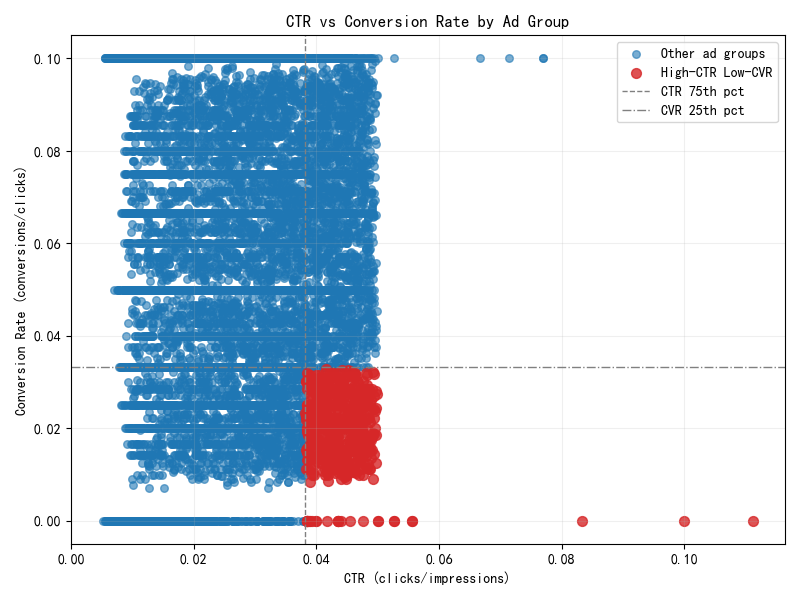
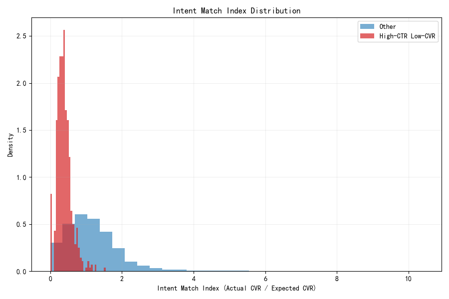
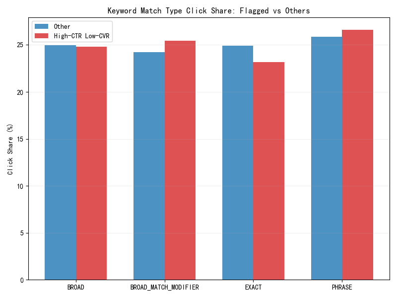
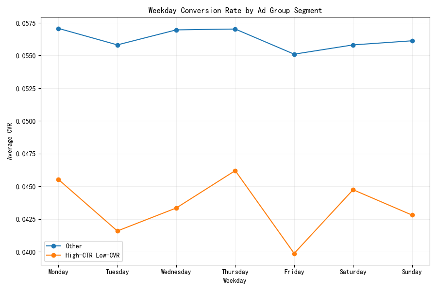

# Ad Intent Mismatch: High-CTR, Low-Conversion Ad Groups — Diagnosis and Playbook

## Executive Summary
We identified ad groups with a click-through rate (CTR) above the 75th percentile and a conversion rate (CVR) below the 25th percentile as likely suffering from search-intent mismatch. These “high-CTR, low-CVR” ad groups:
- Represent 6.16% of all ad groups (616 of 9,993), but drive 10.35% of clicks and 10.52% of spend.
- Produce materially worse efficiency vs. peers (median CVR 0.02 vs. 0.057; CPA 132 vs. 46; ROAS 0.75 vs. 2.10).
- Have a median Intent Match Index (IMI) of 0.37 (actual CVR relative to keyword-expected CVR), reinforcing an intent mismatch.
- Skew toward broader keyword matching (phrase and legacy BMM) and include audience-oriented campaign types (Display, Remarketing, Shopping Broad), consistent with high curiosity clicks but weak purchase intent.

If these flagged ad groups merely reach the 25th percentile CVR (holding traffic constant), we project:
- +255 additional conversions and +$29.3k incremental revenue, with CPA improving from ~$135 to ~$84.

Key actions: tighten keyword intent (expand exact, prune queries), refine audiences, triage underperforming landing pages, optimize bids toward quality signals, and reallocate/schedule spend around higher-intent windows.

## Data, Methods, and Thresholds
Data sources:
- google_ads__ad_group_report (daily by ad group)
- google_ads__keyword_report (by keyword and match type)

Flagging criteria (computed at the ad-group aggregate level across all dates):
- CTR 75th percentile = 0.0382
- CVR 25th percentile = 0.0333
- Flag = CTR > 0.0382 AND CVR < 0.0333

Derived metrics:
- Intent Match Index (IMI) = Actual CVR / Expected CVR
  - Expected CVR estimated from keyword-level baselines: for each keyword_text, global CVR across the dataset. Ad-group expected CVR is the click-weighted mix of its keywords’ expected CVRs.
- Traffic Quality Score (TQS) = 0.6 × normalized CVR + 0.4 × normalized ROAS (scaled 0–100).

Important limitations:
- Device, geographic granularity, landing page quality score, and bidding strategy data are not present in this dataset. Time-of-day is not available; we analyzed weekday as a proxy.

## Scale and Business Impact
Segment size and financials:
- 616 flagged ad groups (6.16% of total).
- 20,380 clicks (10.35% of clicks) and $57,228 spend (10.52% of spend).
- Median efficiency metrics:
  - Flagged: CTR 0.0432, CVR 0.0200, CPC $2.80, CPA $132.16, ROAS 0.75, IMI 0.37, TQS 13.68
  - Others:  CTR 0.0268, CVR 0.0571, CPC $2.74, CPA $45.68, ROAS 2.10, IMI 1.06, TQS 38.09

Upside projection (assumptions: traffic and spend constant; CVR improves to CVR_25th=3.33%):
- Current conversions (flagged): 424
- Projected conversions: 679.3; Delta: +255.3
- CPA improves from $135.0 to $84.2
- Revenue increases from $48.7k to ~$78.1k; Delta: +$29.3k

## What the data shows

1) The anomaly: Very strong CTR, poor conversion outcomes  
- Scatter by ad group shows the flagged cluster in the upper-left (high CTR, low CVR), separated by thresholds.
- Image: ctr_cvr_scatter.png

2) Intent Match Index signals misalignment  
- IMI distribution for flagged ad groups sits notably lower than others, confirming that, relative to expected keyword-level CVR, these groups underperform.
- Image: imi_distribution.png

3) Keyword match types skew broader for flagged ad groups  
- Click shares for flagged vs. others:
  - Flagged emphasize PHRASE (26.6%) and BROAD_MATCH_MODIFIER (25.5%) vs. Others (PHRASE 25.9%, BMM 24.2%).
  - EXACT share is lower among flagged (23.2% vs. 24.9%).
- Interpretation: broader matching tends to attract more top-of-funnel or ambiguous-intent traffic, inflating CTR while depressing CVR.
- Image: match_type_distribution.png

4) Audience/campaign patterns  
- The top flagged offenders include Display Audience, Remarketing, and Shopping Broad campaigns, consistent with curious or re-engagement clicks that don’t translate to conversions. One “Exact” performance ad group appears as well, hinting at landing page or offer fit issues even for precise queries.
- Ad group type distribution visualization provides context across types.
- Image: ad_group_type_dist.png

5) Time-of-week performance (proxy for time-of-day)  
- Across weekdays, flagged segments exhibit lower average CVR relative to other ad groups, with consistent underperformance throughout the week.
- This suggests misalignment persists independent of day, though a detailed hour-of-day cut (not available) would be ideal to isolate low-intent windows.
- Image: weekday_cvr.png

6) Efficiency gap quantified by TQS  
- TQS blends CVR and ROAS; flagged ad groups have a median TQS of 13.7 vs. 38.1 for others, reinforcing weaker traffic quality and monetization.

## Root Causes
- Intent dilution from broader matching:
  - Over-reliance on PHRASE and legacy BMM; likely permissive query matching causing irrelevant clicks.
- Audience targeting misfit:
  - Display/remarketing audiences and Shopping Broad can drive curiosity clicks with weak transactional intent.
- Landing page and offer mismatch:
  - Even an Exact-match performance ad group surfaced among top offenders; content/message/value prop may not align with the clicked intent.
- Bid strategy potentially rewarding engagement over conversion:
  - In absence of bidding fields, patterns suggest bids may not be anchored tightly enough to downstream conversion quality.
- Temporal misalignment:
  - While weekday effects are consistent, specific low-intent hours may be consuming budget (hour-level data needed).

## Prescriptive Playbook

1) Keyword optimization and query control
- Expand Exact match coverage for high-value queries; prune/negate low-intent terms discovered via search terms report.
- Tighten PHRASE and avoid legacy BMM-like breadth; re-map broad exposure into controlled Discovery/Display goals, not direct conversion.
- Introduce tiered structures (high-intent exact SKAGs or tight thematics) with dedicated ad copy and landing pages.

2) Audience segmentation and exclusions
- For Display/Remarketing: segment by recency and engagement depth; bid down or exclude low-quality cohorts (e.g., low on-site engagement, low recent intent).
- Layer in in-market and custom intent audiences aligned to transactional signals; exclude placements or audiences with low IMI/TQS.
- For Shopping: refine feeds (titles, attributes) to better pre-qualify clicks; add negative keywords.

3) Landing page and offer alignment
- Map ad groups to pages whose headlines, offers, and CTAs mirror the query language; reduce cognitive friction and ensure relevance above the fold.
- Instrument onsite micro-conversions (scroll, dwell, add-to-cart) to detect friction points.
- A/B test value props for flagged exact-match groups; fix speed/content issues that depress CVR (Core Web Vitals, trust elements, clarity).

4) Bid strategy and budget allocation
- If currently using engagement-leaning strategies, switch or test toward conversion-revenue objectives (tCPA/tROAS) with strong conversion tracking.
- Apply bid adjustments or portfolio rules using TQS/IMI: bid down segments with persistently low TQS, reallocate budget to higher-IMI cohorts.
- Implement tighter caps until IMI/TQS improve; avoid overpaying for curiosity clicks.

5) Time-of-day and schedule tuning
- Pending hour-of-day data: run a quick time-parting test; lower bids or pause in low-IMI/TQS hours; prioritize high-intent windows.
- Align remarketing cadences to recency and product cycle; extend or compress membership durations based on actual conversion latency.

6) Geo/device (data not present here but critical)
- Device: expect mobile to dominate clicks but sometimes under-convert. Test device-specific LPs and adjust bids.
- Geo: concentrate spend where IMI/TQS are highest; suppress low-intent regions; align ad copy/LP to regional nuances.

## Prioritized Action Plan (30/60/90)
- Next 30 days:
  - Pull device, geo, hour-of-day, bidding strategy, and landing page quality fields into the dataset.
  - Execute search term mining; add negatives; expand exact; restructure broad/phrase into tighter ad groups.
  - Quick LP fixes for top 10 flagged ad groups by clicks.
- Days 31–60:
  - Shift budgets using TQS/IMI; test tCPA/tROAS; deploy audience exclusions and in-market layers.
  - Launch LP A/B tests with intent-aligned messaging and faster page variants.
- Days 61–90:
  - Iterate time-parting; scale winners; commit budget to high-IMI clusters; retire persistent low-IMI ad groups or repurpose them for awareness goals.

## Expected Outcome
If the flagged segment reaches the 25th percentile CVR with current traffic, we estimate:
- +255 conversions (+60%) and ~$29k incremental revenue
- CPA reduction from ~$135 to ~$84 (≈ -38%)

These gains are realistic if we combine tighter keyword control, better audience qualification, LP alignment, and bid/schedule optimization.

## Visuals
- CTR vs CVR scatter showing flagged quadrant

- Keyword match type click share comparison

- Intent Match Index distribution by segment

- Ad group type distribution by segment

- Weekday CVR by segment

## Notes on Methodological Choices
- IMI proxy: “expected CVR” computed at the keyword_text level across the dataset, treated as an industry-proxy baseline; ad-group expected CVR is the click-weighted mix across its keywords.
- TQS formula balances conversion propensity (CVR) and monetization (ROAS) to reflect traffic quality beyond clicks.
- Weekday used as a time proxy due to lack of hour-of-day; recommend adding hour granularity for more precise scheduling.

## Appendix: Top flagged ad groups (by clicks, anonymized)
Examples include Display Audience, Remarketing, Shopping Broad, and one Exact performance group, indicating mixed root causes across targeting and landing page fit. See top_flagged_adgroups.csv for details.

— End of report —
