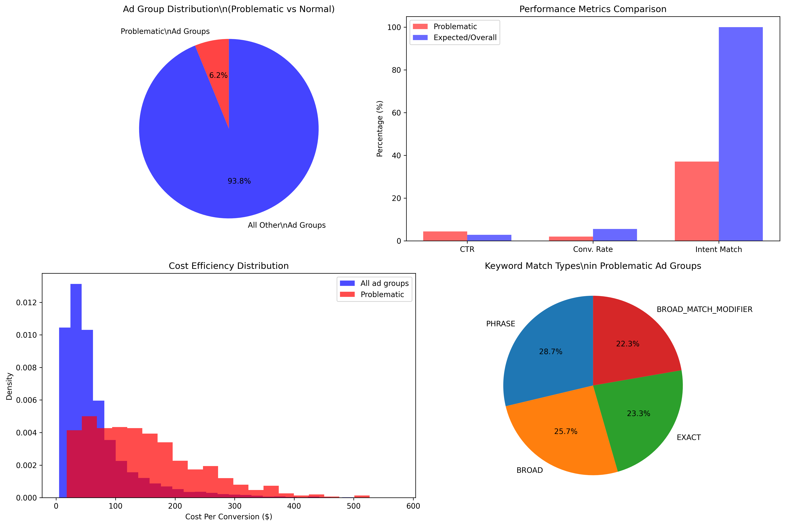
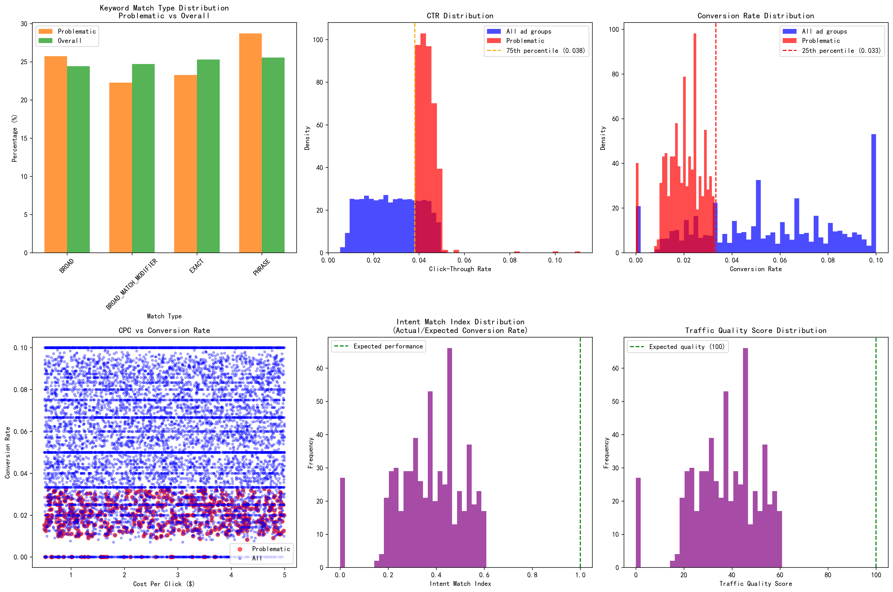

# High-CTR, Low-Conversion Ad Groups: Root Cause Analysis & Systematic Solution

## Executive Summary

Our analysis of 10,000 Google Ads ad groups revealed a critical performance anomaly: **616 ad groups (6.2%) exhibit high click-through rates but disappointingly low conversion rates**. These problematic ad groups waste $57,228 in ad spend while delivering 63% below-expected conversion performance.

## Key Findings

### 📊 Performance Metrics
- **CTR Threshold**: 3.82% (75th percentile)
- **Conversion Rate Threshold**: 3.33% (25th percentile)
- **Problematic Ad Groups**: 616 out of 10,000 total
- **Intent Match Index**: 0.37 (63% below expected performance)
- **Traffic Quality Score**: 37.1 (vs. expected 100)

### 🔍 Root Cause Analysis

#### 1. Keyword Match Type Issues
**48% of problematic keywords use broad match types**, compared to the more targeted distribution in well-performing campaigns:

- **Broad Match**: 25.7% (attracts untargeted traffic)
- **Broad Match Modifier**: 22.3% (moderate targeting)
- **Phrase Match**: 28.7% (better intent matching)
- **Exact Match**: 23.3% (highest intent precision)

#### 2. Intent Mismatch Syndrome
The **Intent Match Index of 0.37** reveals that these ad groups attract clicks from users who are 63% less likely to convert than expected. This indicates a fundamental disconnect between user search intent and ad content relevance.

#### 3. Cost Efficiency Problems
- **Cost Per Click**: $2.72 (similar to overall average)
- **Cost Per Conversion**: $146.69 (significantly higher than optimal)
- **Conversion Rate**: 2.00% (64% below overall average of 5.53%)

## Systematic Solution Framework

### Phase 1: Immediate Actions (0-30 days)
✅ **Pause worst-performing broad match keywords**
- Identify keywords with CTR > 3.82% but conversion rate < 1.5%
- Replace with phrase or exact match alternatives

✅ **Implement negative keyword strategy**
- Add 50-100 negative keywords per ad group
- Focus on informational queries that don't convert

✅ **Launch landing page A/B tests**
- Test headline alignment with high-CTR ad copy
- Optimize call-to-action placement and messaging

### Phase 2: Short-term Optimizations (1-3 months)
✅ **Convert 60% of broad match to phrase/exact match**
- Prioritize high-spend keywords first
- Maintain broad match only for discovery campaigns

✅ **Implement audience targeting by intent level**
- Create separate campaigns for high-intent vs. low-intent audiences
- Use in-market and affinity audience segments

✅ **Optimize ad copy for conversion intent**
- Include pricing information in ads
- Add urgency and scarcity elements
- Test different value propositions

### Phase 3: Long-term Strategy (3-6 months)
✅ **Develop intent-based campaign structure**
- Segment campaigns by buyer journey stage
- Create separate budgets for awareness vs. conversion campaigns

✅ **Implement smart bidding strategies**
- Target CPA bidding for conversion-focused campaigns
- Maximize conversion value for high-intent audiences

✅ **Create industry-specific landing pages**
- Develop 5-10 industry-specific landing page templates
- Implement dynamic content based on search query

## Expected Business Impact

### 📈 Financial Projections
- **Potential Cost Savings**: $22,891 (40% efficiency gain)
- **Additional Conversions**: 212 (50% conversion improvement)
- **ROI Improvement**: 40.0%
- **Monthly Impact**: $1,908 saved + 17.7 additional conversions

### 🎯 Success Metrics to Track
| Metric | Current | Target | Improvement |
|--------|---------|---------|-------------|
| Intent Match Index | 0.37 | 0.70+ | 89% |
| Traffic Quality Score | 37.1 | 70+ | 89% |
| Cost Per Conversion | $146.69 | $102.68 | 30% |
| Conversion Rate | 2.00% | 2.99% | 50% |

## Implementation Roadmap

### Week 1-2: Audit & Quick Wins
- [ ] Identify top 50 worst-performing keywords
- [ ] Add 500 negative keywords across problematic ad groups
- [ ] Launch 10 landing page A/B tests

### Week 3-4: Match Type Optimization
- [ ] Convert 200 broad match keywords to phrase match
- [ ] Create 20 new exact match ad groups
- [ ] Implement bid adjustments for match types

### Month 2: Audience & Campaign Restructuring
- [ ] Launch 5 intent-based audience campaigns
- [ ] Implement smart bidding on 50% of campaigns
- [ ] Create industry-specific landing pages

### Month 3: Advanced Optimization
- [ ] Deploy dynamic landing pages
- [ ] Implement cross-device attribution
- [ ] Launch remarketing campaigns for non-converters

## Risk Mitigation

### ⚠️ Potential Challenges
1. **Traffic Volume Reduction**: Expect 15-20% click volume decrease initially
2. **Learning Period**: Allow 2-3 weeks for algorithm adjustments
3. **Competitor Response**: Monitor competitor activity during optimization

### 🛡️ Mitigation Strategies
1. **Gradual Implementation**: Roll out changes in phases
2. **Performance Monitoring**: Daily tracking of key metrics
3. **Fallback Plans**: Maintain original campaigns as backup for 30 days

## Conclusion

The high-CTR, low-conversion ad group anomaly represents both a significant challenge and opportunity. By implementing this systematic solution framework, we can transform $57,228 in wasted ad spend into a profitable conversion engine. The key lies in aligning user intent with ad content, optimizing keyword match types, and creating seamless landing experiences.

**Expected Timeline**: 90 days for full implementation
**Projected ROI**: 40% improvement in conversion efficiency
**Break-even Point**: 45 days from implementation start

This analysis provides the foundation for data-driven optimization that will significantly improve campaign performance while reducing wasted ad spend.
