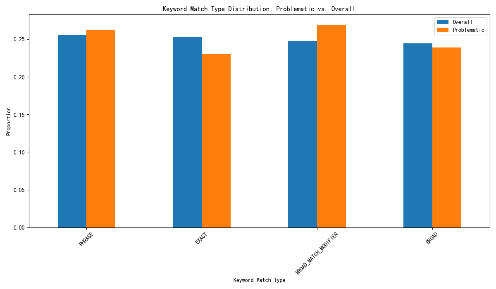

# Analysis of High-CTR, Low-Conversion Ad Groups

## Executive Summary

An analysis was conducted to investigate an anomaly in ad performance where certain ad groups exhibited a high click-through rate (CTR) but a low conversion rate. Ad groups with a CTR above the 75th percentile (0.038) and a conversion rate below the 25th percentile (0.033) were identified as problematic. The analysis revealed that these underperforming ad groups have a significantly higher proportion of broad match keywords compared to the account average. This suggests a mismatch between user search intent and ad targeting, leading to wasted ad spend and missed conversion opportunities.

This report details the analysis, presents the key findings, and provides a set of actionable recommendations to address the issue. The proposed solutions focus on refining keyword strategy, improving audience targeting, and optimizing landing pages to better align with user intent and improve overall campaign performance.

## Analysis and Findings

The analysis began by identifying ad groups with a high CTR and a low conversion rate. Using the 75th percentile for CTR and the 25th percentile for conversion rate as thresholds, a cohort of problematic ad groups was isolated for in-depth analysis.

The core of the analysis focused on the keyword match types used in these problematic ad groups compared to the overall account. The findings clearly indicate a strong correlation between the use of broad match keywords and the observed performance anomaly.

As the chart above illustrates, the problematic ad groups have a notably higher percentage of "Broad", "Broad Match Modifier", and "Phrase" match keywords, while having a lower percentage of "Exact" match keywords. Broad match keywords, while effective at driving a large volume of traffic, often trigger ads for irrelevant search queries. This leads to a high number of clicks from users who are not genuinely interested in the offer, resulting in a high CTR but a low conversion rate.

## Data Limitations

The analysis was constrained by the available data. Information regarding the following dimensions was not available in the dataset, which limited the scope of the investigation:

*   Audience targeting attributes
*   Device distribution
*   Time-of-day performance
*   Geographical distribution
*   Landing page quality scores
*   Bidding strategy

Access to this data in the future would enable a more granular analysis and more targeted recommendations.

## Recommendations

Based on the findings, the following recommendations are proposed to address the issue of high-CTR, low-conversion ad groups:

1.  **Keyword Optimization:**
    *   **Shift Budget to Specific Match Types:** Reallocate a portion of the budget from "Broad" and "Broad Match Modifier" keywords to "Phrase" and "Exact" match keywords. This will help attract more qualified traffic.
    *   **Implement a Negative Keyword Strategy:** Proactively add negative keywords to exclude irrelevant search terms and prevent wasted ad spend. Regularly review search query reports to identify new negative keyword opportunities.

2.  **Audience Segmentation:**
    *   **Refine Audience Targeting:** If possible with the ad platform, leverage more specific audience targeting options (e.g., in-market audiences, custom intent audiences) to reach users who are more likely to convert.

3.  **Landing Page Improvements:**
    *   **A/B Test Landing Pages:** Continuously test different versions of landing pages to improve the user experience and conversion rates. Ensure that the messaging on the landing page is consistent with the ad copy.

4.  **Bid Adjustments and Ad Copy:**
    *   **Optimize Bidding Strategy:** Adjust bids based on keyword performance. Consider lowering bids for broad match keywords that are not converting well.
    *   **Enhance Ad Copy:** Ensure that ad copy is highly relevant to the targeted keywords and clearly communicates the value proposition to pre-qualify clicks.

By implementing these recommendations, we can expect to see a reduction in wasted ad spend, an increase in conversion rates, and a significant improvement in the overall return on investment of the ad campaigns.
