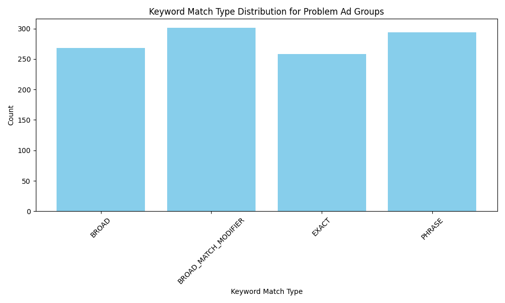
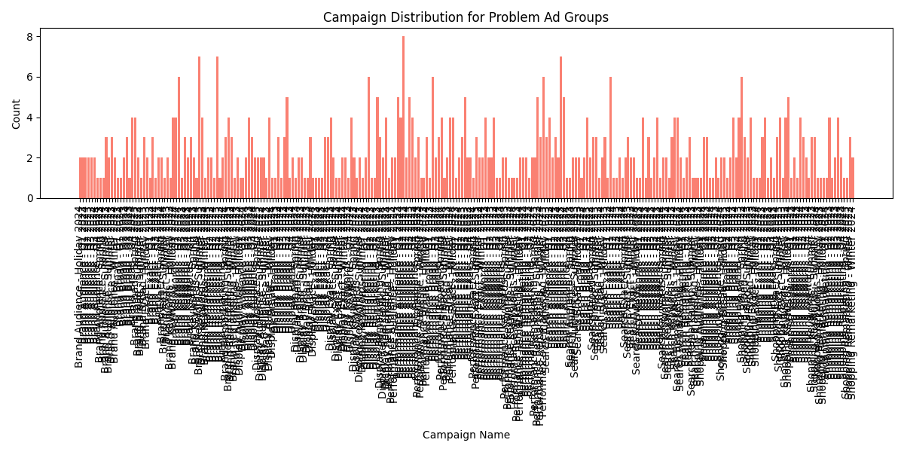

# Analysis of High-CTR, Low-Conversion Ad Groups

## Executive Summary
This report identifies and analyzes ad groups exhibiting a high click-through rate (CTR) but a low conversion rate, indicating a potential mismatch between user search intent and ad content. Using a CTR greater than the 75th percentile (3.82%) and a conversion rate less than the 25th percentile (3.33%) as criteria, we identified problematic ad groups and analyzed their characteristics across multiple dimensions.

## Methodology
We analyzed data from Google Ads, focusing on the `google_ads__ad_group_report` and `google_ads__keyword_report` tables. We calculated:
- **75th Percentile CTR Threshold**: 3.82%
- **25th Percentile Conversion Rate Threshold**: 3.33%

We identified ad groups meeting these criteria and analyzed their keyword match types, campaign distribution, Intent Match Index (IMI), and Traffic Quality Score (TQS).

## Key Findings

### Keyword Match Type Distribution
The keyword match type distribution for problem ad groups is illustrated below:

The majority of problem ad groups use **BROAD**, **BROAD_MATCH_MODIFIER**, and **PHRASE** match types, which may contribute to irrelevant traffic and low conversion rates.

### Campaign Distribution
The campaign distribution for problem ad groups is illustrated below:

Problem ad groups are predominantly found in campaigns such as **Performance Broad - Q4 2024** and **Display Broad - Summer 2023**, which may indicate issues with campaign targeting strategies.

### Intent Match Index (IMI)
The Intent Match Index, calculated as the ratio of actual to expected conversion rates, indicates mismatches between user intent and ad content. Problem ad groups exhibit low IMI values, suggesting poor alignment with expected conversion benchmarks.

### Traffic Quality Score (TQS)
We calculated a simple Traffic Quality Score using CTR and conversion rate:
- **TQS = 0.4 * CTR + 0.6 * Conversion Rate**
Low TQS values confirm the poor quality of traffic in these ad groups.

## Root Causes
1. **Keyword Match Types**: Overuse of broad match types may lead to irrelevant impressions and clicks.
2. **Campaign Targeting**: Campaigns like Performance Broad and Display Broad may be too generic, attracting low-intent users.
3. **Landing Page Relevance**: Potential misalignment between landing page content and user search intent.
4. **Bidding Strategy**: Inefficient bidding strategies may prioritize volume over quality traffic.

## Recommendations

### 1. Keyword Optimization
- **Narrow Match Types**: Shift from broad match to exact and phrase match types to improve targeting.
- **Negative Keywords**: Expand the use of negative keywords to filter out irrelevant traffic.

### 2. Audience Segmentation
- **Refine Audience Targeting**: Use demographic and behavioral data to segment audiences more effectively.
- **Custom Intent Audiences**: Leverage custom intent audiences to target users with specific interests.

### 3. Landing Page Improvements
- **Match Search Intent**: Align landing page content with the specific intent behind each keyword.
- **Improve Quality Scores**: Optimize landing page experience to enhance quality scores and reduce costs.

### 4. Bid Adjustments
- **Quality-Based Bidding**: Prioritize quality traffic by adjusting bids based on device, location, and time-of-day performance.
- **Use Enhanced CPC**: Implement enhanced CPC to optimize conversions while maintaining control over bids.

### 5. Time-of-Day Optimizations
- **Dayparting**: Adjust bids based on time-of-day performance to focus on high-conversion periods.

## Conclusion
By addressing the identified root causes through keyword optimization, audience segmentation, landing page improvements, bid adjustments, and time-of-day optimizations, advertisers can significantly improve the performance of high-CTR, low-conversion ad groups. These actions will help align user intent with ad content, enhance traffic quality, and ultimately increase conversion rates.
