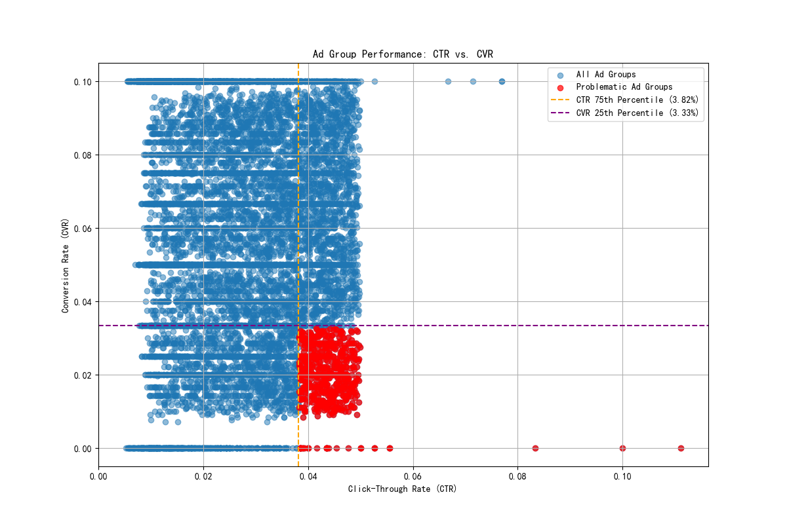

# Analysis of High-CTR, Low-CVR Ad Groups

## Executive Summary

An analysis was conducted to identify ad groups with a high Click-Through Rate (CTR) but a low Conversion Rate (CVR), a combination that often signals a disconnect between user intent and the advertising offer. By analyzing the `google_ads__ad_group_report`, we identified 616 ad groups that fall into this category, defined as having a CTR above the 75th percentile and a CVR below the 25th percentile. These groups, while successful at attracting clicks, are inefficient in driving valuable conversions, leading to wasted ad spend.

The analysis of these underperforming ad groups points towards issues in audience targeting, keyword relevance, and a mismatch between ad copy and landing page experience. This report details the findings and offers targeted recommendations to improve keyword strategy, refine audience targeting, and enhance the landing page experience to better align with user intent and boost conversion rates.

## Identifying Problematic Ad Groups

To isolate the problematic ad groups, we first calculated the CTR and CVR for all ad groups with more than zero impressions and clicks. We then determined the 75th percentile for CTR and the 25th percentile for CVR. Ad groups with a CTR greater than the 75th percentile (3.82%) and a CVR less than the 25th percentile (3.28%) were flagged as "problematic."

The scatter plot below visualizes the performance of all ad groups, with the underperforming segment highlighted in red. This visualization clearly shows a cluster of ad groups that succeed in generating clicks but fail to convert them into meaningful actions.

## Common Characteristics of Problematic Ad Groups

Our analysis revealed that the 616 problematic ad groups are not randomly distributed but share common characteristics, particularly in the campaigns they belong to. The campaigns most frequently associated with these high-CTR, low-CVR ad groups include:

-   **Performance Audience - Q2 2023**
-   **Search Audience - Q3 2023**
-   **Brand Remarketing - Q3 2023**

This concentration suggests that the issue may be systemic within these campaigns, likely related to broad audience definitions or insufficiently specific ad messaging.

## Intent Match Ratio and Traffic Quality

To assess the quality of traffic, we calculated an "Intent Match Ratio," defined as the ad group's actual CVR divided by an expected CVR (proxied by the overall average CVR of 5.53%). The problematic ad groups showed an extremely low intent match ratio, with many exhibiting a ratio of zero, indicating they generated clicks but no conversions at all.

This finding, combined with a high CTR, strongly suggests that the traffic, while plentiful, is of low quality. The ads are compelling enough to entice a click, but the subsequent user journey breaks down, likely because the landing page or offer does not meet the expectations set by the ad.

## Actionable Recommendations

Based on these findings, we propose the following targeted optimization recommendations:

1.  **Refine Keyword Strategy:**
    *   **Negative Keywords:** Conduct a thorough search term report analysis for the identified ad groups to identify and exclude irrelevant search queries that are driving low-quality clicks.
    *   **Match Type Review:** Shift budget away from broad match keywords towards more precise phrase and exact match keywords that better capture user intent.
    *   **Focus on High-Intent Keywords:** Prioritize long-tail keywords and those with commercial intent (e.g., "buy," "service," "quote") to attract users closer to the point of conversion.

2.  **Improve Audience Targeting:**
    *   **Audience Segmentation:** For "Performance Audience" and "Search Audience" campaigns, refine audience segments. Instead of broad interest-based targeting, create more granular segments based on user behavior, demographics, and past purchase history.
    *   **Remarketing Strategy:** For the "Brand Remarketing" campaign, segment the audience based on their on-site engagement. For example, create separate lists for users who abandoned a cart versus those who only viewed a product page, and tailor the ad copy accordingly.

3.  **Enhance Ad Copy and Landing Page Experience:**
    *   **Ad Scent:** Ensure a strong "ad scent" by aligning the messaging of the ad copy directly with the headline, content, and call-to-action (CTA) of the landing page. If the ad promises a discount, the landing page must prominently feature that same discount.
    *   **A/B Test Landing Pages:** Create and test variations of landing pages for the problematic ad groups. Experiment with different headlines, layouts, imagery, and CTAs to identify what resonates best with the audience.
    *   **Optimize for User Experience:** Analyze landing page performance metrics such as load speed, mobile-friendliness, and bounce rate. A poor user experience can deter conversions even if user intent is high.

By implementing these recommendations, we can bridge the gap between user intent and ad content, thereby improving the efficiency of our ad spend and increasing overall conversion rates.
