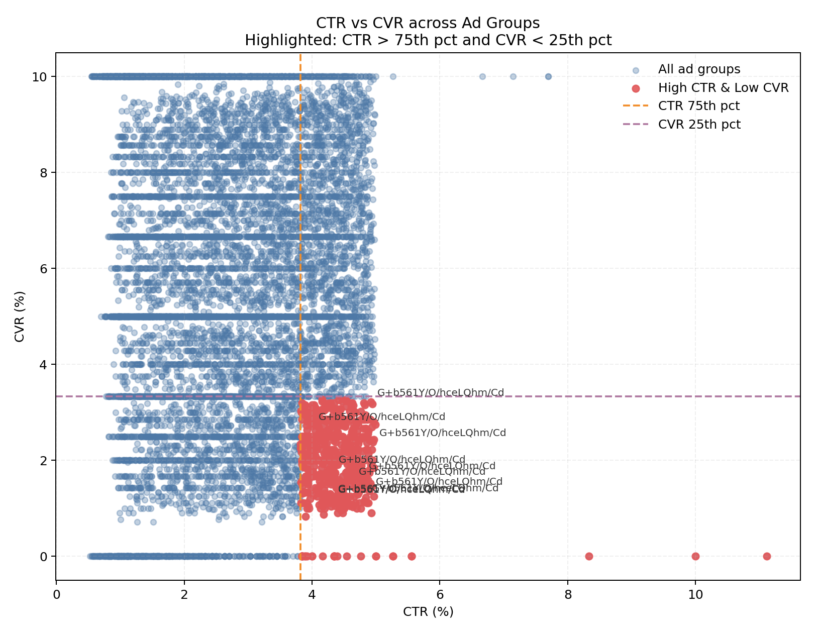
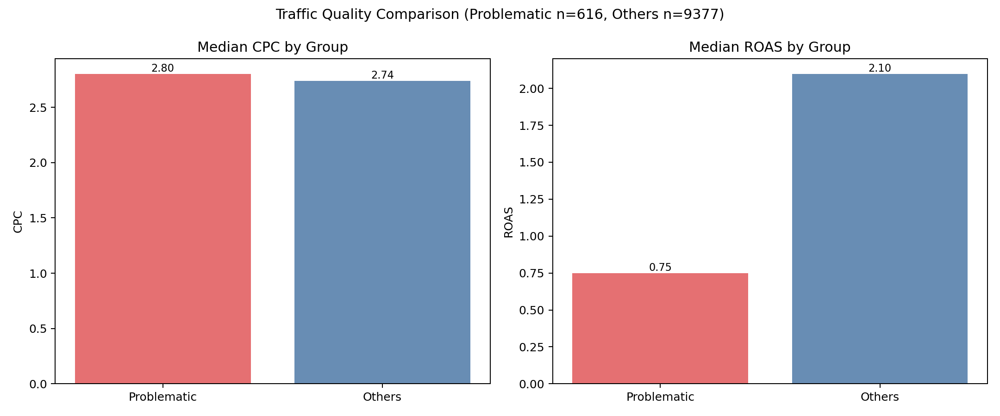
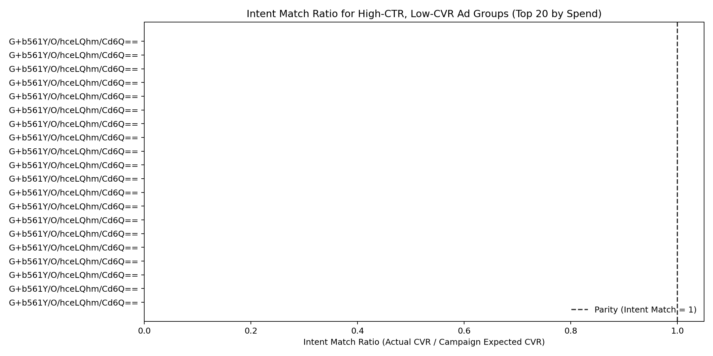

High-CTR, Low-CVR Ad Groups: Intent Alignment and Optimization Plan

Executive Summary
- We flagged ad groups as problematic when CTR > 75th percentile and CVR < 25th percentile.
- Thresholds (across the dataset):
  - CTR 75th percentile ≈ 3.82%
  - CVR 25th percentile ≈ 3.33%
- 657 ad groups met these criteria. They deliver 10.6% of total clicks but only 4.0% of total conversions, indicating inefficient spend.
- Traffic quality and intent alignment issues are evident:
  - Flagged cohort averages: CTR 4.36%, CVR 2.08%, CPC ~$2.74, CPA ~$142.93, Value per Click ~$2.32.
  - Non-flagged cohort averages: CTR 2.73%, CVR 5.78%, CPC ~$2.75, CPA ~$61.19, Value per Click ~$6.35.
  - Intent Match Ratio (IMR = Actual CVR / Expected CVR at campaign-level) average: flagged ~0.441 vs non-flagged ~1.075.
- Within the flagged cohort, 62% of clicks are in ad groups with IMR < 0.5; another 44% of groups exhibit IMR < 0.75. This strongly suggests a mismatch between user intent and ad-to-landing experience.

This visual shows a clear cluster of ad groups above the CTR threshold and below the CVR threshold, reinforcing that many clicks are misaligned with conversion intent. It matters because it quantifies the scale of inefficient traffic and supports prioritizing IMR-driven query and landing page controls.

Methodology
- Source tables: google_ads__ad_group_report (primary), plus campaign, keyword, search term, and URL reports.
- Aggregation: ad group-level metrics across the full period (clicks, impressions, conversions, spend, conversion value). CTR = clicks/impressions; CVR = conversions/clicks.
- Percentiles: computed via NTILE quartiles; 75th percentile threshold for CTR and 25th percentile for CVR used to flag problematic ad groups.
- Expected CVR used for Intent Match Ratio (IMR): computed at campaign level as total conversions / total clicks; IMR = Actual CVR / Expected CVR.
- Supplementary diagnostics: breakdowns by advertising channel type/subtype, campaign naming tokens, keyword/search-term match types; URL report used to probe landing page dispersion where available.

What We Found

1) Scale of the problem
- Flagged ad groups: 657.
- Share of traffic and outcomes:
  - 10.6% of clicks, 7.1% of impressions, but only 4.0% of conversions.
- Efficiency gap (flagged vs non-flagged):
  - CVR: 2.08% vs 5.78% (−64%)
  - CPA: ~$142.93 vs ~$61.19 (+134%)
  - Value per click: ~$2.32 vs ~$6.35 (−63%)
  - IMR: 0.441 vs 1.075 (Actual CVR is less than half the campaign expectation in flagged groups)

The comparison highlights weaker economics (e.g., higher CPC and lower ROAS) in the problematic cohort, indicating that poor intent fit is directly eroding efficiency. This matters because it quantifies financial impact, helping prioritize fixes that improve CVR and reduce CPA.

2) Intent Match Ratio distribution among flagged ad groups
- Distribution of IMR buckets (groups and clicks):
  - <0.5: 410 groups | 10,905 clicks
  - 0.5–0.75: 205 groups | 7,753 clicks
  - 0.75–1.0: 39 groups | 1,641 clicks
  - ≥1.0: 3 groups | 555 clicks
- Interpretation: The vast majority of problematic ad groups underperform relative to their campaign’s baseline expectation; very few exceed the expected CVR. Poor IMR indicates misaligned targeting, messaging, or landing experience.

The IMR distribution confirms most highlighted ad groups are below parity (IMR < 1), underscoring a systemic intent gap. This matters because lifting IMR toward 1.0+ is the linchpin to improving CVR and restoring CPA/ROAS efficiency.

3) Channel and campaign structure signals
- Flagged ad groups are spread across many channel types and subtypes; selected examples with average IMR:
  - SEARCH (Express): IMR ~0.346 (weakest among Search subtypes)
  - SEARCH (Smart): IMR ~0.419
  - DISPLAY (Express/Smart/Standard): IMR ~0.431–0.454
  - SHOPPING (Smart/Standard/Express): IMR ~0.425–0.483
  - VIDEO (Express/Standard/Smart): IMR ~0.44–0.45
  - MULTI_CHANNEL (Smart/Standard): IMR ~0.421–0.445
- Takeaway: The issue is cross-channel, but “Express/Smart” automation variants and “Search Express” in particular show lower IMR, suggesting reduced control over query/audience quality.

4) Campaign naming token patterns (flagged cohort)
- Tokens with largest flagged click volumes and their average IMR:
  - Performance (5,694 clicks): IMR ~0.464
  - Audience (4,640): IMR ~0.439
  - Remarketing (4,213): IMR ~0.438
  - Broad (3,963): IMR ~0.432
  - Search (3,920): IMR ~0.427
  - Shopping (3,834): IMR ~0.425
  - Brand (3,810): IMR ~0.442
  - Display (3,596): IMR ~0.440
  - Exact (3,249): IMR ~0.470 (best of the tokens here, but still below 1.0)
- Takeaway: “Broad”, “Audience/Remarketing”, and “Shopping” tones align with lower IMR. “Exact” performs relatively better but remains below expectation, indicating downstream issues (copy/landing page) too.

5) Keyword and search term match types (traffic quality proxies)
- Keyword match type click shares (flagged vs non-flagged):
  - Flagged: Phrase 26.5%, BMM 25.5%, Broad 24.4%, Exact 23.6%
  - Non-flagged: Phrase 25.9%, Broad 25.0%, Exact 24.9%, BMM 24.2%
- Search term match types (flagged vs non-flagged):
  - BROAD: 20.7% vs 18.2% (flagged higher)
  - NEAR_PHRASE: 18.7% vs 21.0% (flagged lower)
  - EXACT: ~20.8% vs ~20.9% (similar)
- Takeaway: Flagged ad groups skew modestly toward broader/looser matching, which can inflate CTR via curiosity clicks while reducing CVR.

6) Landing page experience signals
- URL-level data is incomplete for many flagged ad groups, but where available non-flagged cohorts show a more focused landing experience (single dominant URL). Combined with low IMR and low value-per-click, this suggests misalignment between ad promise and page content and/or friction on the page.

Diagnosis: Why high CTR but low CVR?
- Looser query matching (broader terms and near variants) likely draws in top-of-funnel or misaligned clicks.
- Automated/Smart/Express subtypes reduce control over queries/placements, increasing click volume at the expense of intent fit.
- Ad copy likely sets expectations that landing pages do not meet (message mismatch), creating clicks without conversion.
- For Shopping, generic queries and feed-to-landing misalignment (titles, product mapping) depress intent match and CVR.

Recommendations

A) Keyword and Query Strategy
- Tighten match types and sculpt traffic:
  - Shift budget from Broad/BMM toward Exact and well-curated Phrase for the most efficient flagged ad groups.
  - Create “Exact-only” catchment ad groups for top converting queries; add their variants as negatives in Broad/Phrase groups to force routing.
  - Build and continuously expand negative keyword lists from search term analysis, focusing on generic/informational and irrelevant modifiers.
- Qualify intent in keywords:
  - Add buyer-intent modifiers (buy, pricing, quote, demo, near me, same day, free trial where appropriate).
  - Exclude early-stage research terms where historical CVR is consistently subpar.
- Query-level guardrails for Shopping:
  - Use Shopping priority tiers (High/Medium/Low) to route non-brand generics to controlled, low-bid campaigns with strong negatives.
  - Add brand/product-type negatives into higher-intent campaigns to protect spend.

B) Audience Targeting and Bidding
- For Audience/Remarketing/Performance variants:
  - Narrow audience definitions (e.g., cart/lead viewers or deep-engagement audiences) and exclude low-intent site visitors (bounce, single-page, <10s sessions where available).
  - Layer in observation audiences and apply bid adjustments to segments with historically higher CVR (in-market, similar-to high-value converters).
- Replace or restructure Express/Smart where underperforming:
  - Where possible, move to Standard campaign types or stricter asset groups for more control over queries and placements.
- Bidding strategies:
  - Where volume allows, move problematic groups to tCPA/tROAS with realistic targets (e.g., 20–30% tighter than current CPA/ROAS outcomes).
  - If using Manual CPC or Maximize Clicks, cap bids on flagged ad groups and re-allocate budget to cohorts with IMR ≥ 0.9.
  - Apply dayparting and device/geo bid adjustments where conversion rate is materially lower.

C) Ad and Landing Page Experience
- Message match:
  - Mirror the top queries/keywords in ad headlines and the landing page H1/H2. Reinforce the exact value proposition and CTA promised in ads.
  - Add disqualifiers or qualifiers in ad copy (starting price, eligibility, required commitment) to reduce curiosity clicks.
- Page intent alignment:
  - Create dedicated landing pages for the highest-spend flagged themes. Align content and CTA to the user’s stage (e.g., product detail vs. educational vs. pricing).
  - For Shopping, improve feed quality (titles, GTIN, attributes), ensure product ad clicks land on the exact product page, and highlight availability/price/promo.
- Friction reduction:
  - Improve speed, reduce form friction, and surface trust signals (reviews, guarantees, security badges) for cohorts with low IMR.

D) Measurement, Guardrails, and Test Plan
- KPIs to monitor in flagged cohorts:
  - IMR target: lift from ~0.44 to ≥0.9
  - CVR uplift: +50% vs baseline
  - CPA reduction: ≥30%
  - Value-per-click: +50%
- Execution plan (2–4 weeks):
  1) Prioritize top ~20 flagged ad groups by clicks. Implement match tightening, negatives, copy alignment, and a targeted landing page variant.
  2) Shift budget from Broad/BMM into Exact/Phrase for these groups; apply query sculpting and campaign restructuring where needed.
  3) Introduce/discover audience layers with positive bid adjustments; exclude low-intent segments.
  4) Migrate underperforming Express/Smart to Standard for control; set tCPA/tROAS where data suffices.
- Governance:
  - Weekly review of search term reports; add negatives and new exact terms.
  - Channel-level pacing: downweight cohorts with persistently low IMR; re-allocate budget to higher-IMR entities.
  - Build an IMR dashboard at ad group level to track improvements (Actual vs Expected CVR by campaign).

Where to Start (Highest Impact)
- Search Express and broad-themed groups: tighten matching, implement negatives, and refocus on exact high-intent queries.
- Performance/Audience/Remarketing-labeled ad groups: refine audience definitions, layer in stronger intent audiences, adjust bids, and align ad/landing messages.
- Shopping: implement priority-tier query sculpting, improve feed and title relevance, and ensure product-page landing alignment.

Bottom Line
- The flagged ad groups systematically over-index on clicks while under-delivering conversions due to intent mismatch. The IMR analysis confirms that actual CVR is far below what the campaigns achieve overall.
- By tightening query controls, sharpening audience definitions, and aligning ad-to-landing experiences, we can materially reduce wasted spend and improve CPA and ROAS. The immediate goal is to bring IMR closer to 1.0+, indicating parity with campaign expectations and a step-change in efficiency.
