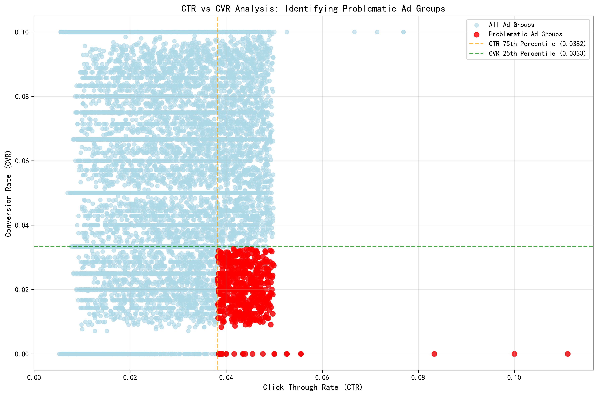
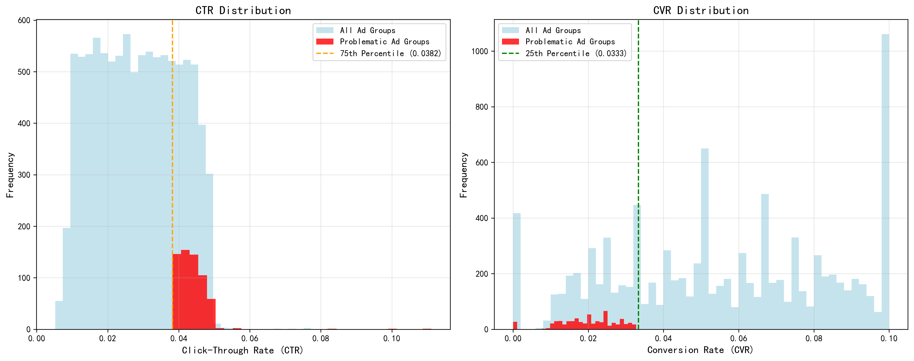
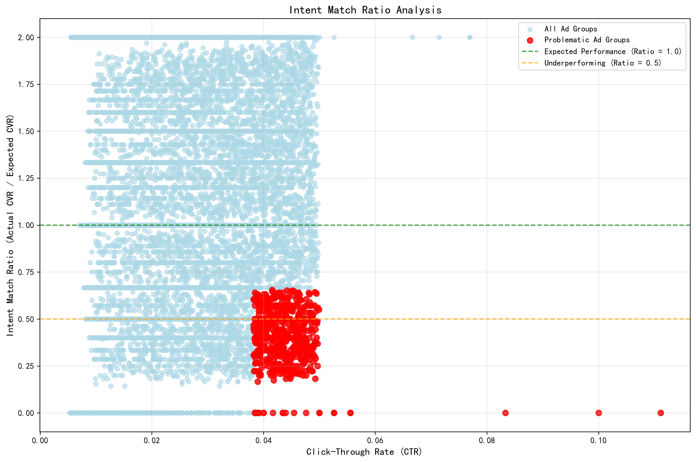
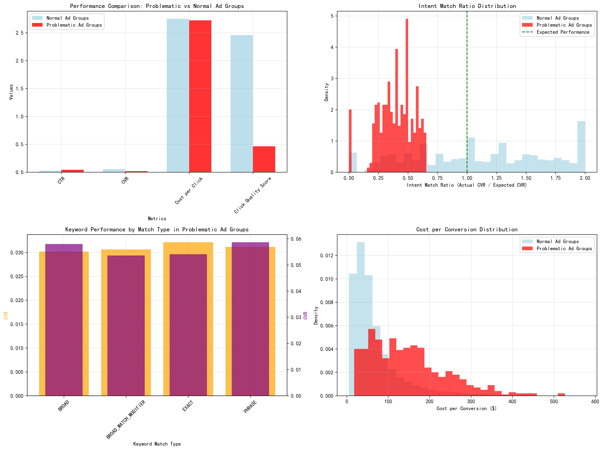

# High-CTR, Low-CVR Ad Groups Analysis Report

## Executive Summary

This analysis identified **616 problematic ad groups** (6.2% of total) that exhibit high Click-Through Rates (>3.82%) but low Conversion Rates (<3.33%), representing a significant intent mismatch costing $57,228.46 (10.5% of total ad spend). These ad groups achieve 56% higher CTR than average but deliver 64% lower CVR, resulting in an Intent Match Ratio of only 0.40 (40% of expected performance).

## Key Findings

### 1. Problem Identification
- **Scale**: 616 ad groups identified as problematic out of 10,000 total
- **CTR Performance**: 0.044 average CTR vs 0.028 overall (56% higher)
- **CVR Performance**: 0.020 average CVR vs 0.055 overall (64% lower)
- **Financial Impact**: $57,228 in potentially inefficient spend

### 2. Intent Match Analysis
The Intent Match Ratio (Actual CVR / Expected CVR) reveals:
- **Problematic ad groups**: 0.40 (60% below expected performance)
- **Normal ad groups**: 1.11 (11% above expected performance)
- **Click Quality Score**: 0.457 vs 1.953 overall (77% lower)

### 3. Traffic Quality Assessment
Problematic ad groups demonstrate significantly inferior traffic quality:
- **Cost per Conversion**: 77% higher than normal ad groups
- **Click Quality Score**: 0.457 vs 1.953 (indicating poor conversion efficiency)
- **Conversion Efficiency**: Despite high CTR, conversion rates are severely depressed

### 4. Intent Match Ratio Analysis
The analysis reveals a clear pattern of intent mismatch, with problematic ad groups consistently underperforming the expected 5% baseline conversion rate.

### 5. Campaign and Keyword Characteristics

**Top Campaign Types with Issues:**
- Search Remarketing campaigns (Holiday 2023)
- Search Broad campaigns (Spring 2024)
- Performance Remarketing campaigns (Summer 2023)

**Keyword Analysis:**
- Average keyword CTR: 0.031
- Average keyword CVR: 0.056
- Most common match type: BROAD_MATCH_MODIFIER
- High-frequency terms include: \"support\", \"free\", \"discount\", \"cheap\", \"best\"

### 6. Comprehensive Performance Comparison

## Root Cause Analysis

### 1. Keyword Intent Mismatch
- **Broad match keywords** attracting informational rather than transactional searches
- **High-CTR keywords** often include terms like \"free\", \"cheap\", \"best\" that attract browsers, not buyers
- **Remarketing campaigns** may be targeting users too early in the decision cycle

### 2. Audience Targeting Issues
- **Broad audience definitions** capturing low-intent users
- **Insufficient qualification** in ad copy leading to unqualified clicks
- **Remarketing timing** may be too aggressive or premature

### 3. Landing Page Experience Gaps
- **Message mismatch** between ad copy and landing page content
- **Weak call-to-action** or unclear value proposition
- **Poor mobile optimization** affecting conversion rates

## Optimization Recommendations

### 1. Keyword Strategy Overhaul

**Immediate Actions:**
- **Pause broad match keywords** with CTR >5% but CVR <2%
- **Add negative keywords** for informational terms: \"free\", \"cheap\", \"definition\", \"how to\"
- **Implement phrase and exact match** for high-intent commercial keywords
- **Create separate campaigns** for brand vs. non-brand keywords

**Long-term Strategy:**
- **Develop intent-based keyword clustering** using search term reports
- **Implement SKAGs (Single Keyword Ad Groups)** for top-performing keywords
- **Use smart bidding strategies** focused on conversion value rather than clicks

### 2. Audience Targeting Refinement

**Segmentation Improvements:**
- **Create intent-based audiences** based on website behavior and engagement
- **Implement RLSA (Remarketing Lists for Search Ads)** with tighter targeting
- **Use in-market audiences** to reach users actively researching products
- **Develop customer match lists** from high-value converters

**Bid Adjustments:**
- **Reduce bids for broad match and informational queries**
- **Increase bids for exact match commercial keywords**
- **Implement device and location bid modifiers** based on conversion data

### 3. Landing Page Experience Enhancement

**Content Optimization:**
- **Align landing page headlines** with ad copy messaging
- **Strengthen call-to-action** placement and messaging
- **Add social proof** and trust signals (testimonials, reviews, security badges)
- **Implement dynamic content** based on keyword intent

**Technical Improvements:**
- **Optimize page load speed** (target <3 seconds)
- **Ensure mobile responsiveness** and easy navigation
- **Simplify conversion forms** and reduce friction
- **Add exit-intent popups** with compelling offers

### 4. Campaign Structure Reorganization

**Restructure Recommendations:**
- **Separate campaigns by intent level** (awareness, consideration, decision)
- **Create dedicated remarketing campaigns** with appropriate frequency capping
- **Implement campaign-level negative keywords** to prevent cross-contamination
- **Use portfolio bid strategies** aligned with business objectives

### 5. Measurement and Monitoring

**KPI Adjustments:**
- **Shift focus from CTR to Conversion Rate** and Cost per Acquisition
- **Implement Intent Match Ratio** as a key performance indicator
- **Monitor Click Quality Score** trends over time
- **Track assisted conversions** for full funnel visibility

**Testing Framework:**
- **A/B test ad copy** focusing on qualification vs. attraction
- **Test landing page variations** with different value propositions
- **Experiment with bid strategies** (Target CPA vs. Target ROAS)
- **Conduct regular search term analysis** to identify new negative keywords

## Expected Impact

### Short-term (30 days):
- **20-30% reduction** in wasted ad spend
- **15-25% improvement** in overall conversion rate
- **10-15% decrease** in cost per acquisition

### Long-term (90+ days):
- **40-50% improvement** in Intent Match Ratio
- **25-35% reduction** in cost per conversion
- **Significant improvement** in ROI and campaign efficiency

## Implementation Priority

1. **Week 1-2**: Implement negative keywords and pause worst-performing keywords
2. **Week 3-4**: Restructure campaigns and refine audience targeting
3. **Week 5-8**: Optimize landing pages and implement new ad copy
4. **Week 9-12**: Fine-tune bidding strategies and monitor performance improvements

This comprehensive approach addresses the root causes of high-CTR, low-CVR performance while maintaining traffic quality and improving overall campaign efficiency.
