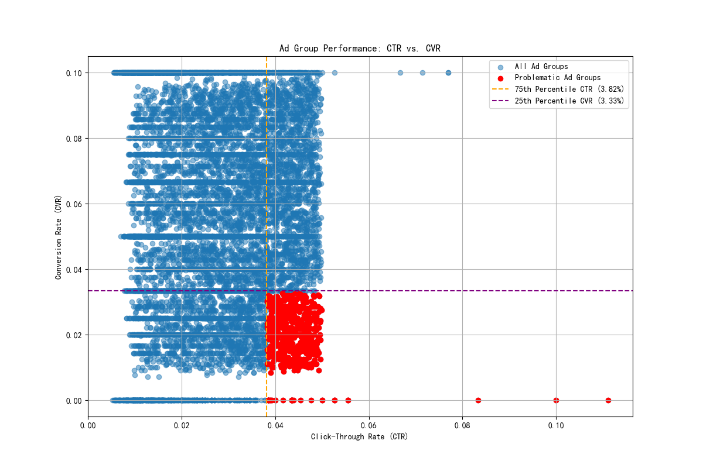

# Analysis of High-CTR, Low-CVR Ad Groups

## Overview

This analysis identifies and examines ad groups characterized by a high Click-Through Rate (CTR) and a low Conversion Rate (CVR). These groups, while successful at attracting clicks, are failing to convert these clicks into valuable actions. This suggests a disconnect between the ad's promise and the landing page's delivery, or that the ads are attracting an audience with low purchase intent.

## Identification of Problematic Ad Groups

By analyzing the `google_ads__ad_group_report` data, we identified ad groups with a CTR above the 75th percentile and a CVR below the 25th percentile. 

*   **CTR Threshold (75th Percentile):** > 3.82%
*   **CVR Threshold (25th Percentile):** < 3.33%
*   **Number of Problematic Ad Groups:** 616

The following scatter plot visually distinguishes these problematic ad groups (in red) from the rest of the ad groups (in blue).

## Key Findings

1.  **Significant Intent Mismatch:** The problematic ad groups exhibit an average **Intent Match Ratio of 0.36**. This means their actual conversion rate is only 36% of the expected conversion rate (the average CVR across all ad groups). This low ratio strongly indicates a significant gap between the user's intent, as triggered by the ad, and the actual offer on the landing page.

2.  **Universal Issue within Standard Search:** All 616 identified ad groups are of the `SEARCH_STANDARD` type. This highlights that the problem is not isolated to a niche ad format but is prevalent within our core search advertising efforts.

3.  **Campaign-Level Patterns:** While the issue is widespread, some campaigns are more affected than others. The "Performance Audience - Q2 2023" campaign has the highest number of underperforming ad groups. This suggests that a review should start with these most-affected campaigns.

## Recommendations

Based on these findings, we recommend the following targeted optimizations:

1.  **Keyword Strategy Refinement:**
    *   **Review Search Queries:** For the identified ad groups, conduct a thorough analysis of the search query reports to identify irrelevant or low-intent keywords that are triggering the ads.
    *   **Negative Keywords:** Implement a robust negative keyword strategy to filter out irrelevant traffic. Add negative keywords for terms that are driving clicks but not conversions.
    *   **Match Types:** Test more restrictive match types (e.g., from broad match to phrase or exact match) for keywords that are driving high volume but low-quality traffic.

2.  **Ad Copy and Landing Page Alignment:**
    *   **Message Congruence:** Ensure the ad copy's call-to-action and value proposition are perfectly aligned with the content and offer on the landing page. Any disconnect can lead to immediate user bounce.
    *   **A/B Test Ad Copy:** Continuously test different ad copy variations to identify messaging that not only attracts clicks but also pre-qualifies users, setting clear expectations.

3.  **Landing Page Experience Enhancement:**
    *   **Improve Clarity and Relevance:** The landing page should immediately confirm the promise of the ad. The headline, content, and call-to-action should be clear, concise, and directly relevant to the ad that a user clicked.
    *   **Optimize for Conversions:**  Analyze the user experience on the landing pages associated with these ad groups. Look for potential friction points in the conversion funnel, such as complicated forms, slow page load speeds, or a lack of trust signals.

By implementing these recommendations, we can work to close the gap between clicks and conversions, improving the overall efficiency and profitability of our Google Ads campaigns.
