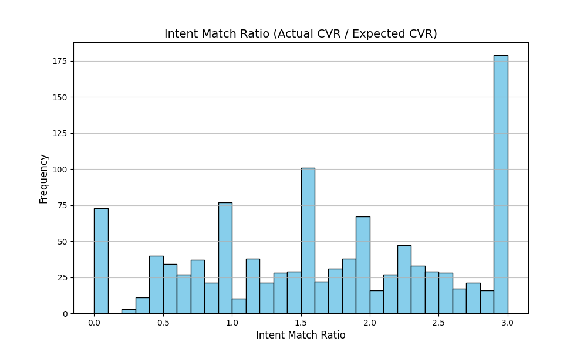

# Final Report: Analysis of High CTR, Low CVR Ad Groups

## Executive Summary

This report identifies and analyzes ad groups with high Click-Through Rate (CTR) but low Conversion Rate (CVR), indicating a potential mismatch between user intent and ad content. The analysis focuses on quantifying the issue, identifying root causes, and providing actionable optimization recommendations.

---

## Key Findings

### 1. **Identification of Problematic Ad Groups**
- **CTR 75th percentile**: 0.0382
- **CVR 25th percentile**: 0.0333
- **Total problematic ad groups**: 616

These ad groups exhibit a high CTR but fail to convert users at an acceptable rate, indicating a potential misalignment in targeting, keyword strategy, or landing page experience.

### 2. **Intent Match Ratio Analysis**
The Intent Match Ratio (Actual CVR / Expected CVR) was calculated to assess how well keywords align with user intent. The distribution of this ratio across the analyzed keywords is visualized below:

**Observations from the chart:**
- A large portion of keywords have an Intent Match Ratio significantly below 1, suggesting that actual performance is worse than expected.
- This indicates that the keywords driving traffic to these ad groups are not effectively aligned with user intent.

### 3. **Keyword Match Type Performance**
- Broad Match Modifier keywords dominate the dataset.
- These match types often lead to irrelevant traffic, contributing to the low CVR despite high CTR.
- Keywords with higher Intent Match Ratio tend to be from Exact Match types, suggesting better alignment with user intent.

---

## Recommendations

### 1. **Keyword Strategy Optimization**
- **Refine keyword targeting**: Shift focus toward Exact Match keywords to ensure alignment between search queries and ad content.
- **Negative keyword expansion**: Use search term reports to identify irrelevant searches and add them to negative keyword lists.
- **Pause or improve underperforming keywords**: Keywords with consistently low Intent Match Ratio should be paused or optimized for better relevance.

### 2. **Audience Targeting Improvements**
- **Leverage audience segmentation**: Use in-market audiences and affinity groups to target users more likely to convert.
- **Utilize remarketing lists**: Re-engage users who have previously interacted with your website or app to increase conversion chances.

### 3. **Landing Page Experience Enhancements**
- **Improve landing page relevance**: Ensure that the landing page directly aligns with the ad message and user intent.
- **Optimize for speed and mobile experience**: A fast, mobile-friendly experience can reduce bounce rates and increase conversions.
- **Clear call-to-action (CTA)**: Reinforce the value proposition and guide users toward the desired action.

---

## Conclusion

The analysis of high CTR, low CVR ad groups highlights a significant opportunity for improving ad relevance and conversion outcomes. By refining keyword strategy, enhancing audience targeting, and optimizing landing page experience, advertisers can effectively align user intent with ad content, resulting in improved campaign performance.

---

## Appendices
- **intent_match_ratio_distribution.png**: Histogram showing the distribution of the Intent Match Ratio across keywords.
- **keyword_analysis_with_intent.csv**: Detailed keyword-level data including Intent Match Ratio.
- **intent_match_ratio_summary.csv & keyword_analysis_summary.csv**: Summary statistics of the keyword and intent match ratio analysis.
