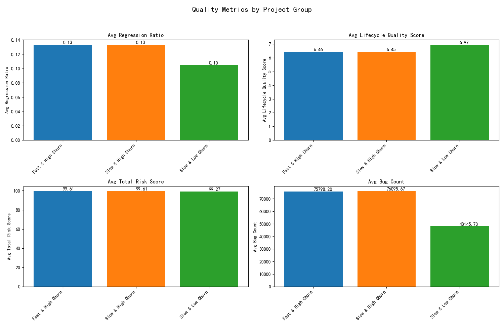

# The Unstable Speed: Are Fast-Delivering, High-Turnover Projects Truly Healthy?

## Executive Summary

An analysis was conducted to investigate the health of projects characterized by rapid delivery (average issue close time < 15 days) and high team turnover. The central question was whether speed, when coupled with instability, comes at the cost of quality and long-term sustainability. Our findings suggest that high team churn is a stronger predictor of poor project quality than delivery speed. Projects with high churn rates, regardless of their delivery velocity, exhibit significantly higher bug counts and regression ratios, indicating lower quality and increased rework.

## Analysis and Findings

To explore the relationship between speed, stability, and quality, we segmented projects into four categories based on their average issue close time and team churn risk. We then compared key quality indicators across these groups.

**Project Categories:**

*   **Speed:**
    *   Fast: Average issue close time < 15 days
    *   Slow: Average issue close time >= 15 days
*   **Stability:**
    *   High Churn: Team churn risk >= 20%
    *   Low Churn: Team churn risk < 20%

This resulted in three distinct project groups from our dataset: "Fast & High Churn", "Slow & High Churn", and "Slow & Low Churn". The "Fast & Low Churn" category had no projects, suggesting that in this dataset, fast delivery is often associated with higher team churn.

**Quality Metrics Comparison:**

The following chart compares the average quality metrics across the three project groups.

**Key Observations:**

*   **Bug Count:** High-churn projects, both fast and slow, have significantly more bugs on average (~75k-76k) compared to low-churn projects (~48k). This indicates a strong correlation between team instability and the number of defects.
*   **Regression Ratio:** This metric, representing the proportion of work that is rework, is notably higher in high-churn projects (~0.133) compared to low-churn projects (~0.105). Team instability appears to lead to more mistakes and a greater need for corrective work.
*   **Lifecycle Quality & Risk Scores:** The average lifecycle quality scores and total risk scores are very similar across all project groups, suggesting that these high-level metrics may not be sensitive enough to capture the nuances of team dynamics.

## Conclusion: Stability Trumps Speed

The data tells a clear story: **team stability is a critical factor for project health, more so than a rapid delivery pace.** While speed is a desirable project attribute, it should not be pursued at the expense of a stable and cohesive team. The high bug counts and regression rates in high-churn projects point to a reactive, "fire-fighting" environment where long-term quality is sacrificed for short-term gains. These projects are not truly healthy, as they incur a significant "quality debt" that will likely impact future development and maintenance.

## Recommendations

1.  **Prioritize Team Stability:** Project and engineering leadership should actively monitor and address team churn. Strategies for improving team stability, such as better resource management, professional development opportunities, and fostering a positive work environment, should be implemented.
2.  **Rethink "Success" Metrics:** Over-emphasizing speed can create perverse incentives. Project success metrics should be holistic, incorporating not just delivery time but also quality indicators like bug rates and rework, and team health metrics like churn risk.
3.  **Further Investigation:** The projects in the "Fast & High Chun" category should be subject to a more in-depth qualitative analysis. Interviews with team members and a closer look at the development process could reveal the root causes of the high turnover and its impact on their work.
