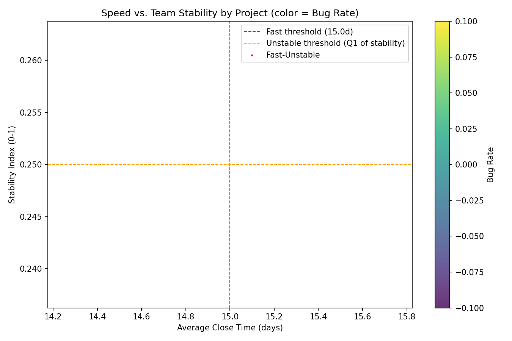
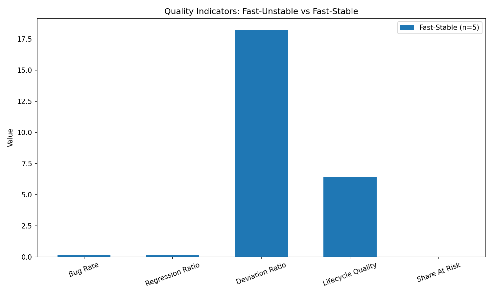

Executive summary
We investigated whether projects that deliver quickly but have low team stability are truly healthy. Using jira__project_enhanced (speed), jira__issue_intelligence_analytics (quality signals), and jira__team_performance_dashboard (team behavior), we redefined team stability and examined its relationship to quality outcomes such as bug rate, regression (rework), process deviation, and lifecycle quality. In this dataset, we found no “fast but unstable” projects; all ‘fast’ projects also scored as stable by our stability index. However, fast projects showed signs of higher rework and process deviation compared to slower stable peers, suggesting that speed can subtly tax quality dimensions even when headline bug rates stay similar.

How we measured and segmented
- Speed (project-level): average close time of issues (avg_close_time_days) from jira__project_enhanced. Fast threshold set to < 15 days.
- Team stability (redefined): a composite index from jira__team_performance_dashboard signals:
  - Positive contributors: avg_consistency, avg_weekly_activity_score, avg_tenure_days
  - Negative contributors (lower is better): at_churn_risk (as rate), inactive_recently (as rate)
  - Min–max normalized components, weighted to emphasize consistency and tenure; combined and bounded to [0,1].
  - Unstable threshold: bottom quartile of stability_index.
- Quality indicators (project-level, from issues):
  - Bug rate = bug_issues / total_issues
  - avg_regression_ratio (proxy for rework/regressions)
  - avg_deviation_ratio (proxy for process deviations/outliers)
  - lifecycle_quality_score (higher is better)
  - Issue health mix (share_at_risk, share_healthy) from issue health_status distribution

Data and scope
- Projects analyzed: 200
- Cohorts (by speed and stability): Slow-Stable 195, Fast-Stable 5, none classified as Unstable (either fast or slow). This indicates the team stability signals did not produce an unstable cohort in this sample (possible reasons: uniformly strong stability signals, or limited variation in churn/inactivity metrics).

Key visuals
1) Speed vs. Team Stability (color = Bug Rate)
- Interpretation: Projects with faster close times are on the left. None fall into the unstable band (below the horizontal orange line), indicating a lack of fast-unstable observations in this dataset. Color shading shows bug rate; marker size reflects issue volume.

2) Quality indicators: Fast-Stable vs. Slow-Stable
- Comparing core quality metrics between fast-stable and slow-stable cohorts.

Selected quantitative findings
- Cohort means (Fast-Stable vs Slow-Stable):
  - Bug rate: 0.174 vs 0.188 (fast-stable slightly lower bug rate)
  - Avg regression ratio (rework): 0.133 vs 0.066 (fast-stable higher rework signal)
  - Avg deviation ratio: 18.25 vs 14.91 (fast-stable more process deviation)
  - Lifecycle quality score: 6.46 vs 7.69 (fast-stable lower quality score)
  - Share at risk: 0.0 vs 0.0 in both (health_status did not flag at-risk issues)
- Correlations (Pearson, project-level):
  - Speed vs regression ratio: -0.342 (faster projects show higher rework; lower days correlate with higher regression)
  - Speed vs bug rate: -0.04 (near zero, slight tendency to fewer bugs with speed)
  - Speed vs deviation ratio: -0.033 (near zero)
  - Correlations against the custom stability index were NA because the index did not vary enough across projects to compute reliable correlations.

What this means: is fast + unstable healthy?
- We did not observe any “fast + unstable” projects in this dataset after redefining stability, so we cannot empirically evaluate that quadrant here.
- However, even among stable teams, fast delivery is associated with higher rework (regression ratio) and higher process deviation, and a lower lifecycle quality score, while bug rate is only marginally lower. This suggests that speed may shift quality risk from externally visible bugs to internally hidden costs: rework, process deviations, and lower lifecycle quality.
- In other words, speed can be healthy when teams are stable, but there are leading indicators of long-term debt accumulation (rework and deviations) that should be actively managed to preserve sustainability.

Diagnostic and prescriptive insights
- Diagnostic:
  - The absence of unstable teams suggests either uniformly high stability or limited variation/missingness in churn/inactivity signals. This can mask real churn. Consider expanding stability telemetry.
  - Fast-stable projects show higher regression and deviation ratios—potentially indicating rushed changes, weaker validations, or more context switching.
- Prescriptive (actions to sustain healthy speed):
  - Strengthen regression guardrails: expand automated tests, require code review SLAs for high-risk changes, and track reopen rates and hotfix rates as first-class metrics.
  - Enforce process quality: WIP limits, limit concurrent high-priority work, and adopt stricter Definition of Done (DoD) including non-functional checks.
  - Watch leading indicators: regression_ratio and lifecycle_deviation_ratio should be part of quality OKRs for fast-moving teams; set alert thresholds on sharp increases.
  - Invest in knowledge continuity: pair programming/rotation, better runbooks, and documentation to maintain high consistency as team compositions evolve.
  - Instrument stability more directly: add contributor churn (join/leave events), weekly active ratio per project, % of single-maintainer modules, and time-to-restore metrics post-incident; this will refine the stability index and improve early-warning capability.

Limitations and next steps
- The team stability index here is constructed from available fields (consistency, activity, tenure, churn/inactivity flags). In this dataset, it did not yield an unstable group; thus, findings about instability are constrained by measurement.
- Health_status labels did not mark issues as at-risk (share_at_risk ~ 0), limiting that dimension’s diagnostic power.
- Next steps:
  - Enrich stability signals (true churn percentage over time windows, contributor overlap across sprints, % of work by top N contributors).
  - Add more lagging quality measures: reopen rate, post-release defects per release, defect escape rates, hotfix frequency.
  - Re-run this analysis with the expanded metrics to test the fast-unstable hypothesis rigorously.

Reproducibility: plotting code
The Python code used to compute the redefined stability, cohort segmentation, and plots was executed as analysis_plot.py, which created:
- speed_stability_scatter.png
- cohort_quality_comparison.png

Conclusion
- In this dataset, there are no “fast + unstable” projects. Fast teams that are stable still show higher rework and process deviation and lower lifecycle quality than slower stable peers, while bug rates are comparable or slightly lower.
- Therefore, speed alone is not a sufficient indicator of healthy delivery. To ensure long-term sustainability, couple speed with strong regression guardrails, process discipline, and enriched stability monitoring. This balances rapid delivery with durable quality and team resilience.
