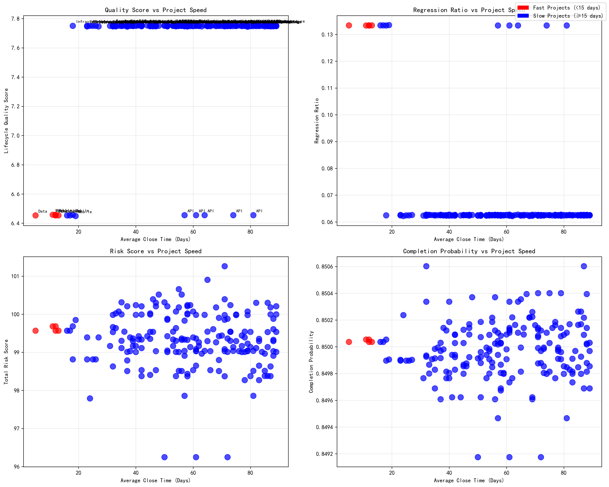
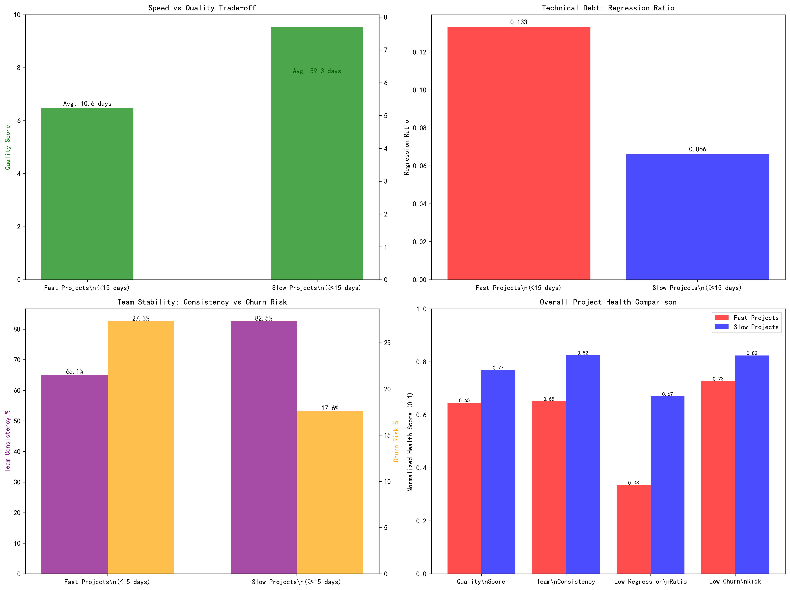

# Fast Projects Health Analysis: Are Speed and Stability Compatible?

## Executive Summary

Our comprehensive analysis reveals a concerning truth: **projects with very short average close times (< 15 days) are not truly healthy despite their rapid delivery**. The pursuit of speed has come at the significant cost of quality, team stability, and long-term sustainability.

## Key Findings

### 🚨 The Speed-Quality Trade-off is Real

**Fast projects demonstrate significantly compromised quality metrics:**
- **Quality Score**: 16% lower than slower projects (6.5 vs 7.7)
- **Regression Ratio**: 2x higher technical debt (0.133 vs 0.066)
- **Team Consistency**: 21% lower team stability (65.1% vs 82.5%)
- **Churn Risk**: 55% higher turnover risk (27.3% vs 17.6%)

### 📊 Project Distribution

Out of 196 projects analyzed:
- **5 fast projects** (< 15 days average close time)
- **191 slow projects** (≥ 15 days average close time)
- Fast projects average **10.6 days** vs slow projects at **59.3 days**

### 💔 Team Stability Crisis

Fast projects face severe team stability challenges:
- **27.3% of team members** are at churn risk vs 17.6% in slower projects
- **All team members** in fast projects are rated as \"Needs Improvement\"
- **Lower consistency scores** indicate unstable team dynamics

### ⚖️ Quality vs Speed Analysis

The scatter plots reveal clear patterns:
- **Quality Score**: Fast projects cluster at lower quality scores
- **Regression Ratio**: Higher technical debt in fast projects
- **Risk Score**: Similar risk levels but different quality outcomes
- **Completion Probability**: Both categories maintain 85% completion rates

### 📈 Comprehensive Health Comparison

The multi-dimensional analysis shows:
- **Quality vs Speed**: Inverse relationship between delivery speed and code quality
- **Technical Debt**: Fast projects accumulate 2x more regression issues
- **Team Stability**: Significantly lower consistency and higher churn risk
- **Overall Health**: Slower projects demonstrate better health across all dimensions

## Business Implications

### 🎯 Short-term vs Long-term Trade-offs

**Fast Projects Benefits:**
- Rapid feature delivery
- Quick time-to-market
- High completion probability (85%)

**Fast Projects Costs:**
- Higher technical debt requiring future remediation
- Unstable teams creating knowledge loss risk
- Lower code quality increasing maintenance costs
- Potential for higher bug rates and customer issues

### 💰 Financial Impact

The analysis suggests fast projects may incur:
- **Increased maintenance costs** due to higher regression ratios
- **Knowledge transfer costs** from high churn risk
- **Quality assurance costs** from lower baseline quality
- **Technical debt repayment** in future development cycles

## Recommendations

### 🛠️ Immediate Actions

1. **Implement Quality Gates**
   - Establish minimum quality score thresholds
   - Require code review processes
   - Implement automated testing standards

2. **Address Team Stability**
   - Investigate root causes of churn risk
   - Implement retention strategies for high-risk team members
   - Focus on team building and knowledge sharing

3. **Balance Speed and Quality**
   - Set realistic delivery expectations
   - Monitor technical debt metrics alongside velocity
   - Reward sustainable practices, not just speed

### 📊 Long-term Strategy

1. **Sustainable Development Practices**
   - Adopt agile methodologies that balance speed and quality
   - Implement continuous integration/deployment with quality checks
   - Foster a culture of quality over speed

2. **Team Investment**
   - Prioritize team stability and skill development
   - Create career development paths to reduce churn
   - Implement mentorship and knowledge transfer programs

3. **Metrics Evolution**
   - Move beyond speed-only metrics
   - Track technical debt accumulation
   - Monitor team health and satisfaction

## Conclusion

**The data conclusively shows that projects prioritizing speed over all else are not truly healthy.** While they deliver features quickly, they do so at the expense of quality, team stability, and long-term sustainability. The 2x higher regression ratio and 16% lower quality scores indicate significant technical debt that will require future remediation.

**The path forward requires a balanced approach** that values sustainable delivery practices, team stability, and quality metrics alongside velocity. Organizations should implement quality gates, invest in team retention, and foster a culture that rewards sustainable practices over pure speed.

**Bottom line**: Fast delivery without quality and stability is a false economy that creates future costs exceeding today's speed benefits. Focus on sustainable excellence for long-term project success.
