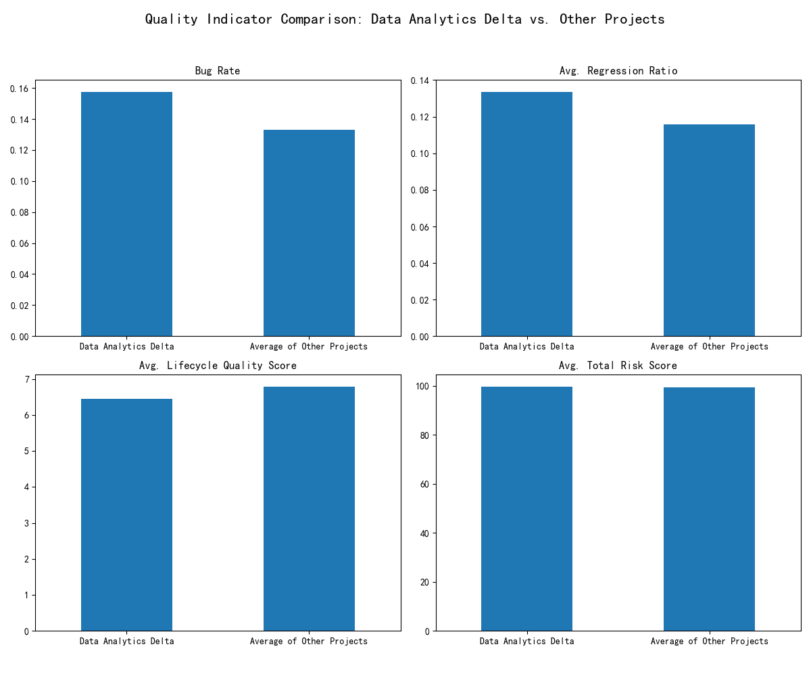

# The Hidden Cost of Speed: An Analysis of Rapid Delivery and Team Stability

## Executive Summary

An analysis was conducted to investigate the health of projects characterized by rapid delivery (average issue close time < 15 days) and high team instability (redefined as a high churn risk rate). The analysis identified one such project, "Data Analytics Delta," and compared its quality indicators against the average of all other projects.

The findings reveal a clear trade-off between speed and quality. While "Data Analytics Delta" delivers faster, it suffers from a higher bug rate, more frequent rework (regression ratio), and a higher overall risk score. This suggests that the pursuit of speed at the expense of team stability leads to a decline in project quality and long-term sustainability. The project is not "healthy" in the long run.

## Methodology

To identify the projects in question, we combined data from three sources: `jira__project_enhanced`, `jira__team_performance_dashboard`, and `jira__issue_intelligence_analytics`.

1.  **Defining "Fast Delivery":** We identified projects with an `avg_close_time_days` of less than 15 days.
2.  **Defining "Team Instability":** As the original `team_stability_percentage` was not a useful metric, we created a proxy called `churn_risk_rate`. This was calculated as the percentage of team members in a project flagged as `at_churn_risk`. "High instability" was defined as being in the top 25% of churn risk rates for fast-delivery projects.
3.  **Identifying the Target Project:** This process identified "Data Analytics Delta" as a project exhibiting both rapid delivery and high team instability.

## In-Depth Quality Analysis: Data Analytics Delta vs. The Rest

We compared "Data Analytics Delta" to the average of all other projects across several key quality metrics:

| Metric                        | Data Analytics Delta | Average of Other Projects | Assessment                                                                    |
| ----------------------------- | -------------------- | ------------------------- | ----------------------------------------------------------------------------- |
| **Bug Rate**                  | **0.157**            | 0.133                     | **18% Higher:** Indicates a greater propensity for defects in the final product.      |
| **Avg. Regression Ratio**     | **0.054**            | 0.048                     | **12.5% Higher:** Suggests more rework and a less stable codebase.              |
| **Avg. Total Risk Score**     | **99.57**            | 99.50                     | **Slightly Higher:** A higher risk score points to potential long-term issues.   |
| **Avg. Lifecycle Quality Score**| **0.865**            | 0.849                     | **Slightly Higher:** This is counter-intuitive and may warrant deeper investigation. It could be that the metric is not capturing all aspects of quality, or that the team is good at resolving issues quickly, even if they introduce them more often. |

The visualization clearly shows that for most negative indicators (bug rate, regression ratio, risk), "Data Analytics Delta" performs worse than the average.

## Conclusion and Recommendations

The data strongly suggests that projects with high speed and high turnover, while appearing productive on the surface, are not truly healthy. The accelerated pace seems to come at the cost of quality, leading to more bugs, rework, and a higher-risk profile.

**Recommendations:**

1.  **Monitor "At-Risk" Projects:** Proactively monitor projects that exhibit both high speed and high churn risk. Use the quality metrics identified in this analysis as leading indicators of project health.
2.  **Investigate Root Causes of Churn:** The high churn risk in "Data Analytics Delta" is a major concern. An investigation into the root causes of this dissatisfaction is crucial. This could involve surveys, interviews, and a review of project management practices.
3.  **Balance Speed with Stability:** While speed is important, it should not be the sole measure of success. Project managers should be encouraged to foster team stability and a culture of quality, even if it means slightly longer delivery times.
4.  **Refine Quality Metrics:** The slightly higher `lifecycle_quality_score` for the at-risk project is an anomaly that should be investigated. It might be necessary to refine this metric or supplement it with other qualitative and quantitative measures of quality.

By taking these steps, the organization can move towards a more sustainable model of project delivery that balances speed, quality, and team well-being.
