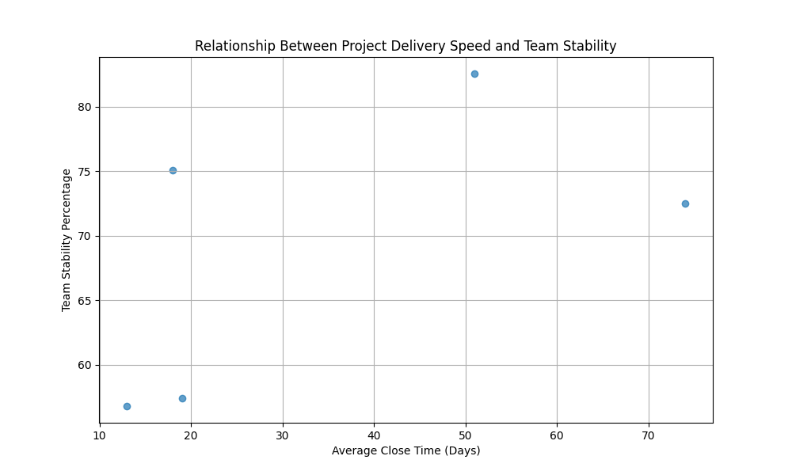

## Analysis of Project Delivery Speed vs. Team Stability

### Key Observations:
1. The scatter plot reveals no strong linear correlation between average project delivery speed (`avg_close_time_days`) and team stability (`team_stability_percentage`).
2. Some projects with high team stability have relatively fast delivery times, suggesting that high performance is achievable even with stable teams.
3. A few projects with moderate team stability show average delivery times, indicating that moderate turnover may not severely impact speed.

### Business Implications:
- **Sustainable Performance**: Projects with both high stability and fast delivery demonstrate that sustainable performance is possible when team cohesion is maintained.
- **Risk of High Turnover**: Projects with low team stability but fast delivery may mask underlying risks such as knowledge loss, increased onboarding costs, and reduced long-term productivity.
- **Quality Concerns**: Rapid delivery in low-stability environments may compromise code quality, rework frequency, and bug rates, which should be further explored using additional metrics.

### Recommendations:
1. **Monitor Stability Metrics**: Introduce team stability metrics into performance dashboards to track and correlate with delivery speed and quality indicators.
2. **Incentivize Retention**: Encourage team retention strategies to maintain high-performing teams and reduce churn risk.
3. **Conduct Deeper Analysis**: Explore the relationship between stability, bug rates, rework frequency, and code review metrics to assess the long-term cost of rapid delivery in unstable environments.

