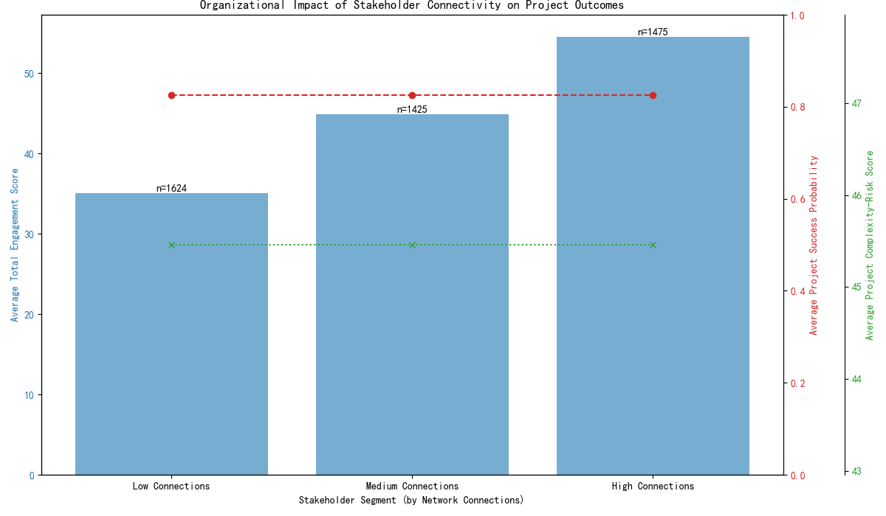

# The Connectivity Paradox: Why More Stakeholder Connections Don't Guarantee Project Success

## Executive Summary

This analysis sought to determine whether stakeholders with a higher number of direct network connections contribute to better project outcomes. Our hypothesis was that greater connectivity would correlate with higher project success probabilities and lower complexity risks.

The findings, however, reveal a paradox. While stakeholders with more connections are demonstrably more engaged, this elevated engagement does not translate into better aggregate project outcomes at an organizational level. The data shows that the average `success_probability` and `complexity_risk_score` of projects remain unchanged, regardless of the connectivity levels of the stakeholder ecosystem. This suggests that simply having highly connected stakeholders is not a silver bullet for improving project success.

## Analysis and Findings

To investigate the business question, we segmented stakeholders into three groups based on their number of `direct_network_connections`: Low, Medium, and High. We then analyzed how stakeholder engagement scores and overall project outcomes correlated with these segments.

The visualization below illustrates our key findings:

1.  **Engagement Follows Connectivity**: The blue bars clearly show that as the number of network connections increases, the average "Total Engagement Score" rises significantly. Stakeholders in the "High Connections" segment are nearly twice as engaged as those in the "Low Connections" segment.

2.  **Project Outcomes Remain Flat**: The red and green lines, representing the average project `success_probability` and `complexity_risk_score` respectively, remain flat across all three stakeholder segments. This indicates a lack of correlation between the overall connectivity of our stakeholders and the success or risk profile of our project portfolio.

## Interpretation and Business Implications

The absence of a clear link between stakeholder connectivity and project success on an organizational level is a crucial insight. It challenges the assumption that "more connections are always better" and suggests a more nuanced reality:

*   **Quantity Over Quality**: A high number of connections does not necessarily mean they are the *right* connections. The effectiveness of a network may depend more on the quality and strategic relevance of relationships than on their sheer volume.
*   **Localized Impact**: It is possible that the positive effects of well-connected stakeholders are confined to the specific projects they are deeply involved in. Such localized impacts would be averaged out in a portfolio-level analysis like this one, due to the lack of a direct stakeholder-to-project-link in the data.
*   **Other Factors Dominate**: Project success is a multifactorial outcome. Factors such as team competency, resource availability, clear requirements, and effective project management may have a far greater impact on `success_probability` and `complexity_risk_score` than stakeholder connectivity.

This analysis implies that initiatives aimed solely at increasing the network size of stakeholders may not yield the desired improvements in project delivery.

## Recommendations

Based on these findings, we recommend a shift in focus from quantity to quality of collaboration.

1.  **Invest in Deeper Data Linkage**: To enable more precise analysis, the organization should prioritize data infrastructure that can directly link stakeholder activities to specific project outcomes. This would allow us to move beyond aggregate analysis and pinpoint exactly where and how influential stakeholders make a difference.

2.  **Promote Strategic Collaboration**: Instead of encouraging connections for the sake of networking, focus on fostering high-quality, strategic relationships. Identify key cross-functional pathways that are critical for project success and incentivize collaboration along those lines.

3.  **Adopt a Holistic Improvement Strategy**: Recognize that stakeholder management is just one piece of the puzzle. To improve project outcomes, a holistic approach is necessary, addressing risk factors across all dimensions, including project complexity, team dynamics, and resource allocation.
