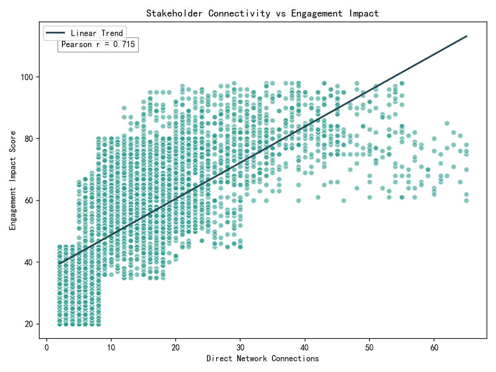
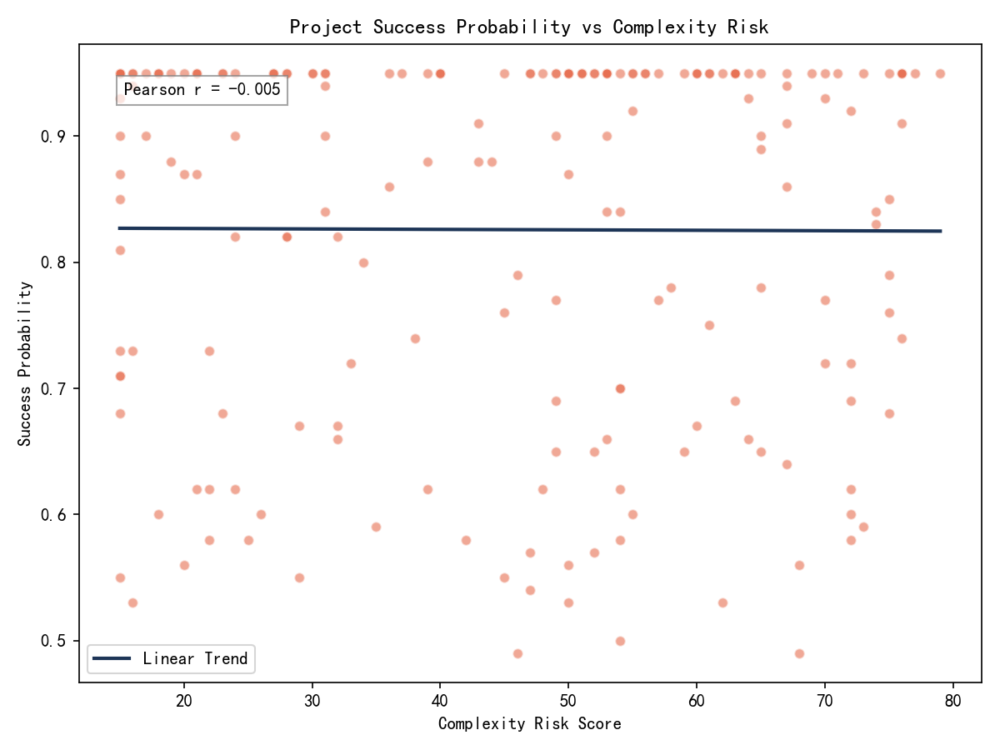
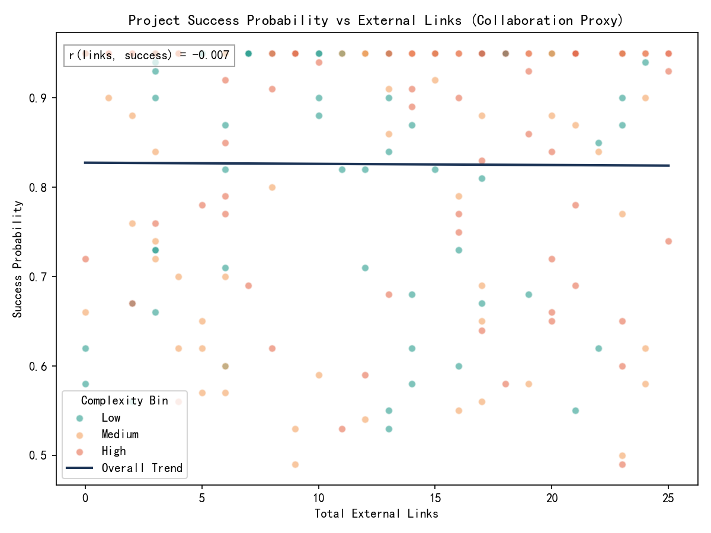

# Cross-Functional Collaboration Effectiveness: Do Highly Connected Stakeholders Improve Outcomes?

## Executive Summary
- Stakeholder level: Direct network connections show strong positive relationships with engagement outcomes—especially cross-functional reach and engagement impact. Stakeholders in the top connectivity quartile have substantially higher engagement impact and cross-functional involvement than those in the bottom quartile.
- Project level: In this dataset, project success_probability is essentially uncorrelated with complexity_risk_score overall. A project-level proxy for cross-functional collaboration (total_external_links) is also near-zero correlated with success_probability overall, with a slight positive correlation for low-complexity projects and slight negative for high-complexity projects.
- Interpretation: Highly connected stakeholders appear to enhance engagement breadth and quality across functions, but we cannot directly conclude they increase project success_probability without a stakeholder-to-project mapping. Collaboration intensity may yield benefits in simpler contexts, but in highly complex projects, unmanaged cross-functional interaction could introduce coordination overhead.

Visuals included:
- stakeholder_connections_vs_impact.png
- project_success_vs_complexity.png
- project_success_vs_external_links.png

## Data & Methods
- Data sources: 
  - jira__stakeholder_engagement_insights: contains stakeholder-level metrics including direct_network_connections, engagement_impact_score, total_engagement_score, engagement_quality_score, engagement_depth_score, strategic_value_score, total_projects_involved, cross_functional_projects.
  - jira__project_risk_assessment: contains project-level metrics including complexity_risk_score, success_probability, total_external_links, and additional risk and stability measures.
- Limitation: The database lacks a joinable stakeholder-to-project assignment table. Therefore, I assessed: 
  (a) whether stakeholder connectivity is associated with stronger engagement and cross-functional breadth, and 
  (b) how project complexity and cross-functional collaboration proxy relate to success_probability. 
- Methods: Correlations, quartile comparisons, simple OLS regressions (numpy least squares), and stratified analyses by complexity tiers. 

## Key Findings

1) Stakeholder connectivity strongly aligns with engagement performance and cross-functional breadth
- Correlations with direct_network_connections:
  - r(conn, engagement_impact_score) = 0.715
  - r(conn, total_engagement_score) = 0.679
  - r(conn, engagement_quality_score) = 0.671
  - r(conn, total_projects_involved) = 0.401
  - r(conn, cross_functional_projects) = 0.794
  - r(conn, engagement_depth_score) ≈ -0.001 (near zero)
- Quartile effect sizes (means):
  - Engagement Impact: Q1 (low) = 34.81 → Q4 (high) = 75.42
  - Cross-functional Projects: Q1 = 2.19 → Q4 = 6.81
- Takeaway: Connectivity is tied to broader and higher-quality engagement across functions—especially breadth, as indicated by strong correlation with cross_functional_projects and negligible correlation with engagement_depth_score.

Visualization: stakeholder_connections_vs_impact.png

2) Project complexity and success probability show essentially no relationship in this dataset
- r(complexity_risk_score, success_probability) = -0.0047 (effectively zero)
- Linear fit: success_probability ≈ -0.0000 × complexity_risk_score + 0.8275
- Mean success_probability by complexity terciles:
  - Low = 0.8307
  - Medium = 0.8137
  - High = 0.8337
- Multivariate OLS (success ~ complexity + team_stability + resolution_velocity_change) showed coefficients near zero; without confidence intervals, treat as negligible.
- Takeaway: The current success model likely captures other drivers; complexity alone is not predictive of success_probability across projects in this snapshot.

Visualization: project_success_vs_complexity.png

3) Project-level collaboration proxy (external links) is not a strong predictor of success overall; small nuance by complexity
- Overall: r(total_external_links, success_probability) = -0.0067 (near zero)
- Stratified by complexity:
  - Low complexity: r ≈ +0.100 (slight positive)
  - Medium complexity: r ≈ -0.034 (near zero)
  - High complexity: r ≈ -0.090 (slight negative)
- OLS with interaction (success ~ complexity + external links + complexity×links): 
  - total_external_links coefficient ≈ +0.0021; interaction ≈ -0.000045 (suggests diminishing returns of more links as complexity rises)
- Takeaway: Collaboration signals may be mildly helpful in simpler contexts but can introduce coordination overhead in high complexity unless managed.

Visualization: project_success_vs_external_links.png

## What This Means for Cross-Functional Collaboration
- High-connectivity stakeholders clearly correlate with stronger engagement outcomes and broader cross-functional reach. This is the kind of behavior we want when we aim to reduce silos and improve alignment.
- However, at the project outcome level (success_probability), we do not observe a direct positive relationship with our available collaboration proxy or with complexity. Without assignment-level data, we cannot attribute project success changes to specific stakeholders.
- Importantly, in high-complexity environments, collaboration intensity (as proxied by external links) might yield diminishing or even slightly negative associations with predicted success unless it is structured and governed.

## Recommendations
1) Instrument the data model for causal attribution
- Create and maintain a stakeholder-to-project assignment table with role, start/end dates, and intensity of involvement. This enables causal identification (e.g., matching, difference-in-differences) of how high-connectivity stakeholders affect success_probability.

2) Targeted deployment of highly connected stakeholders
- Assign highly connected stakeholders as \"integration leads\" on cross-functional initiatives, particularly in early phases (requirements alignment, dependency mapping). Use them to establish clear interfaces and decision protocols.

3) Manage collaboration overhead in high-complexity projects
- For high complexity, set guardrails: clear RACI, bounded meeting cadences, defined integration points, and dependency SLAs. The interaction findings suggest that unstructured increases in cross-team touchpoints can reduce predicted success.

4) Operational heuristics to test now
- If a project shows low collaboration signals (few external links) and low stakeholder network strength on the team, pilot adding 1–2 high-connection stakeholders to drive alignment. Track pre/post changes in leading indicators (issue resolution velocity, stability, risk trajectory) and success_probability.

5) Enhance the predictive model with network features
- Incorporate stakeholder network features (e.g., direct connections, betweenness/bridging centrality, engagement_quality_score) into the success prediction pipeline. Use k-fold validation to quantify uplift vs the current model.

6) Build a collaboration effectiveness dashboard
- Track weekly: 
  - Stakeholder connectivity quartiles on each project
  - Engagement Impact and Quality scores
  - External links volume and type
  - Success probability trend and risk deltas
- Use alerting when collaboration signals and success trend diverge (e.g., rising links but declining success in high complexity).

## Limitations
- No direct stakeholder-to-project mapping prevents causal inference about specific stakeholders’ effects on project outcomes.
- Correlations are not causation; coefficients here are descriptive and may be confounded by unobserved factors (project size, domain, leadership maturity).
- External links are an imperfect proxy for collaboration quality or effectiveness; richer collaboration telemetry (e.g., cross-team decision cycle times, dependency lead times) would improve measurement.

## Appendix: Generated Visuals
- stakeholder_connections_vs_impact.png
- project_success_vs_complexity.png
- project_success_vs_external_links.png

Overall conclusion: Highly connected stakeholders are strongly associated with better engagement and cross-functional breadth, which are desirable collaboration behaviors. Direct evidence that they improve project success_probability is inconclusive in this dataset due to missing assignment-level links and weak associations between our project-level collaboration proxy and success. The path forward is to (a) instrument stakeholder-to-project mappings, (b) intentionally deploy high-connectivity stakeholders with governance—especially on complex work—and (c) fold network metrics into predictive and operational workflows to test and scale what works.
