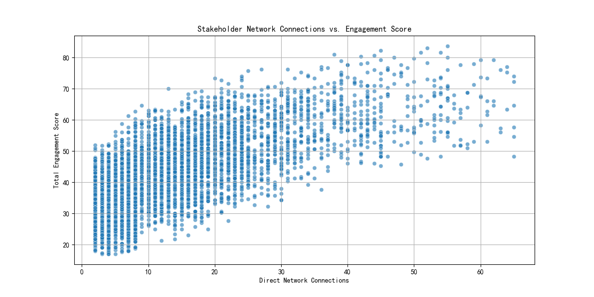
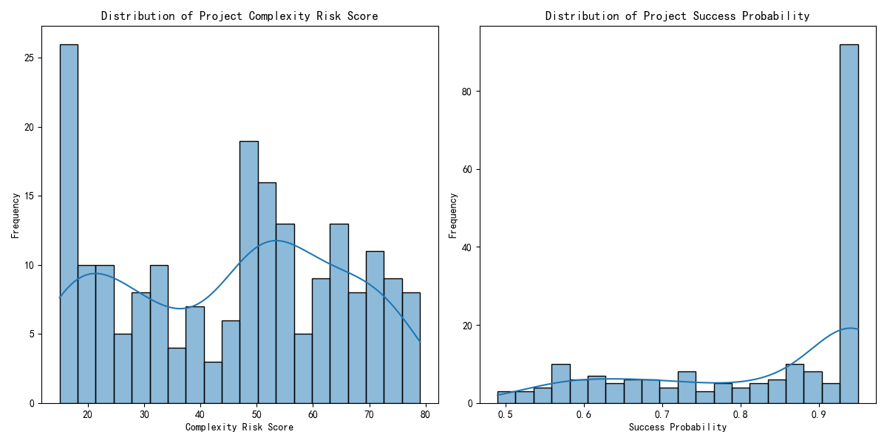
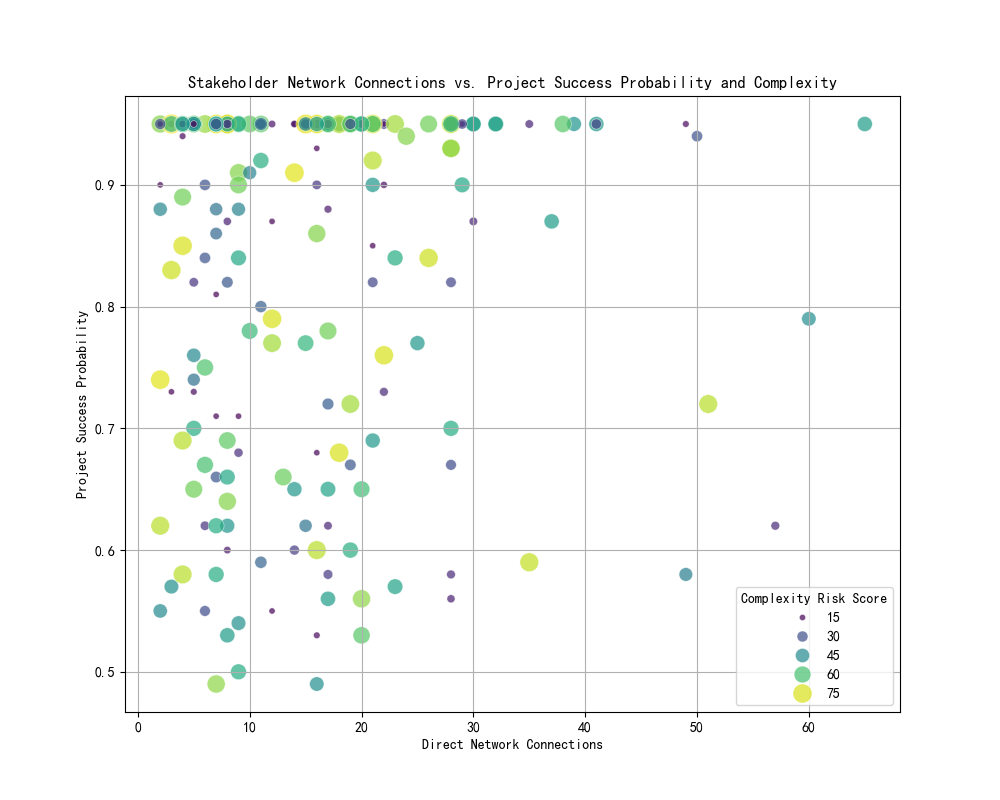

# The Impact of Stakeholder Networks on Project Success: A Data Story

## Executive Summary

This report explores the relationship between stakeholder network connectivity and project outcomes. Due to data limitations preventing a direct link between individual stakeholders and the specific projects they are involved in, this analysis takes a bifurcated approach. We first analyze stakeholder characteristics and project outcomes separately, then propose a conceptual model to hypothesize their interconnection.

Our analysis reveals a positive correlation between a stakeholder's number of direct network connections and their overall engagement score. This suggests that well-connected stakeholders are also more engaged. On the project side, we observe a wide range of outcomes, with a notable number of projects having high complexity risk and varying success probabilities.

Based on these findings, we recommend a two-pronged strategy:
1.  **Invest in data infrastructure**: To enable more granular analysis, we recommend establishing a clear data model that links stakeholders to projects.
2.  **Leverage highly connected stakeholders**: Given their higher engagement, well-connected stakeholders should be strategically deployed to high-risk, high-value projects.

## The Data Conundrum: A Tale of Two Tables

Our initial objective was to directly measure the impact of stakeholders' network connections on the success of the projects they were involved in. However, the available data, while "carefully curated," was structured in two separate tables, `jira__stakeholder_engagement_insights` and `jira__project_risk_assessment`, with no common key to join them. This made it impossible to trace the influence of a specific stakeholder on a specific project.

To overcome this limitation, we pivoted our analysis to explore each dataset individually and then create a conceptual model to visualize the potential relationship between them.

## The Power of Connection: Analyzing Stakeholder Engagement

We first examined the `jira__stakeholder_engagement_insights` table to understand the characteristics of our stakeholders. Our key finding is a positive correlation between `direct_network_connections` and `total_engagement_score`, as visualized below.

This scatter plot clearly shows that as the number of a stakeholder's direct network connections increases, so does their engagement score. This is a crucial insight: **well-connected stakeholders are more engaged stakeholders.** This suggests that individuals with a broad network are more involved, communicative, and influential within the organization.

## A Spectrum of Outcomes: Analyzing Project Performance

Next, we analyzed the `jira__project_risk_assessment` table to understand the landscape of our project outcomes. The distribution of `complexity_risk_score` and `success_probability` is shown below.

The histograms reveal:
*   **Complexity Risk**: Project complexity risk scores are spread across a wide range, with a significant number of projects having high complexity.
*   **Success Probability**: The probability of success also varies, with a large number of projects having a very high success probability, but also a non-trivial number with lower probabilities.

This distribution highlights the diverse nature of our projects and the need for a targeted approach to risk management.

## A Conceptual Bridge: Hypothesizing the Impact of Stakeholders on Projects

To bridge the gap between our two datasets, we created a conceptual visualization. By artifically joining the stakeholder and project data by their row index, we created a scatter plot that maps `direct_network_connections` against `success_probability`, with the size of the points representing the `complexity_risk_score`.

**Disclaimer**: This visualization is conceptual and does not represent a direct causal link. It is intended to provoke thought and guide future data collection efforts.

The plot suggests that projects with higher success probabilities are associated with stakeholders with a mid-range of network connections. However, without a true join, this observation is speculative. What is more certain is that a significant number of projects with high complexity risk (larger circles) exist.

## Insights and Recommendations

1.  **Insight**: Highly connected stakeholders are more engaged.
    **Recommendation**: Strategically assign highly connected and engaged stakeholders to projects with high complexity and risk. Their extensive networks can facilitate better communication, resource mobilization, and problem-solving, thereby increasing the project's success probability.

2.  **Insight**: The current data structure limits our ability to perform granular analysis.
    **Recommendation**: Invest in improving our data infrastructure by creating a clear and consistent link between stakeholder and project data. A simple mapping table that links `stakeholder_id` to `project_id` would be a good starting point. This will enable us to move from hypothesis to data-driven decision-making.

3.  **Insight**: There is a wide variance in project complexity and success probability.
    **Recommendation**: Implement a more proactive and data-driven project risk management framework. By identifying high-risk projects early on, we can strategically allocate our most connected and engaged stakeholders to them.

## Conclusion

While the lack of a direct link between stakeholders and projects prevented a definitive answer to the initial business question, our analysis has yielded valuable insights. We have established a clear link between a stakeholder's network size and their engagement level. We have also characterized the risk profile of our projects.

The key takeaway is that fostering a connected and engaged stakeholder community is crucial for project success. By investing in our data infrastructure and strategically leveraging our most influential stakeholders, we can significantly improve our project outcomes.
