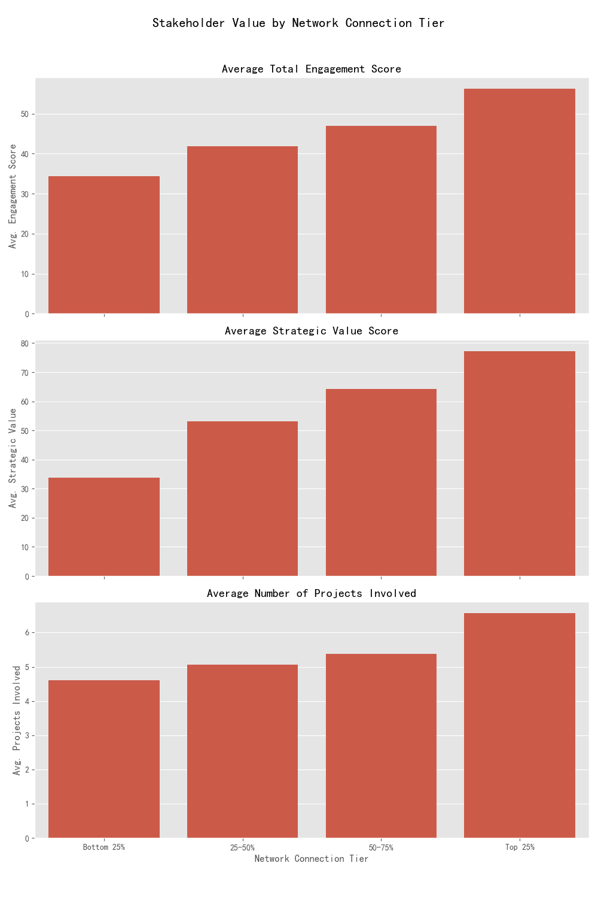

# The Hidden Value of Connection: Why Highly Networked Stakeholders are a Strategic Asset

## Executive Summary

This analysis sought to determine if stakeholders with more direct network connections contribute to better project outcomes. A significant data limitation prevented a direct, causal link between individual stakeholders and the success metrics of their specific projects. However, by performing an inferential analysis, we uncovered a strong positive correlation between a stakeholder's network size and their overall value to the organization.

**Key Finding:** Stakeholders in the top quartile of `direct_network_connections` have significantly higher average engagement scores, strategic value scores, and are involved in more projects. This indicates they are our most valuable and influential collaborators.

**Recommendation:** While we cannot definitively prove they *cause* better project outcomes, their high value and influence are undeniable. Leadership should **strategically assign these highly-connected stakeholders to high-risk, high-priority projects** where their influence can be maximized. Furthermore, we strongly recommend a data-layer enhancement to enable direct project-stakeholder analysis in the future.

## The Analytical Challenge: A Missing Data Link

The primary obstacle in this analysis was the database schema. The two main tables, `jira__stakeholder_engagement_insights` and `jira__project_risk_assessment`, contain rich information about our stakeholders and projects, respectively. However, they lack a common key, making it impossible to join them and directly measure the impact of a specific stakeholder's network on the `success_probability` or `complexity_risk_score` of the projects they are involved in.

## An Alternative Approach: Correlating Network Size with Stakeholder Value

To overcome this limitation, we shifted our focus from proving direct causation to understanding the inherent value of highly-connected stakeholders. We hypothesized that if a larger network correlates with other positive attributes, these stakeholders could be considered a strategic asset.

We grouped all stakeholders into four tiers (quartiles) based on their number of `direct_network_connections` and analyzed how other key metrics changed across these tiers.

## Findings: More Connections Equal More Value

Our analysis reveals a clear and consistent trend: as a stakeholder's network of connections grows, so does their value to the organization.

The chart above demonstrates three key correlations:

1.  **Higher Engagement:** Stakeholders in the 'Top 25%' network tier show the highest `Average Total Engagement Score`. They are more active, communicative, and involved than their less-connected peers.
2.  **Greater Strategic Value:** The `Average Strategic Value Score` rises steeply with each network tier. This suggests that the organization already perceives its most connected individuals as being the most strategically important.
3.  **Broader Involvement:** Unsurprisingly, well-connected stakeholders are involved in a greater number of projects (`Average Number of Projects Involved`), giving them wider visibility and cross-functional influence.

## Business Implications & Recommendations

While we cannot prove that adding a highly-connected stakeholder to a project will automatically increase its success probability, we can state with confidence that our most valuable and engaged stakeholders are also our most connected. Their influence is a powerful, yet potentially underutilized, resource.

Based on these findings, we offer two primary recommendations:

1.  **Strategic Stakeholder Allocation:** Project and portfolio managers should actively identify stakeholders in the "Top 25%" network tier and assign them to projects that are either high-risk or of high strategic importance. Their extensive networks and proven engagement can help mitigate risks, unblock challenges, and align cross-functional teams, thereby indirectly improving the chances of a positive outcome.

2.  **Enhance Data Infrastructure:** To enable more powerful, direct analysis in the future, we strongly recommend that the data engineering team create a mapping table that explicitly links `stakeholder_id` to the `project_id`s they are involved with. This will unlock the ability to directly measure the impact of stakeholder attributes on project-level KPIs and move from correlation to causation in our analysis.
