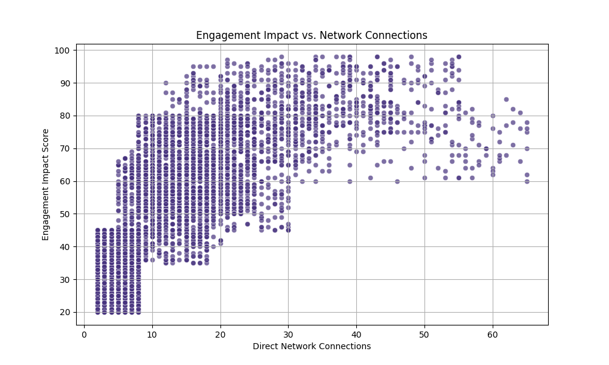
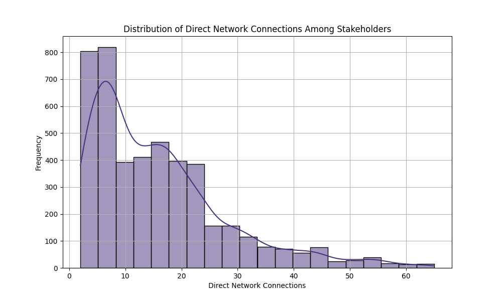
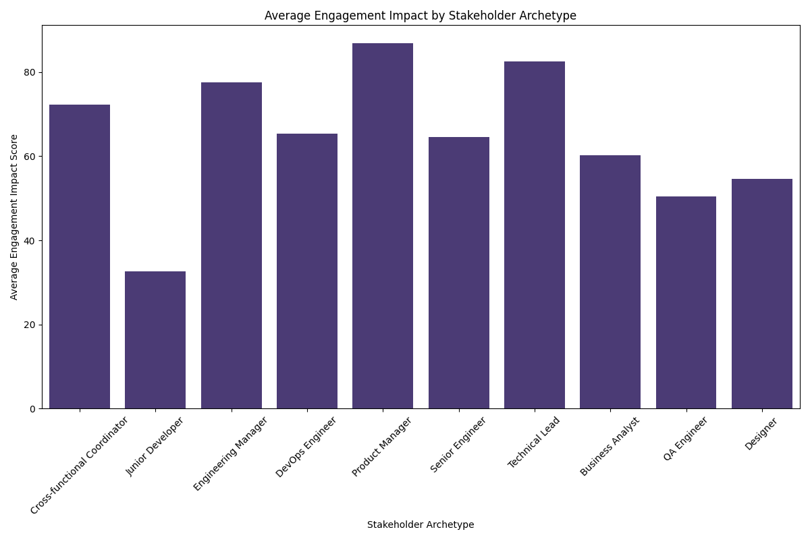
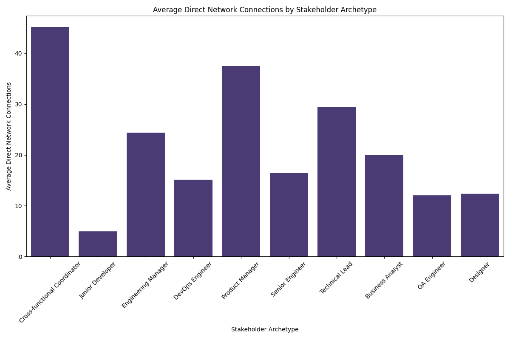
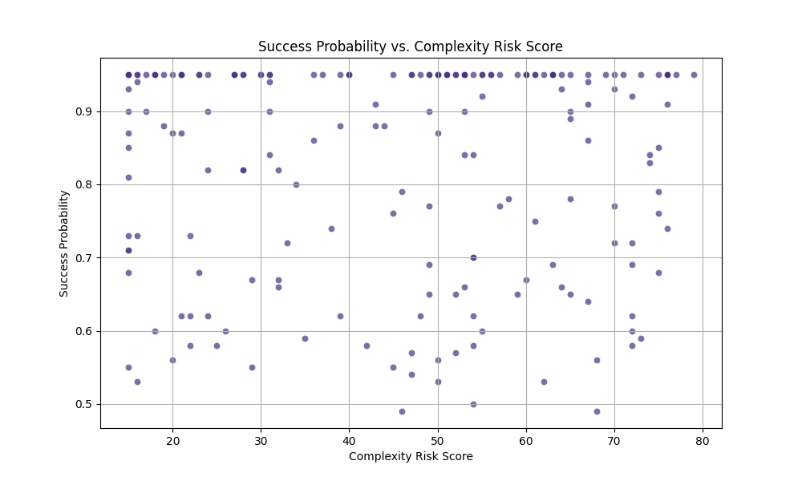

# Analysis of Stakeholder Network Connections and Project Outcomes

## Executive Summary

This report explores the relationship between **stakeholder network connections** and **project outcomes**, focusing on metrics such as `complexity_risk_score` and `success_probability`. We found that stakeholders with higher **direct network connections** generally have a greater **engagement impact**. However, no clear correlation was found between **project complexity risk** and **success probability**.

---

## Key Insights

### 1. Stakeholder Network and Engagement Impact
Stakeholders with more **direct network connections** tend to have a significantly higher **engagement impact score**, with a correlation of **0.715**.

#### Distribution of Network Connections
The distribution of direct network connections among stakeholders shows that most stakeholders have fewer than 20 connections, but some key roles like **Cross-functional Coordinators** and **Product Managers** have over 50 connections.

#### Stakeholder Archetype Comparison
- **Product Managers** and **Cross-functional Coordinators** have the highest **engagement impact scores**.
- **Junior Developers** and **Designers** have the lowest scores.

---

### 2. Project Risk vs. Success Probability
There is no strong correlation between **complexity risk score** and **success probability** (correlation: **-0.0047**). This suggests that high complexity risk does not necessarily lead to lower success probability.

Some high-complexity projects (e.g., "User Authentication v3.0", "ML Platform Refactor") still achieve high success probabilities, indicating that other factors might be compensating for risk.

---

## Recommendations

### 1. Leverage Highly Connected Stakeholders
Roles such as **Product Managers** and **Cross-functional Coordinators** play a crucial role in stakeholder engagement. Their involvement should be prioritized in complex or high-risk projects to maximize impact.

### 2. Reassess Risk Models
The weak relationship between complexity risk and success probability suggests that current risk models may not fully capture actual project outcomes. Consider incorporating additional success factors such as:
- Stakeholder influence and engagement
- Cross-functional collaboration
- Strategic value and alignment

### 3. Invest in Engagement Programs
Given the strong correlation between network connections and engagement impact, organizations should invest in initiatives that:
- Expand stakeholder networks
- Encourage communication across functions
- Support leadership development for high-impact roles

---

## Conclusion

While stakeholder connectivity strongly influences engagement impact, project success appears to be influenced by additional, unmeasured factors beyond complexity risk. Future analysis should explore more granular data linking stakeholder involvement to specific project outcomes to refine decision-making and risk mitigation strategies.
