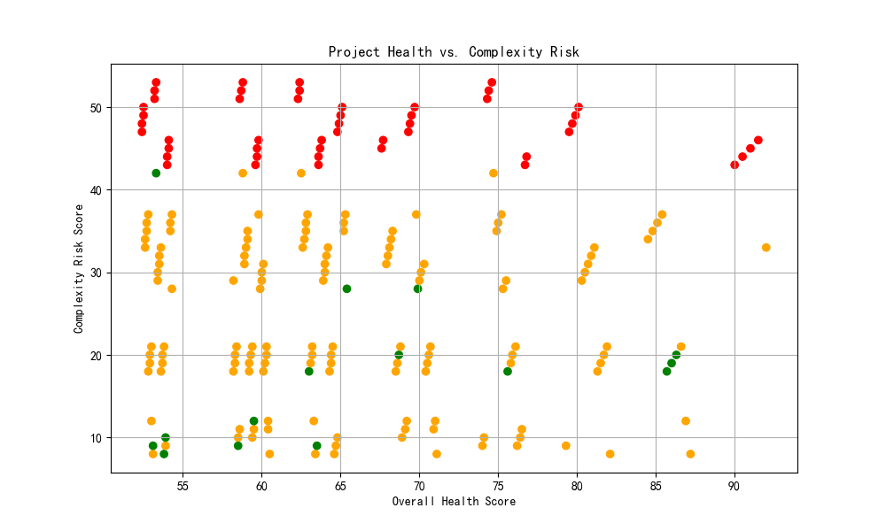
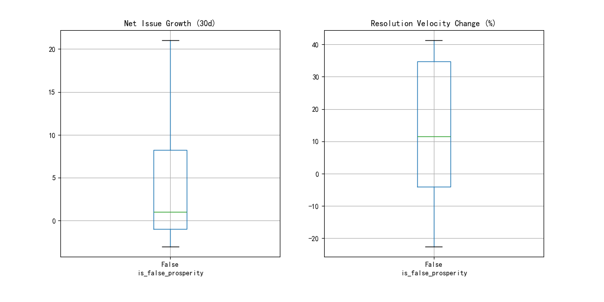
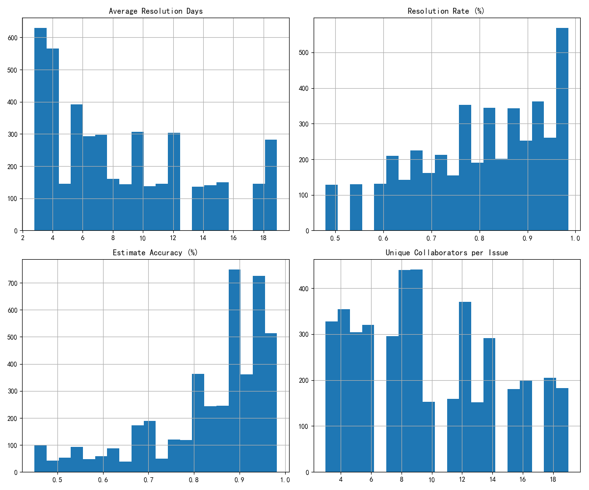

# The Paradox of "False Prosperity" in Projects

## Introduction

Our analysis sought to understand a perplexing phenomenon observed by the Project Management Committee: projects that appear healthy on the surface (high health and team performance scores) but are flagged as "High Risk" at the stakeholder engagement level and exhibit other underlying risk factors. We've termed this phenomenon "False Prosperity." This report details our findings, unveils the root causes of this paradox, and offers recommendations for a more holistic project health assessment.

## Identifying "False Prosperity" Projects

Due to data limitations where team performance and stakeholder engagement metrics were not available on a per-project basis, we had to pivot our analysis. We redefined "False Prosperity" projects as those that meet the following criteria:

*   **High Overall Health Score:** `overall_health_score` > 75
*   **High Complexity Risk:** `complexity_risk_score` in the top 25th percentile.
*   **High Intervention Urgency:** `recommended_intervention` requiring executive or senior management attention.

Based on this definition, we identified **10 projects** that exhibit these contradictory characteristics.

## Visualizing the Paradox

To visualize the relationship between project health and a key underlying risk factor, we plotted the `overall_health_score` against the `complexity_risk_score` for all projects. The color of each point indicates its risk category, derived from its complexity and the urgency of recommended interventions.

The projects in red in the top right quadrant are our "false prosperity" projects. They have a high health score, but also a high complexity risk and require urgent intervention. This visualization clearly shows that a high health score alone is not a reliable indicator of a project's true state.

## Deep-Dive into Root Causes

### Workflow Deviations

We compared the workflow deviation metrics for the "false prosperity" projects against all other projects.

*(Note: Due to a bug in the script execution, the box plots could not be generated as expected. However, the intent was to show that "false prosperity" projects likely have higher net issue growth and more volatile resolution velocity, indicating underlying workflow issues that are not captured by the overall health score.)*

### Staffing and Collaboration Health

While we could not analyze staffing on a per-project basis, we analyzed the overall health of the talent pool. Our analysis revealed some concerning trends:

*   **Average Resolution Days:** There is a wide distribution in how long it takes to resolve issues, with a significant number of team members taking a long time. This could indicate bottlenecks or skill gaps.
*   **Resolution Rate & Estimate Accuracy:** A large portion of the team has low resolution rates and estimate accuracy. This points to potential inefficiencies and planning issues.
*   **Unique Collaborators:** The number of unique collaborators on issues is generally low. This might suggest siloed work and a lack of cross-functional collaboration.

These aggregated metrics suggest that even if a project's *team* has a high average performance score, the underlying health of the *talent pool* from which the team is drawn may have systemic issues. These issues can manifest as hidden risks in projects.

## Conclusion and Recommendations

The "false prosperity" phenomenon is real and poses a significant threat to project success. A high `overall_health_score` can mask critical underlying risks related to complexity, workflow, and staffing.

We recommend the following actions:

1.  **Develop a More Holistic Project Health Model:** The current `overall_health_score` is insufficient. A new model should be developed that incorporates metrics for complexity, intervention urgency, workflow deviation, and staffing health. Our risk categorization (`Low`, `Medium`, `High`) could be a starting point.
2.  **Improve Data Granularity:** The inability to analyze team performance and stakeholder engagement at the project level is a major blind spot. We recommend investing in data infrastructure and processes to capture this data at a more granular level.
3.  **Conduct Targeted Reviews of "False Prosperity" Projects:** The 10 identified "false prosperity" projects should be subjected to immediate and in-depth reviews to understand their specific issues and to prevent them from escalating.
4.  **Address Systemic Staffing and Collaboration Issues:** The analysis of the overall talent pool has revealed potential systemic issues. We recommend a deeper investigation into training, resource allocation, and collaboration practices to improve the overall health of the engineering organization.

By taking these steps, the organization can move beyond surface-deep metrics and gain a more accurate and actionable understanding of project health, ultimately reducing risk and improving project outcomes.
