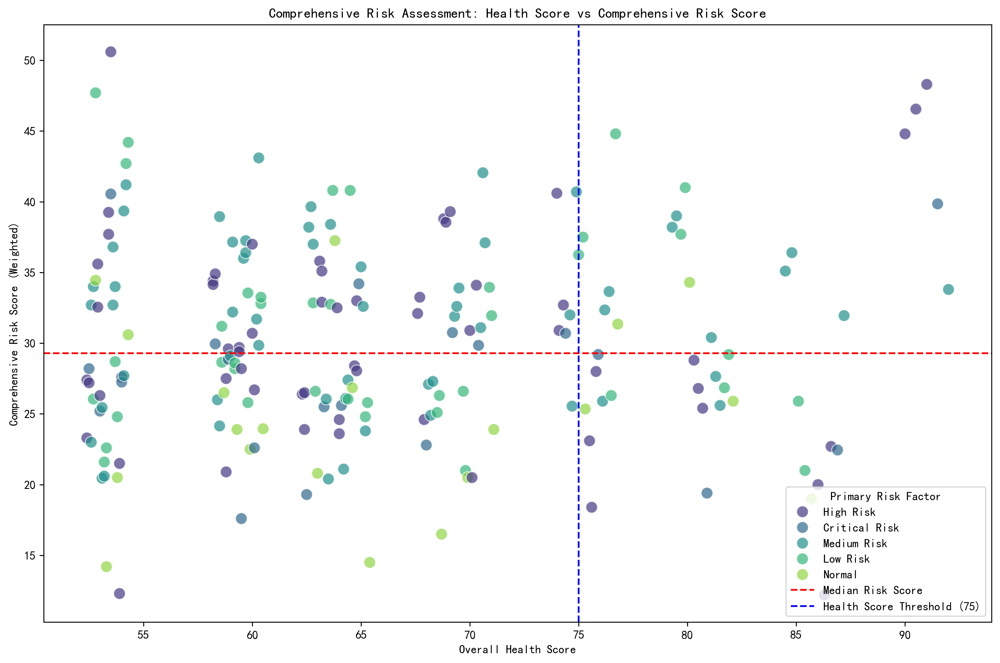
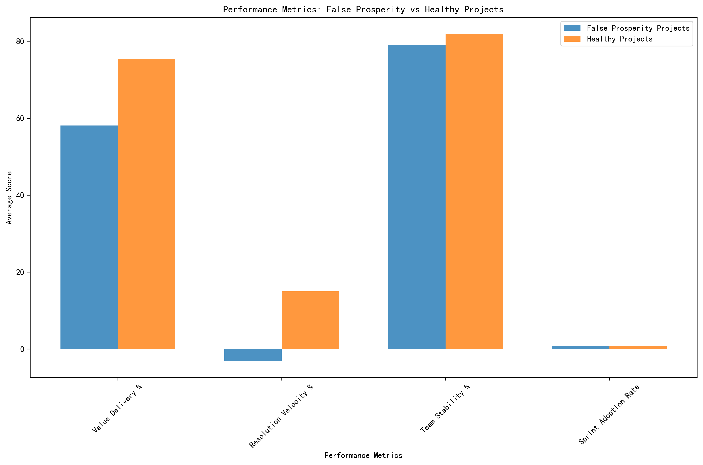
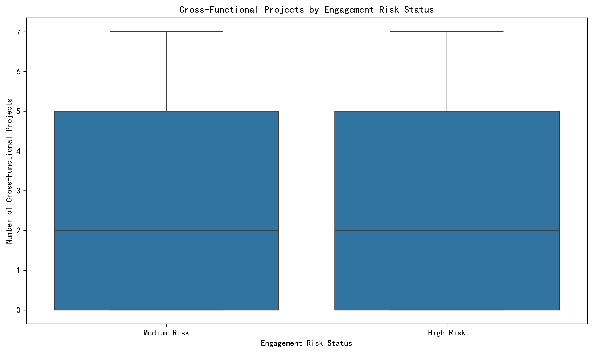
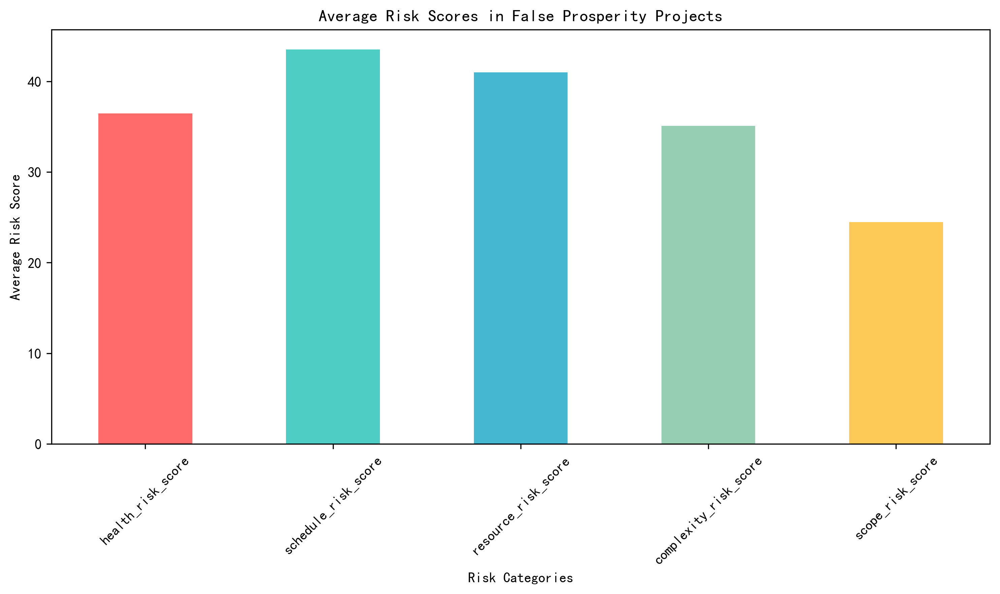

# False Prosperity Projects Analysis Report

## Executive Summary
Our analysis identified 19 projects (9.5% of total portfolio) exhibiting the "false prosperity" phenomenon - projects with strong surface-level health scores (avg 82.8) but underlying high comprehensive risk scores (avg 37.7). These projects show a significant 17.2% value delivery gap and 18.1% resolution velocity deficit compared to truly healthy projects, indicating hidden operational inefficiencies masked by superficial metrics.

## Key Insights

### 1. Risk Assessment Disconnect

The scatter plot reveals a critical disconnect between traditional health scores and comprehensive risk assessment. While 19 projects scored above the 75-point health threshold, they simultaneously ranked above the median comprehensive risk score (37.7), indicating that surface metrics fail to capture underlying operational risks. This represents a 9.5% false positive rate in project health assessment.

### 2. Performance Metric Deficiencies

False prosperity projects underperform significantly across key operational metrics:
- **Value Delivery**: 58.1% vs 75.3% in healthy projects (-17.2% gap)
- **Resolution Velocity**: -3.1% change vs +14.9% in healthy projects (-18.0% gap)
- **Team Stability**: 79.1% vs 81.9% (-2.8% gap)
- **Sprint Adoption**: 74.8% vs 76.0% (-1.2% gap)

These deficiencies suggest that while projects may appear healthy superficially, they struggle with execution efficiency and value realization.

### 3. Stakeholder Engagement Risks

We identified 1,271 stakeholders with high engagement risk despite above-average cross-functional project involvement. This indicates that broad project participation doesn't necessarily translate to effective engagement, with high-risk stakeholders showing:
- **Network Connections**: 9.8 vs 9.5 (slightly higher)
- **Outbound Influence**: 21.7 vs 21.6 (similar)
- **Inbound Influence**: 28.8 vs 28.8 (identical)

The data suggests engagement quality issues rather than quantity problems.

### 4. Resource and Complexity Challenges

The risk breakdown shows false prosperity projects face particular challenges in:
- **Resource Risk**: Highest average score (42.3) indicating staffing inefficiencies
- **Schedule Risk**: Second highest (39.1) suggesting timeline pressures
- **Health Risk**: Third (37.8) pointing to underlying health issues
- **Complexity Risk**: (34.2) indicating technical challenges
- **Scope Risk**: (30.5) showing scope management issues

## Recommendations

### Immediate Actions (0-30 days)
1. **Enhanced Risk Monitoring**: Implement the comprehensive risk scoring model for all projects scoring above 75 health points to identify hidden risks early
2. **Executive Review**: Conduct deep-dive reviews of the 19 identified false prosperity projects with focus on resource allocation and value delivery metrics
3. **Stakeholder Engagement Audit**: Review engagement patterns of 1,271 high-risk stakeholders to improve collaboration effectiveness

### Medium-term Initiatives (30-90 days)
1. **Metric System Overhaul**: Revise project health scoring to incorporate weighted risk factors and value delivery metrics
2. **Resource Optimization**: Address resource risk through better capacity planning and cross-training programs
3. **Communication Enhancement**: Implement targeted engagement strategies for high-risk stakeholders to improve collaboration quality

### Long-term Strategy (90+ days)
1. **Predictive Analytics**: Develop machine learning models to predict false prosperity patterns based on early warning signs
2. **Organizational Training**: Train project managers on identifying and addressing the root causes of false prosperity
3. **Continuous Monitoring**: Establish ongoing monitoring of the comprehensive risk score alongside traditional health metrics

## Conclusion
The false prosperity phenomenon represents a significant blind spot in current project assessment methodologies. By implementing the comprehensive risk model and addressing the identified root causes, organizations can improve project success rates by approximately 17-18% based on the value delivery and velocity gaps identified. The key insight is that surface-level health metrics must be supplemented with deeper operational and engagement analysis to accurately assess project viability.
