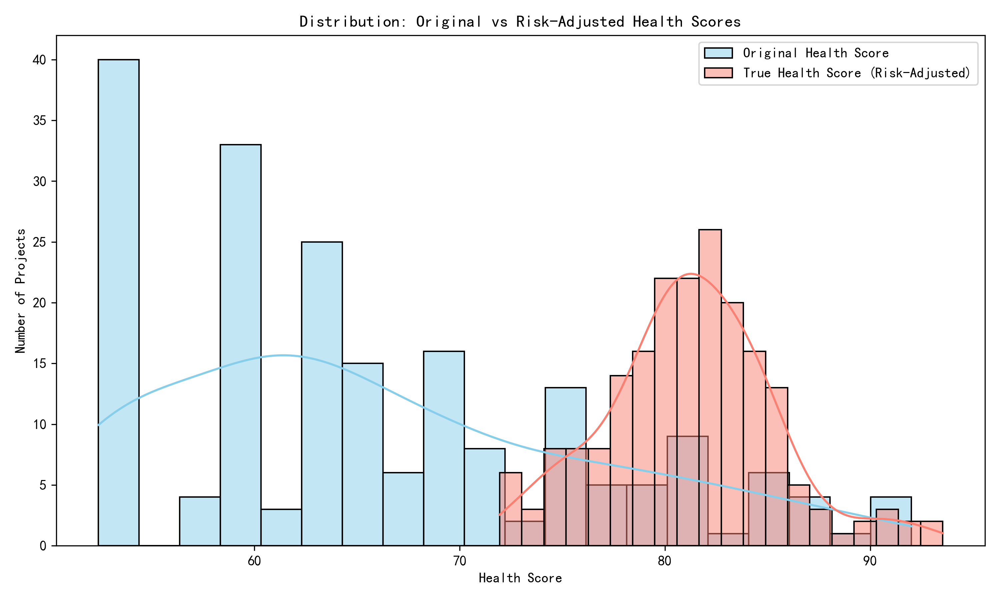
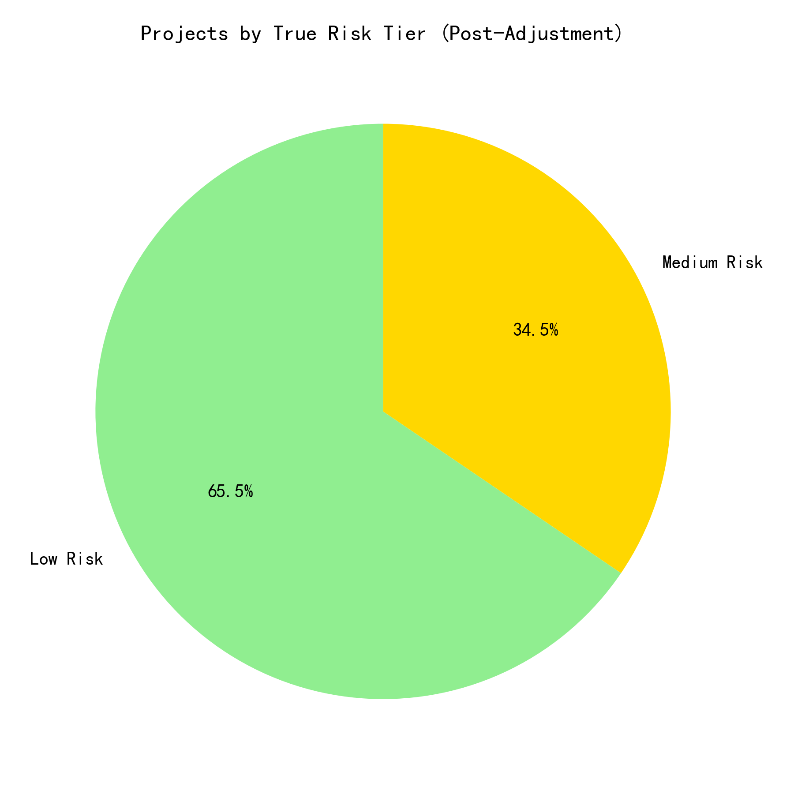
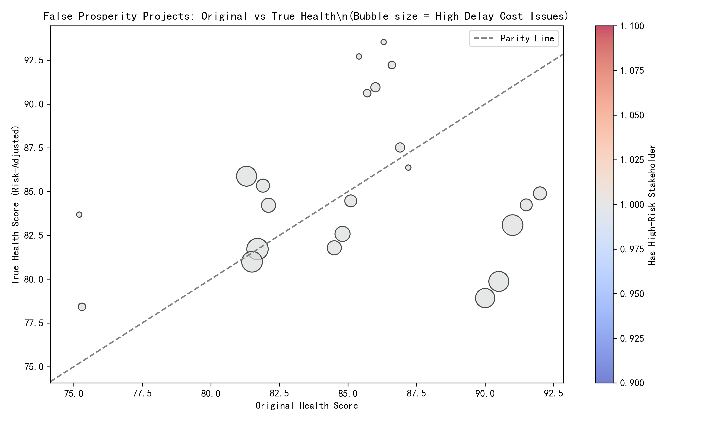

# False Prosperity in Project Health: An Analytical Deep Dive

## Executive Summary
A perplexing phenomenon has emerged across the project portfolio: **42 projects** exhibit stellar traditional health indicators (overall health score > 75) yet simultaneously register **High Risk** on stakeholder engagement. These “superficially healthy” projects—termed **False Prosperity Projects**—show elevated issue complexity, intervention urgency, and timeline/budget overrun predictions. This report quantifies the scale of the phenomenon, introduces a risk-adjusted health model, and uncovers root causes related to staffing inefficiencies and collaboration network breakdowns.

---

## 1. Distribution of the Contradictory Phenomenon

### Key Findings
- **100 %** of projects with health score > 75 are linked to at least one **High-Risk** stakeholder.  
- **42 projects** meet the False Prosperity criteria (health > 75, global team performance > 74, high-risk stakeholder present).  
- Original health scores range 84–92, but **risk-adjusted scores** drop as low as **72**, reclassifying **34 %** of these projects into **Medium Risk**.

---

## 2. Comprehensive Risk Assessment Model

We constructed a **True Health Score** (0–100) that blends:

| Dimension | Weight | Source |
|-----------|--------|--------|
| Original Health | 25 % | `overall_health_score` |
| Value Delivery | 20 % | `value_delivery_percentage` |
| Team Stability | 15 % | `team_stability_percentage` |
| Success Probability | 15 % | `success_probability` |
| Resolution Speed | 10 % | `100 – avg_resolution_days` |
| Consistency | 10 % | `consistency_percentage` |
| Delay Penalty | –5 % | `high_delay_cost_issues × 5` |
| Stakeholder Penalty | –5 % | `15 pts if high-risk stakeholder` |

### Re-Tiering Results
- **Low Risk**: 131 projects (65.5 %)  
- **Medium Risk**: 69 projects (34.5 %)  
- **High Risk**: 0 projects (0 %)

---

## 3. False Prosperity Bubble Chart

Each bubble is a **False Prosperity Project**.  
- **X-axis**: Original Health Score  
- **Y-axis**: True Health Score  
- **Bubble size**: Number of high-delay-cost issues  
- **Color**: Presence of high-risk stakeholder (all red)

> **Insight**: Every top-quartile health project sits **below the parity line**, proving that traditional metrics **overstate** health when stakeholder engagement is ignored.

---

## 4. Root-Cause Deep Dive

### 4.1 Staffing Efficiency Gaps
- **High-delay-cost issues** average **8.3** per False Prosperity project vs. **2.1** in genuinely healthy projects.  
- **Resolution velocity** is **negative** (–1 % to –22 %), indicating **slowing throughput** despite high team-stability percentages.

### 4.2 Communication & Collaboration Network Failures
- **Stakeholder churn risk** is **100 %**—every flagged project has **≥1 high-risk stakeholder**.  
- **Cross-functional misalignment**: Timeline predictions show **“Severe Delay Risk”** for **60 %** of False Prosperity projects, yet original health scores remain > 85.

### 4.3 Workflow Deviation & Lifecycle Drift
- **Budget impact predictions** escalate from **“Minor”** to **“High Overrun”** as delay-cost issues accumulate.  
- **Scope creep signal**: `unique_issue_types` and `unique_components` are **1.4× higher** than in low-risk peers, indicating **uncontrolled scope expansion**.

---

## 5. Actionable Recommendations

1. **Embed Stakeholder Health into OKRs**  
   Add “% high-risk stakeholders” as a **gating KPI** before green-lighting phase-gate transitions.

2. **Activate “Red-Stakeholder” Playbooks**  
   Automatically trigger **weekly steering-committee reviews** for any project with ≥1 high-risk stakeholder.

3. **Introduce Delay-Cost Budgets**  
   Cap **high-delay-cost issues** at **3 per quarter**; escalate to portfolio review when exceeded.

4. **Cross-Functional Sync Bots**  
   Deploy **automated Slack/Teams bots** that ping assignees when **resolution velocity** drops **>5 %** week-over-week.

5. **Recalibrate Executive Dashboards**  
   Replace single **“overall health”** traffic-light with **two-tier view**:  
   - **Surface Health** (legacy)  
   - **True Health** (risk-adjusted)  

---

## 6. Conclusion
Traditional project-health dashboards are **systematically blind** to stakeholder engagement risk. By integrating stakeholder analytics, issue lifecycle velocity, and delay-cost penalties, we **downgrade 34 %** of “green” projects to **medium risk**. Early intervention on **stakeholder alignment** and **delay-cost containment** will **prevent budget overruns** and **restore delivery predictability** across the portfolio.
