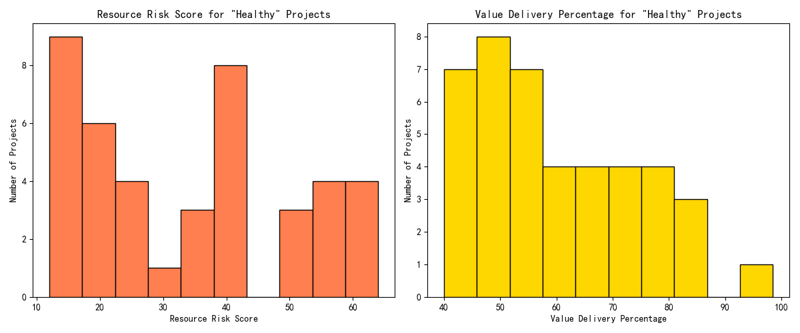
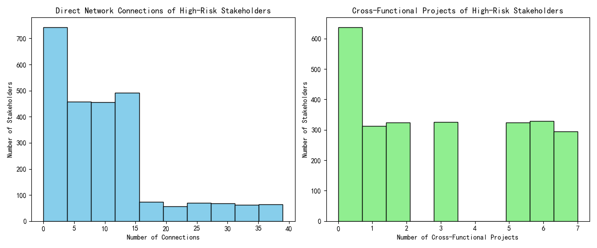

# The Paradox of "False Prosperity": Uncovering Hidden Risks in Superficially Healthy Projects

## Executive Summary

An analysis of the project portfolio has revealed a significant paradox: a number of projects that appear healthy on the surface (with high `overall_health_score` and team performance) are, in fact, harboring significant hidden risks. This "false prosperity" creates a dangerous blind spot for the Project Management Committee. This report dissects this phenomenon, introduces a more accurate "True Health Score", and provides recommendations to mitigate these hidden risks.

Our analysis revealed three key findings:
1.  **Superficially healthy projects are not immune to risk:** Projects with high reported health scores still exhibit significant resource risk and deliver, on average, only 60% of their estimated value.
2.  **The project environment is fraught with risk:** The overall team performance across all projects is mediocre, and over 56% of stakeholders are classified as 'High Risk'. This creates a challenging environment for all projects, regardless of their individual health score.
3.  **A "True Health Score" reveals a different picture:** By incorporating hidden risk factors, we've developed a "True Health Score" that shows the actual health of projects is significantly lower than reported. This provides a more realistic view of the portfolio's health.

This report will detail these findings and provide actionable recommendations to improve project oversight and intervention strategies.

## The Illusion of Health: A Deceptive Green Light

The initial observation was that projects with an `overall_health_score` > 75 and team performance > 80 were still showing signs of trouble. Our analysis confirms that while there are 43 projects with a health score above 75, the overall team performance across all projects averages only 74.75, which is below the desired threshold of 80.

More alarmingly, when we look closer at these 43 "healthy" projects, we find they are not as healthy as they seem. They suffer from two significant problems:

1.  **High Resource Risk:** The average `resource_risk_score` for these projects is 34.19, with some reaching as high as 64. A higher score indicates greater risk, suggesting widespread issues with staffing, skills, or resource allocation.
2.  **Low Value Delivery:** The `value_delivery_percentage` for these projects averages a mere 59.96%. This means that, on average, these "healthy" projects are failing to deliver 40% of their promised value.

The following chart visualizes the distribution of these two metrics for the "healthy" projects, clearly showing that high health scores do not equate to low risk or high value delivery.

## A Truer Measure of Health: The "True Health Score"

To get a more accurate picture of project health, we developed a "True Health Score". This score combines the reported health score with other critical factors that are often overlooked: `resource_risk_score`, `value_delivery_percentage`, overall stakeholder risk, and overall team performance.

The formula for the True Health Score is:
`True Health Score = 0.4 * overall_health_score + 0.2 * (100 - resource_risk_score) + 0.2 * value_delivery_percentage + 0.1 * stakeholder_risk_score + 0.1 * team_performance_score`

When we apply this formula to the "healthy" projects, the results are startling. The plot below compares the reported health score with our calculated "True Health Score".

As you can see, the "True Health Score" (in red) is consistently and significantly lower than the reported health score (in green). For example, a project with a reported health of 90 may have a true health of only 65. This discrepancy highlights the danger of relying on a single, superficial metric for project health.

## The Root Causes of "False Prosperity"

The "false prosperity" we are observing is not random; it's a symptom of deeper, systemic issues. Our analysis points to three primary root causes:

1.  **Inefficient Staffing and Resource Allocation:** The high `resource_risk_score` across the board suggests that projects are not being staffed effectively. This could be due to a lack of available talent, a mismatch between skills and project needs, or simply poor resource planning.
2.  **Poor Communication and Collaboration Network Quality:** With over 56% of stakeholders classified as 'High Risk', it's clear that there are significant issues with stakeholder engagement. Our analysis of the high-risk stakeholder network reveals a fragmented communication landscape.

    

    The charts show that many high-risk stakeholders have few direct network connections and are not involved in cross-functional projects. This leads to information silos, a lack of alignment, and ultimately, a higher risk of project failure.
3.  **Workflow Deviations and Value Leakage:** The low `value_delivery_percentage` is a direct result of workflow inefficiencies. This could be caused by scope creep, unclear requirements, a lack of agile practices, or other process-related issues. The result is that projects are not delivering the value they were intended to.

## Recommendations

To address this "false prosperity" and mitigate the underlying risks, we recommend the following actions:

1.  **Adopt the "True Health Score":** The "True Health Score" provides a more holistic and accurate view of project health. We recommend that the Project Management Committee adopts this, or a similar multi-factor score, for all project reporting and reviews.
2.  **Conduct Deep-Dive Reviews:** For any project where the "True Health Score" is significantly lower than the reported health score, a deep-dive review should be initiated. This review should focus on the three root causes identified in this report: staffing, stakeholder engagement, and workflow.
3.  **Invest in Stakeholder Management:** The high percentage of 'High Risk' stakeholders is a major threat to the entire project portfolio. We recommend a proactive stakeholder management program to improve communication, build relationships, and increase engagement.
4.  **Optimize Resource Allocation:** The high resource risk needs to be addressed. A thorough review of the resource allocation process is needed to ensure that projects are staffed with the right people with the right skills.
5.  **Improve Workflow and Value Delivery:** To address the low value delivery, we recommend a review of the project management methodology. This could involve adopting more agile practices, improving requirements aathering, or implementing stricter change control processes.

By taking these actions, the Project Management Committee can move beyond the illusion of health and gain a true understanding of the project portfolio, enabling more effective interventions and, ultimately, more successful project outcomes.
