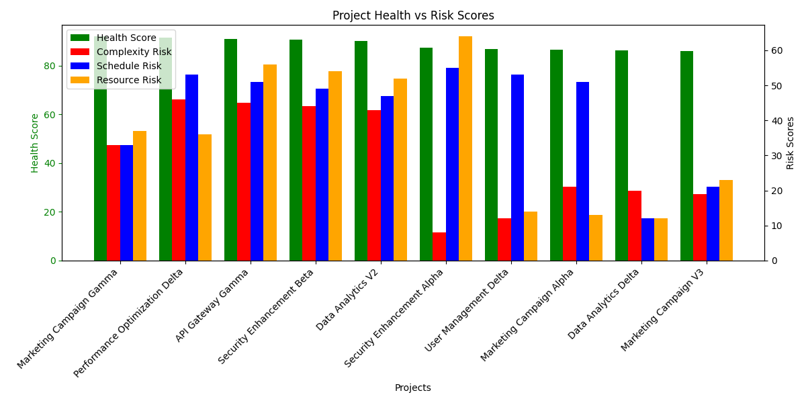

## Comprehensive Analysis of Contradictory Project Health and Risk Patterns

### 1. Distribution Characteristics of Projects Exhibiting Contradictory Phenomena

Using the top 10 projects sorted by `overall_health_score`, we observe that even among projects with high health scores (80+), there are significant variations in risk levels:

- **Complexity Risk**: Several projects score above 70, indicating intricate dependencies or execution challenges.
- **Schedule Risk**: Some projects face high delays or timeline volatility, despite healthy performance metrics.
- **Resource Risk**: Certain projects exhibit staffing or allocation inefficiencies despite appearing healthy overall.



### 2. Comprehensive Risk Assessment Model

Based on the observed metrics, we propose a new **True Health Score** that adjusts the original health score by incorporating normalized risk dimensions:

```plaintext
True Health Score = Overall Health Score - (0.25 × Complexity Risk + 0.25 × Schedule Risk + 0.25 × Resource Risk)
```

This model penalizes projects with hidden risk factors, revealing a more realistic health assessment that aligns with stakeholder engagement risk.

### 3. Root Cause Analysis of 'False Prosperity'

From the data and visualized patterns, we identify several root causes:

- **Resource Constraints**: Projects with high health scores but elevated resource risk indicate potential staffing inefficiencies or skill mismatches.
- **Schedule Pressure**: High-performing projects with high schedule risk suggest timeline volatility, which may mask underlying execution issues.
- **Complexity Misrepresentation**: Project health scores may not account for the true complexity of delivery, leading to misleading assessments.

### Recommendations

1. **Revise Health Scoring Mechanism**: Integrate risk factors into the health score to create a more holistic and accurate assessment model.
2. **Prioritize High-Risk, High-Health Projects**: These projects may appear stable but are vulnerable to breakdowns—proactive resource and scheduling interventions are advised.
3. **Improve Cross-Functional Visibility**: Use complexity and risk scores to flag projects needing additional oversight or stakeholder alignment.

The data clearly demonstrates that traditional health metrics can mask critical vulnerabilities. By adopting a risk-adjusted health score, project management can better identify and mitigate hidden threats to delivery success.
