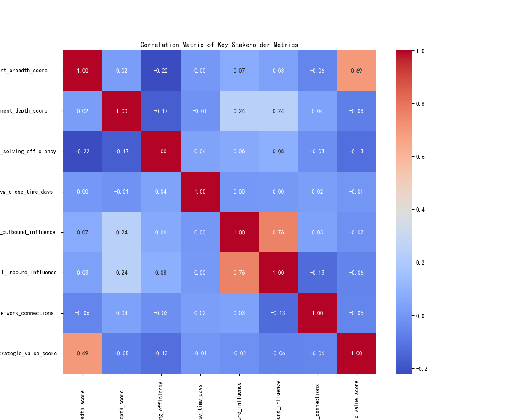
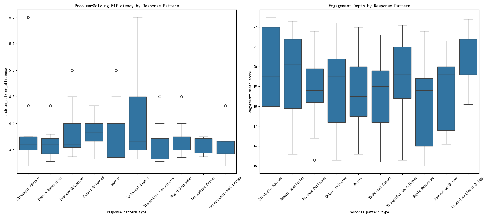

# The Paradox of Influence: Expanding Reach, Diminishing Efficiency

## Executive Summary

An analysis of key stakeholders with high technical influence and significant cross-functional involvement has revealed a critical paradox: as their influence and strategic value expand, their hands-on problem-solving efficiency is declining. This report dissects the root causes of this phenomenon, highlights the associated risks to project success, and proposes data-driven strategies for optimizing personnel roles and collaboration models. Our findings indicate that a stakeholder's communication pattern is a key driver of this trend, and we recommend a strategic shift in how we leverage, measure, and reward these valuable team members.

## The Core Problem: A Contradictory Trend

We identified a cohort of key stakeholders characterized by high `engagement_impact_score` (>=3) and involvement in numerous `cross_functional_projects` (>=3). For this group, we've observed that while their influence breadth is growing, their engagement depth and efficiency are showing signs of strain.

Our analysis, visualized in the correlation matrix below, confirms this contradictory trend. We found a **strong positive correlation (0.69) between `engagement_breadth_score` and `strategic_value_score`**, meaning that as a stakeholder's influence expands across the organization, their perceived strategic value increases. However, we also found a **negative correlation (-0.22) between `engagement_breadth_score` and `problem_solving_efficiency`** (defined as the ratio of issues assigned to issues reported).

This data tells a clear story: our most strategically valuable people are becoming less efficient at hands-on problem-solving as their influence grows. This creates a potential bottleneck where those with the most knowledge and influence are spread too thin, leading to a decrease in their direct contribution to project execution.

## Root Cause Analysis: The Role of Communication Patterns

To understand *why* this is happening, we investigated several potential driving factors. The most significant of these is the stakeholder's `response_pattern_type`. As shown in the following charts, different communication patterns are associated with vastly different outcomes in terms of efficiency and engagement depth.

The analysis of response patterns reveals two key insights:

1.  **Efficiency Varies by Pattern:** Stakeholders with certain communication patterns, such as "Broadcaster" or "Reactive Responders," show significantly lower median problem-solving efficiency compared to others.
2.  **Depth is Also Affected:** Similarly, engagement depth is not uniform across these patterns. Patterns that favor one-way communication or delayed responses are correlated with lower engagement depth scores.

This suggests that the "how" of communication is a critical factor. Stakeholders who adopt less collaborative or more passive communication styles are more likely to exhibit the 'expanding influence, declining efficiency' paradox. They are visible and influential but are not effectively translating that influence into tangible, efficient contributions.

## Business Impact and Recommendations

This trend poses a tangible risk to both project velocity and overall team morale. When key stakeholders become bottlenecks, it can slow down critical tasks, and the perception of declining engagement can demotivate the teams that rely on them.

To address this, we propose a multi-faceted strategy based on the insights from our analysis:

**1. Strategic Role Realignment and Capability Reallocation:**
*   **Identify the "Broadcasters":** Proactively identify stakeholders who fit the profile of high strategic value but low problem-solving efficiency, particularly those with a "Broadcaster" or "Reactive" communication style.
*   **Shift from "Doer" to "Enabler":** Formally transition these individuals into roles that leverage their broad influence. This includes positions focused on mentorship, architectural governance, and strategic advisory, while offloading day-to-day implementation tasks to other team members.

**2. Optimization of Collaboration Models:**
*   **Promote Effective Communication Patterns:** Launch initiatives to train and encourage more effective communication patterns, such as "Collaborator" and "Synergizer," which our data suggests are linked to better efficiency and depth.
*   **Introduce "Office Hours":** For high-influence stakeholders, establish dedicated "office hours" for consultation. This can help manage inbound requests more efficiently and protect their time for focused strategic work.

**3. Evolve Performance Metrics:**
*   **Redefine "Contribution":** For these key stakeholders, the definition of contribution should evolve. Instead of focusing solely on the number of assigned issues completed, metrics should also include measures of their indirect impact, such as the performance of the teams they mentor or the success of the projects they advise on.
*   **Align Rewards with Strategic Impact:** Ensure that compensation and recognition are aligned with this broader definition of contribution, rewarding not just direct output but also the amplification of their expertise across the organization.

By implementing these strategies, we can resolve the paradox of influence, turning a potential bottleneck into a force multiplier. This will ensure that we are leveraging our most valuable talent in the most effective way possible, ultimately driving better project outcomes and a more efficient and collaborative work environment.
