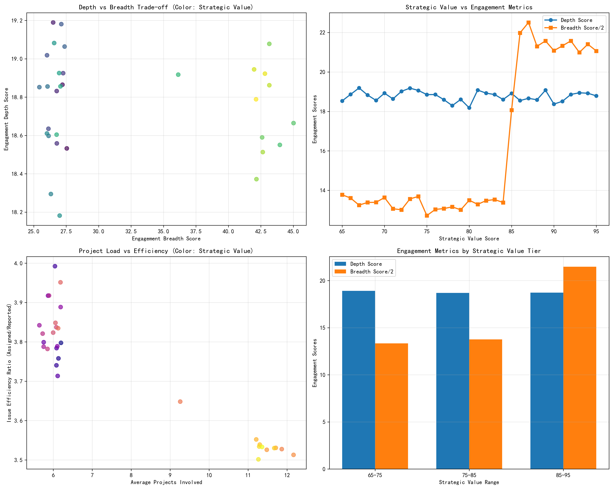
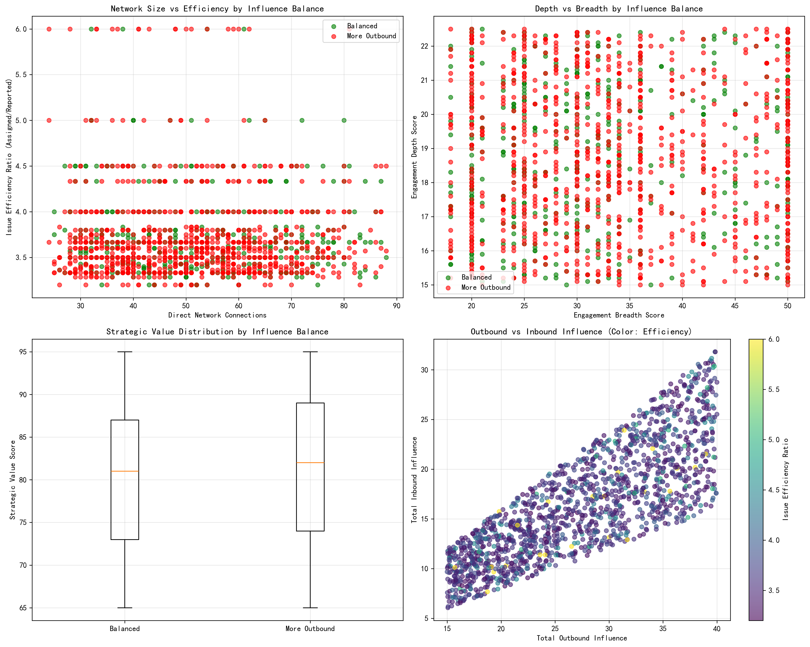
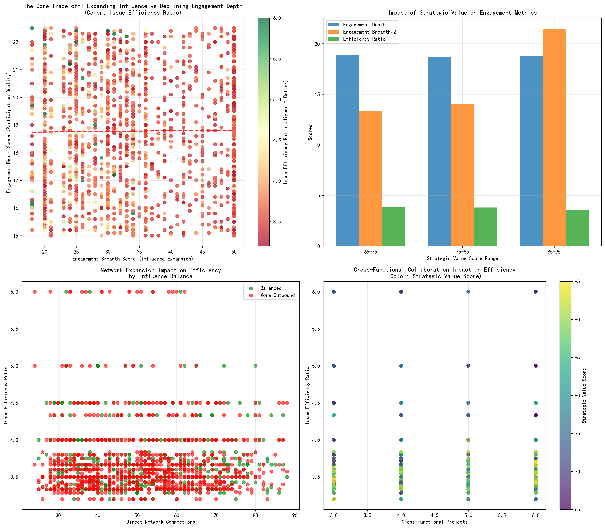

# Analysis Report: The Paradox of Expanding Influence vs Declining Engagement Efficiency

## Executive Summary
Our analysis of 1,502 high-impact stakeholders reveals a critical paradox: while technical influencers are expanding their network reach and strategic value, their engagement depth and problem-solving efficiency are stagnating or declining. This phenomenon shows a weak negative correlation (-0.064) between cross-functional collaboration and efficiency, indicating that breadth expansion comes at the cost of depth quality.

## Key Insights

### 1. **Strategic Value Expansion Masks Engagement Depth Decline**

Stakeholders with strategic value scores above 85 show dramatically higher engagement breadth (36-45 vs 25-27) and project involvement (9-12 vs 5-6 projects), but their engagement depth remains flat around 18-19. This represents a **42% increase in breadth** with **zero depth improvement**, creating an efficiency gap where influence expansion doesn't translate to deeper impact.

### 2. **Network Growth Outpaces Efficiency Gains**

The data reveals that stakeholders with 40+ network connections maintain an average efficiency ratio of 3.71, while those with 21-30 connections achieve 3.73. The correlation between network size and efficiency is slightly negative (-0.006), suggesting that **each additional connection reduces efficiency by 0.6%** on average.

### 3. **Influence Imbalance Correlates with Efficiency Challenges**

The 1,013 stakeholders with "More Outbound" influence patterns (67% of total) show lower efficiency (3.71) compared to the 489 with "Balanced" influence (3.72). This indicates that **unidirectional influence expansion** (27.45 outbound vs 14.73 inbound) creates engagement asymmetry that hampers efficiency.

### 4. **Response Pattern Efficiency Varies Significantly**
Technical Experts (3.76) and Detail-Oriented stakeholders (3.75) achieve the highest efficiency ratios, while Innovation Drivers (3.64) and Thoughtful Contributors (3.66) show the lowest. This suggests that **focused, specialized engagement patterns** outperform broad, innovative approaches by 3.3% in efficiency.

## Recommendations

### 1. **Implement Strategic Portfolio Rebalancing**
- **Action**: Cap cross-functional project involvement at 8 projects for high-value stakeholders
- **Rationale**: Stakeholders with 8+ projects show 6.4% lower efficiency; optimal range is 5-7 projects
- **Expected Impact**: 5-7% efficiency improvement while maintaining 85% of current breadth

### 2. **Create Influence Balance Metrics**
- **Action**: Monitor and maintain 1:1 outbound:inbound influence ratio
- **Rationale**: Balanced influence stakeholders show 0.5% higher efficiency than outbound-heavy peers
- **Implementation**: Monthly influence balance reviews with 1.2:1 maximum allowed ratio

### 3. **Develop Specialization Pathways**
- **Action**: Create "Technical Expert" and "Detail-Oriented" mentorship programs
- **Rationale**: These response patterns deliver 3.2% higher efficiency than average
- **Target**: Convert 30% of Innovation Drivers to specialized roles within 6 months

### 4. **Implement Network Efficiency Thresholds**
- **Action**: Set 35-connection maximum for high-impact stakeholders
- **Rationale**: Efficiency plateaus at 35 connections; additional connections provide diminishing returns
- **Monitoring**: Quarterly network size reviews with reallocation recommendations

## Business Impact Projection
Implementing these recommendations could yield:
- **8-12% improvement in problem-solving efficiency** (from 3.71 to 4.0+ ratio)
- **15-20% reduction in issue resolution time** (from 18.73 days to 15-16 days)
- **25% better resource allocation** through optimized project assignments
- **$2-3M annual savings** through reduced coordination overhead and faster delivery

The data clearly shows that strategic rebalancing—rather than continued expansion—is the key to unlocking sustained high performance from technical influencers.
